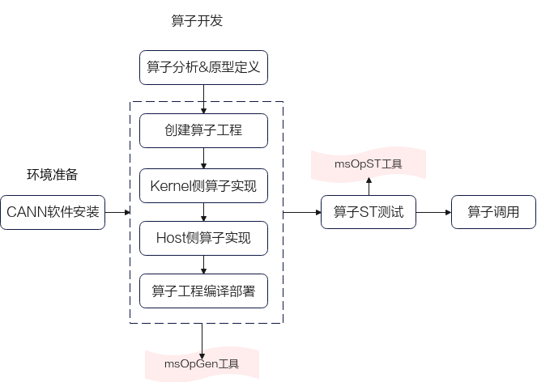
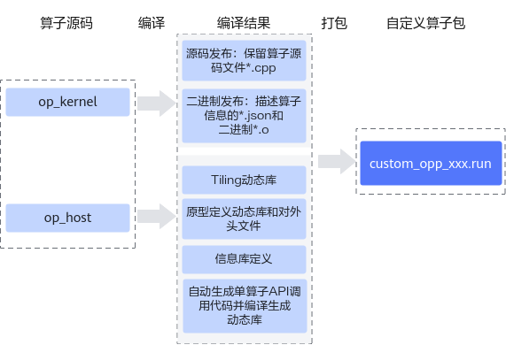
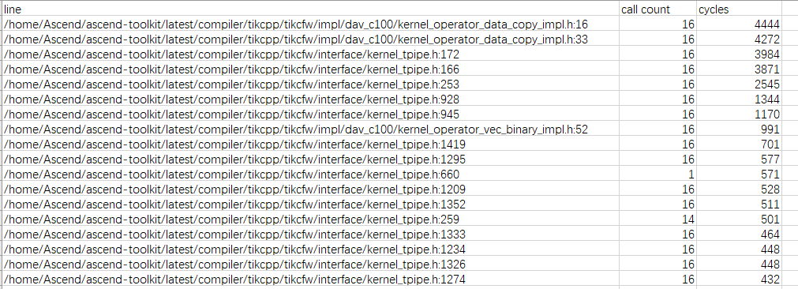

# **MindStudio Ops Generator工具用户指南**<a id="ZH-CN_TOPIC_0000002526346607"></a>

## 简介<a id="ZH-CN_TOPIC_0000002494186946"></a>

**工具简介<a id="zh-cn_topic_0000001776910254_section17618134714611"></a>**

完成算子分析和原型定义后，可使用MindStudio Ops Generator（算子工程工具，msOpGen）生成自定义算子工程，并进行编译部署。工具

具有如下功能：

- 基于算子原型定义输出算子工程。
- 基于性能仿真环境生成的dump数据文件输出算子仿真流水图文件。

**工具使用流程<a id="section1841083612111"></a>**

具体流程请参考[图1 msOpGen工具使用流程介绍](#fig1120319585112)。

**图 1**  msOpGen工具使用流程介绍<a id="fig1120319585112"></a>  


## 使用前准备<a id="使用前准备"></a>

按照环境要求进行配置后，可直接使用msOpGen工具的相关功能。

**环境准备<a id="section16705155515116"></a>**

进行算子开发之前，需要安装配套版本的CANN Toolkit开发套件包和ops算子包并配置CANN环境变量，请参见《[CANN 软件安装指南](https://www.hiascend.com/document/detail/zh/CANNCommunityEdition/83RC1/softwareinst/instg/instg_0000.html)》。本节不再给出安装示例。

**约束<a id="section160697141319"></a>**

- 出于安全性及权限最小化角度考虑，本代码仓中的工具均不应使用root等高权限账户进行操作，建议使用普通用户权限安装执行。
- 使用算子开发工具前，请确保执行用户的umask值大于等于0027，否则会造成获取的性能数据所在目录和文件权限过大。
- 使用算子工具前，请保证使用最小权限原则（如：禁止other用户可写，禁止666或777）。
- 不建议配置或运行其他用户目录下的自定义脚本，避免提权风险。
- 下载代码样例时，需执行以下命令指定分支版本。

    ```sh
    git clone https://gitee.com/ascend/samples.git -b master
    ```

## 算子工程创建功能介绍<a id="ZH-CN_TOPIC_0000002507799464"></a>

### 功能说明<a id="ZH-CN_TOPIC_0000002539479309"></a>

msOpGen目前已支持的功能如下：包括算子工程创建、算子实现（Host侧&Kernel侧）、算子工程编译部署以及解析算子仿真流水图文件等。

**表 1**  msOpGen工具功能

<a id="zh-cn_topic_0000001691887174_table2520191519210"></a>
<table><thead align="left"><tr id="zh-cn_topic_0000001691887174_row17520215162117"><th class="cellrowborder" valign="top" width="27.6%" id="mcps1.2.3.1.1"><p id="zh-cn_topic_0000001691887174_p4521815102112"><a id="zh-cn_topic_0000001691887174_p4521815102112"></a><a id="zh-cn_topic_0000001691887174_p4521815102112"></a>功能</p>
</th>
<th class="cellrowborder" valign="top" width="72.39999999999999%" id="mcps1.2.3.1.2"><p id="zh-cn_topic_0000001691887174_p7521415172116"><a id="zh-cn_topic_0000001691887174_p7521415172116"></a><a id="zh-cn_topic_0000001691887174_p7521415172116"></a>链接</p>
</th>
</tr>
</thead>
<tbody><tr id="zh-cn_topic_0000001691887174_row1152171542120"><td class="cellrowborder" valign="top" width="27.6%" headers="mcps1.2.3.1.1 "><p id="zh-cn_topic_0000001691887174_p16149193723113"><a id="zh-cn_topic_0000001691887174_p16149193723113"></a><a id="zh-cn_topic_0000001691887174_p16149193723113"></a>算子工程创建</p>
</td>
<td class="cellrowborder" valign="top" width="72.39999999999999%" headers="mcps1.2.3.1.2 "><p id="zh-cn_topic_0000001691887174_p1452121582114"><a id="zh-cn_topic_0000001691887174_p1452121582114"></a><a id="zh-cn_topic_0000001691887174_p1452121582114"></a><a href="#创建算子工程">创建算子工程</a></p>
</td>
</tr>
<tr id="zh-cn_topic_0000001691887174_row13521315132112"><td class="cellrowborder" valign="top" width="27.6%" headers="mcps1.2.3.1.1 "><p id="p648323893210"><a id="p648323893210"></a><a id="p648323893210"></a>算子实现（Host侧&amp;Kernel侧）</p>
</td>
<td class="cellrowborder" valign="top" width="72.39999999999999%" headers="mcps1.2.3.1.2 "><p id="zh-cn_topic_0000001691887174_p25211015152117"><a id="zh-cn_topic_0000001691887174_p25211015152117"></a><a id="zh-cn_topic_0000001691887174_p25211015152117"></a><a href="#算子开发">算子开发</a></p>
</td>
</tr>
<tr id="row333312710327"><td class="cellrowborder" valign="top" width="27.6%" headers="mcps1.2.3.1.1 "><p id="p133497193219"><a id="p133497193219"></a><a id="p133497193219"></a>算子工程编译部署</p>
</td>
<td class="cellrowborder" valign="top" width="72.39999999999999%" headers="mcps1.2.3.1.2 "><p id="p19870155063312"><a id="p19870155063312"></a><a id="p19870155063312"></a><a href="#算子编译部署">算子编译部署</a></p>
</td>
</tr>
<tr id="row13351279322"><td class="cellrowborder" valign="top" width="27.6%" headers="mcps1.2.3.1.1 "><p id="p23350723220"><a id="p23350723220"></a><a id="p23350723220"></a>解析算子仿真流水图文件</p>
</td>
<td class="cellrowborder" valign="top" width="72.39999999999999%" headers="mcps1.2.3.1.2 "><p id="p8973947104414"><a id="p8973947104414"></a><a id="p8973947104414"></a><a href="#查看算子仿真流水图">查看算子仿真流水图</a></p>
</td>
</tr>
</tbody>
</table>

### 注意事项<a id="ZH-CN_TOPIC_0000002507639608"></a>

用户按照输入的配置参数生成算子模板后，建议在运行前确认算子工程代码的安全性。

### 命令格式<a id="ZH-CN_TOPIC_0000002507963578"></a>

**命令汇总<a id="section66278453613"></a>**

执行如下命令，参数说明请参见[表1 创建算子工程参数说明](#zh-cn_topic_0000001740005677_table20825174505717)。用户按照输入的配置参数生成算子模板后，建议在运行前确认算子工程代码的安全性。

```sh
msopgen gen -i {*.json} -f {framework type} -c {Compute Resource} -lan cpp -out {Output Path}
```

### 参数说明<a id="ZH-CN_TOPIC_0000002508123428"></a>

**表 1**  创建算子工程参数说明

<a id="zh-cn_topic_0000001740005677_table20825174505717"></a>
<table><thead align="left"><tr id="zh-cn_topic_0000001740005677_row682564565718"><th class="cellrowborder" valign="top" width="19.220000000000002%" id="mcps1.2.4.1.1"><p id="zh-cn_topic_0000001740005677_p128251945155719"><a id="zh-cn_topic_0000001740005677_p128251945155719"></a><a id="zh-cn_topic_0000001740005677_p128251945155719"></a>参数名称</p>
</th>
<th class="cellrowborder" valign="top" width="66.95%" id="mcps1.2.4.1.2"><p id="zh-cn_topic_0000001740005677_p18251245125720"><a id="zh-cn_topic_0000001740005677_p18251245125720"></a><a id="zh-cn_topic_0000001740005677_p18251245125720"></a>参数描述</p>
</th>
<th class="cellrowborder" valign="top" width="13.83%" id="mcps1.2.4.1.3"><p id="zh-cn_topic_0000001740005677_p682514545718"><a id="zh-cn_topic_0000001740005677_p682514545718"></a><a id="zh-cn_topic_0000001740005677_p682514545718"></a>是否必选</p>
</th>
</tr>
</thead>
<tbody><tr id="zh-cn_topic_0000001740005677_row1182514455574"><td class="cellrowborder" valign="top" width="19.220000000000002%" headers="mcps1.2.4.1.1 "><p id="zh-cn_topic_0000001740005677_p58255455574"><a id="zh-cn_topic_0000001740005677_p58255455574"></a><a id="zh-cn_topic_0000001740005677_p58255455574"></a>gen</p>
</td>
<td class="cellrowborder" valign="top" width="66.95%" headers="mcps1.2.4.1.2 "><p id="zh-cn_topic_0000001740005677_p13826114510578"><a id="zh-cn_topic_0000001740005677_p13826114510578"></a><a id="zh-cn_topic_0000001740005677_p13826114510578"></a>用于生成算子开发交付件。</p>
</td>
<td class="cellrowborder" valign="top" width="13.83%" headers="mcps1.2.4.1.3 "><p id="zh-cn_topic_0000001740005677_p182684519577"><a id="zh-cn_topic_0000001740005677_p182684519577"></a><a id="zh-cn_topic_0000001740005677_p182684519577"></a>是</p>
</td>
</tr>
<tr id="zh-cn_topic_0000001740005677_row98261945145710"><td class="cellrowborder" valign="top" width="19.220000000000002%" headers="mcps1.2.4.1.1 "><p id="zh-cn_topic_0000001740005677_p198261452574"><a id="zh-cn_topic_0000001740005677_p198261452574"></a><a id="zh-cn_topic_0000001740005677_p198261452574"></a>-i，--input</p>
</td>
<td class="cellrowborder" valign="top" width="66.95%" headers="mcps1.2.4.1.2 "><p id="zh-cn_topic_0000001740005677_p282694575716"><a id="zh-cn_topic_0000001740005677_p282694575716"></a><a id="zh-cn_topic_0000001740005677_p282694575716"></a>算子原型定义文件（<strong id="b89116118168"><a id="b89116118168"></a><a id="b89116118168"></a>.json</strong>）路径，可配置为绝对路径或者相对路径。工具执行用户需要有此路径的可读权限。</p>
</td>
<td class="cellrowborder" valign="top" width="13.83%" headers="mcps1.2.4.1.3 "><p id="zh-cn_topic_0000001740005677_p12826945145713"><a id="zh-cn_topic_0000001740005677_p12826945145713"></a><a id="zh-cn_topic_0000001740005677_p12826945145713"></a>是</p>
</td>
</tr>
<tr id="zh-cn_topic_0000001740005677_row88264455577"><td class="cellrowborder" valign="top" width="19.220000000000002%" headers="mcps1.2.4.1.1 "><p id="zh-cn_topic_0000001740005677_p15826184516572"><a id="zh-cn_topic_0000001740005677_p15826184516572"></a><a id="zh-cn_topic_0000001740005677_p15826184516572"></a>-f，--framework</p>
</td>
<td class="cellrowborder" valign="top" width="66.95%" headers="mcps1.2.4.1.2 "><p id="zh-cn_topic_0000001740005677_p48261745105714"><a id="zh-cn_topic_0000001740005677_p48261745105714"></a><a id="zh-cn_topic_0000001740005677_p48261745105714"></a>框架类型。</p>
<a id="zh-cn_topic_0000001740005677_ul5826144515578"></a><a id="zh-cn_topic_0000001740005677_ul5826144515578"></a><ul id="zh-cn_topic_0000001740005677_ul5826144515578"><li>默认为TensorFlow框架，默认值：tf或者tensorflow</li><li>Caffe框架，参数值：caffe<div class="note" id="note3645111616382"><a id="note3645111616382"></a><a id="note3645111616382"></a><span class="notetitle"> 说明： </span><div class="notebody"><p id="p1364551663812"><a id="p1364551663812"></a><a id="p1364551663812"></a>自定义Ascend C算子不支持Caffe框架。</p>
</div></div>
</li><li>PyTorch框架，参数值：pytorch</li><li>MindSpore框架，参数值：ms或mindspore</li><li>ONNX框架，参数值：onnx</li></ul>
<div class="note" id="zh-cn_topic_0000001740005677_note75526525356"><a id="zh-cn_topic_0000001740005677_note75526525356"></a><a id="zh-cn_topic_0000001740005677_note75526525356"></a><span class="notetitle"> 说明： </span><div class="notebody"><a id="zh-cn_topic_0000001740005677_ul1483915433531"></a><a id="zh-cn_topic_0000001740005677_ul1483915433531"></a><ul id="zh-cn_topic_0000001740005677_ul1483915433531"><li>所有参数值大小写不敏感。</li><li>TBE&amp;TIK不支持单算子API调用，默认生成TensorFlow框架。</li><li>Ascend C算子工程支持TensorFlow框架、PyTorch框架和单算子API调用，默认生成TensorFlow框架。</li><li>当用户使用-f aclnn时，生成Ascend C算子工程。</li></ul>
</div></div>
</td>
<td class="cellrowborder" valign="top" width="13.83%" headers="mcps1.2.4.1.3 "><p id="zh-cn_topic_0000001740005677_p7827154512574"><a id="zh-cn_topic_0000001740005677_p7827154512574"></a><a id="zh-cn_topic_0000001740005677_p7827154512574"></a>否</p>
</td>
</tr>
<tr id="row790282815185"><td class="cellrowborder" valign="top" width="19.220000000000002%" headers="mcps1.2.4.1.1 "><p id="zh-cn_topic_0000001740005677_p11914135218228"><a id="zh-cn_topic_0000001740005677_p11914135218228"></a><a id="zh-cn_topic_0000001740005677_p11914135218228"></a>-lan，--language</p>
</td>
<td class="cellrowborder" valign="top" width="66.95%" headers="mcps1.2.4.1.2 "><p id="zh-cn_topic_0000001740005677_p885792872216"><a id="zh-cn_topic_0000001740005677_p885792872216"></a><a id="zh-cn_topic_0000001740005677_p885792872216"></a>算子编码语言。</p>
<a id="zh-cn_topic_0000001740005677_ul142592250248"></a><a id="zh-cn_topic_0000001740005677_ul142592250248"></a><ul id="zh-cn_topic_0000001740005677_ul142592250248"><li>cpp：基于<span id="ph18765379559"><a id="ph18765379559"></a><a id="ph18765379559"></a>Ascend C</span>编程框架，使用C/C++编程语言进行开发。</li><li>py：基于DSL和TIK算子编程框架，使用Python编程语言进行开发。</li></ul>
<p id="zh-cn_topic_0000001740005677_p1651012022614"><a id="zh-cn_topic_0000001740005677_p1651012022614"></a><a id="zh-cn_topic_0000001740005677_p1651012022614"></a>默认值：py。</p>
<div class="note" id="note4520168111917"><a id="note4520168111917"></a><a id="note4520168111917"></a><span class="notetitle"> 说明： </span><div class="notebody"><p id="p105204881911"><a id="p105204881911"></a><a id="p105204881911"></a><strong id="b1816821316196"><a id="b1816821316196"></a><a id="b1816821316196"></a>cpp</strong>仅适用于Ascend C算子开发场景。</p>
</div></div>
</td>
<td class="cellrowborder" valign="top" width="13.83%" headers="mcps1.2.4.1.3 "><p id="zh-cn_topic_0000001740005677_p108571628192219"><a id="zh-cn_topic_0000001740005677_p108571628192219"></a><a id="zh-cn_topic_0000001740005677_p108571628192219"></a>否</p>
</td>
</tr>
<tr id="zh-cn_topic_0000001740005677_row3827114535715"><td class="cellrowborder" valign="top" width="19.220000000000002%" headers="mcps1.2.4.1.1 "><p id="zh-cn_topic_0000001740005677_p9827945125719"><a id="zh-cn_topic_0000001740005677_p9827945125719"></a><a id="zh-cn_topic_0000001740005677_p9827945125719"></a>-c，--compute_unit</p>
</td>
<td class="cellrowborder" valign="top" width="66.95%" headers="mcps1.2.4.1.2 "><a id="zh-cn_topic_0000001740005677_ul131481444164116"></a><a id="zh-cn_topic_0000001740005677_ul131481444164116"></a><ul id="zh-cn_topic_0000001740005677_ul131481444164116"><li>算子使用的计算资源。<p id="zh-cn_topic_0000001740005677_p982910215314"><a id="zh-cn_topic_0000001740005677_p982910215314"></a><a id="zh-cn_topic_0000001740005677_p982910215314"></a>配置格式为：ai_core-<em id="zh-cn_topic_0000001740005677_i382714510573"><a id="zh-cn_topic_0000001740005677_i382714510573"></a><a id="zh-cn_topic_0000001740005677_i382714510573"></a>{soc version}</em>，ai_core与<em id="zh-cn_topic_0000001740005677_i15827204575715"><a id="zh-cn_topic_0000001740005677_i15827204575715"></a><a id="zh-cn_topic_0000001740005677_i15827204575715"></a>{soc version}</em>之间用中划线“-”连接。</p>
<p id="zh-cn_topic_0000001740005677_p109605188117"><a id="zh-cn_topic_0000001740005677_p109605188117"></a><a id="zh-cn_topic_0000001740005677_p109605188117"></a>请根据实际<span id="zh-cn_topic_0000001740005677_ph1555712386204"><a id="zh-cn_topic_0000001740005677_ph1555712386204"></a><a id="zh-cn_topic_0000001740005677_ph1555712386204"></a>AI处理器</span>版本进行选择。</p>
</li></ul>
<div class="note" id="zh-cn_topic_0000001740005677_note481620356579"><a id="zh-cn_topic_0000001740005677_note481620356579"></a><a id="zh-cn_topic_0000001740005677_note481620356579"></a><span class="notetitle"> 说明： </span><div class="notebody"><p id="zh-cn_topic_0000001618617245_p15587811201611"><a id="zh-cn_topic_0000001618617245_p15587811201611"></a><a id="zh-cn_topic_0000001618617245_p15587811201611"></a>AI处理器的型号<span id="zh-cn_topic_0000001618617245_ph7380192118169"><a id="zh-cn_topic_0000001618617245_ph7380192118169"></a><a id="zh-cn_topic_0000001618617245_ph7380192118169"></a><em id="zh-cn_topic_0000001618617245_zh-cn_topic_0000001312483385_i79331727136"><a id="zh-cn_topic_0000001618617245_zh-cn_topic_0000001312483385_i79331727136"></a><a id="zh-cn_topic_0000001618617245_zh-cn_topic_0000001312483385_i79331727136"></a>&lt;soc_version&gt;</em></span>请通过如下方式获取：</p>
<a id="zh-cn_topic_0000001618617245_ul1124912113117"></a><a id="zh-cn_topic_0000001618617245_ul1124912113117"></a><ul id="zh-cn_topic_0000001618617245_ul1124912113117"><li>非<span id="zh-cn_topic_0000001740005657_ph11939124012202"><a id="zh-cn_topic_0000001740005657_ph11939124012202"></a><a id="zh-cn_topic_0000001740005657_ph11939124012202"></a><term id="zh-cn_topic_0000001312391781_term1253731311225"><a id="zh-cn_topic_0000001312391781_term1253731311225"></a><a id="zh-cn_topic_0000001312391781_term1253731311225"></a>Atlas A3 训练系列产品</term>/<term id="zh-cn_topic_0000001312391781_term131434243115"><a id="zh-cn_topic_0000001312391781_term131434243115"></a><a id="zh-cn_topic_0000001312391781_term131434243115"></a>Atlas A3 推理系列产品</term></span>：在安装<span id="zh-cn_topic_0000001618617245_zh-cn_topic_0000001265392790_ph196874123168"><a id="zh-cn_topic_0000001618617245_zh-cn_topic_0000001265392790_ph196874123168"></a><a id="zh-cn_topic_0000001618617245_zh-cn_topic_0000001265392790_ph196874123168"></a>昇腾AI处理器</span>的服务器执行<strong id="zh-cn_topic_0000001618617245_zh-cn_topic_0000001265392790_b17687612191618"><a id="zh-cn_topic_0000001618617245_zh-cn_topic_0000001265392790_b17687612191618"></a><a id="zh-cn_topic_0000001618617245_zh-cn_topic_0000001265392790_b17687612191618"></a>npu-smi info</strong>命令进行查询，获取<strong id="zh-cn_topic_0000001618617245_zh-cn_topic_0000001265392790_b10161437131915"><a id="zh-cn_topic_0000001618617245_zh-cn_topic_0000001265392790_b10161437131915"></a><a id="zh-cn_topic_0000001618617245_zh-cn_topic_0000001265392790_b10161437131915"></a>Chip Name</strong>信息。实际配置值为AscendChip Name，例如<strong id="zh-cn_topic_0000001618617245_zh-cn_topic_0000001265392790_b16284944181920"><a id="zh-cn_topic_0000001618617245_zh-cn_topic_0000001265392790_b16284944181920"></a><a id="zh-cn_topic_0000001618617245_zh-cn_topic_0000001265392790_b16284944181920"></a>Chip Name</strong>取值为<em id="zh-cn_topic_0000001618617245_zh-cn_topic_0000001265392790_i1478775919179"><a id="zh-cn_topic_0000001618617245_zh-cn_topic_0000001265392790_i1478775919179"></a><a id="zh-cn_topic_0000001618617245_zh-cn_topic_0000001265392790_i1478775919179"></a>xxxyy</em>，实际配置值为Ascend<em id="zh-cn_topic_0000001618617245_zh-cn_topic_0000001265392790_i1678775901719"><a id="zh-cn_topic_0000001618617245_zh-cn_topic_0000001265392790_i1678775901719"></a><a id="zh-cn_topic_0000001618617245_zh-cn_topic_0000001265392790_i1678775901719"></a>xxxyy</em>。当Ascendxxxyy为代码样例的路径时，需要配置ascend<em id="i111162923510"><a id="i111162923510"></a><a id="i111162923510"></a>xxxyy</em>。</li><li><span id="ph863263317817"><a id="ph863263317817"></a><a id="ph863263317817"></a><term id="zh-cn_topic_0000001312391781_term1253731311225_1"><a id="zh-cn_topic_0000001312391781_term1253731311225_1"></a><a id="zh-cn_topic_0000001312391781_term1253731311225_1"></a>Atlas A3 训练系列产品</term>/<term id="zh-cn_topic_0000001312391781_term131434243115_1"><a id="zh-cn_topic_0000001312391781_term131434243115_1"></a><a id="zh-cn_topic_0000001312391781_term131434243115_1"></a>Atlas A3 推理系列产品</term></span>：在安装<span id="zh-cn_topic_0000001618617245_zh-cn_topic_0000001265392790_ph17911124171120"><a id="zh-cn_topic_0000001618617245_zh-cn_topic_0000001265392790_ph17911124171120"></a><a id="zh-cn_topic_0000001618617245_zh-cn_topic_0000001265392790_ph17911124171120"></a>昇腾AI处理器</span>的服务器执行<strong id="zh-cn_topic_0000001618617245_zh-cn_topic_0000001265392790_zh-cn_topic_0000001264656721_zh-cn_topic_0000001117597244_b206066255591"><a id="zh-cn_topic_0000001618617245_zh-cn_topic_0000001265392790_zh-cn_topic_0000001264656721_zh-cn_topic_0000001117597244_b206066255591"></a><a id="zh-cn_topic_0000001618617245_zh-cn_topic_0000001265392790_zh-cn_topic_0000001264656721_zh-cn_topic_0000001117597244_b206066255591"></a>npu-smi info -t board -i </strong><em id="zh-cn_topic_0000001618617245_zh-cn_topic_0000001265392790_zh-cn_topic_0000001264656721_zh-cn_topic_0000001117597244_i16609202515915"><a id="zh-cn_topic_0000001618617245_zh-cn_topic_0000001265392790_zh-cn_topic_0000001264656721_zh-cn_topic_0000001117597244_i16609202515915"></a><a id="zh-cn_topic_0000001618617245_zh-cn_topic_0000001265392790_zh-cn_topic_0000001264656721_zh-cn_topic_0000001117597244_i16609202515915"></a>id</em><strong id="zh-cn_topic_0000001618617245_zh-cn_topic_0000001265392790_zh-cn_topic_0000001264656721_zh-cn_topic_0000001117597244_b14358631175910"><a id="zh-cn_topic_0000001618617245_zh-cn_topic_0000001265392790_zh-cn_topic_0000001264656721_zh-cn_topic_0000001117597244_b14358631175910"></a><a id="zh-cn_topic_0000001618617245_zh-cn_topic_0000001265392790_zh-cn_topic_0000001264656721_zh-cn_topic_0000001117597244_b14358631175910"></a> -c </strong><em id="zh-cn_topic_0000001618617245_zh-cn_topic_0000001265392790_zh-cn_topic_0000001264656721_zh-cn_topic_0000001117597244_i16269732165915"><a id="zh-cn_topic_0000001618617245_zh-cn_topic_0000001265392790_zh-cn_topic_0000001264656721_zh-cn_topic_0000001117597244_i16269732165915"></a><a id="zh-cn_topic_0000001618617245_zh-cn_topic_0000001265392790_zh-cn_topic_0000001264656721_zh-cn_topic_0000001117597244_i16269732165915"></a>chip_id</em>命令进行查询，获取<strong id="zh-cn_topic_0000001618617245_zh-cn_topic_0000001265392790_b11257114917192"><a id="zh-cn_topic_0000001618617245_zh-cn_topic_0000001265392790_b11257114917192"></a><a id="zh-cn_topic_0000001618617245_zh-cn_topic_0000001265392790_b11257114917192"></a>Chip Name</strong>和<strong id="zh-cn_topic_0000001618617245_zh-cn_topic_0000001265392790_b72671651121916"><a id="zh-cn_topic_0000001618617245_zh-cn_topic_0000001265392790_b72671651121916"></a><a id="zh-cn_topic_0000001618617245_zh-cn_topic_0000001265392790_b72671651121916"></a>NPU Name</strong>信息，实际配置值为Chip Name_NPU Name。例如<strong id="zh-cn_topic_0000001618617245_zh-cn_topic_0000001265392790_b13136111611203"><a id="zh-cn_topic_0000001618617245_zh-cn_topic_0000001265392790_b13136111611203"></a><a id="zh-cn_topic_0000001618617245_zh-cn_topic_0000001265392790_b13136111611203"></a>Chip Name</strong>取值为Ascend<em id="zh-cn_topic_0000001618617245_zh-cn_topic_0000001265392790_i68701996189"><a id="zh-cn_topic_0000001618617245_zh-cn_topic_0000001265392790_i68701996189"></a><a id="zh-cn_topic_0000001618617245_zh-cn_topic_0000001265392790_i68701996189"></a>xxx</em>，<strong id="zh-cn_topic_0000001618617245_zh-cn_topic_0000001265392790_b51347352112"><a id="zh-cn_topic_0000001618617245_zh-cn_topic_0000001265392790_b51347352112"></a><a id="zh-cn_topic_0000001618617245_zh-cn_topic_0000001265392790_b51347352112"></a>NPU Name</strong>取值为1234，实际配置值为Ascend<em id="zh-cn_topic_0000001618617245_zh-cn_topic_0000001265392790_i82901912141813"><a id="zh-cn_topic_0000001618617245_zh-cn_topic_0000001265392790_i82901912141813"></a><a id="zh-cn_topic_0000001618617245_zh-cn_topic_0000001265392790_i82901912141813"></a>xxx</em><em id="zh-cn_topic_0000001618617245_zh-cn_topic_0000001265392790_i154501458102213"><a id="zh-cn_topic_0000001618617245_zh-cn_topic_0000001265392790_i154501458102213"></a><a id="zh-cn_topic_0000001618617245_zh-cn_topic_0000001265392790_i154501458102213"></a>_</em>1234。当Ascend<em id="i1730715562018"><a id="i1730715562018"></a><a id="i1730715562018"></a>xxx</em><em id="i13307756804"><a id="i13307756804"></a><a id="i13307756804"></a>_</em>1234为代码样例的路径时，需要配置ascend<em id="i72407591209"><a id="i72407591209"></a><a id="i72407591209"></a>xxx</em><em id="i1624010595018"><a id="i1624010595018"></a><a id="i1624010595018"></a>_</em>1234。<p id="zh-cn_topic_0000001618617245_zh-cn_topic_0000001265392790_p7807144923215"><a id="zh-cn_topic_0000001618617245_zh-cn_topic_0000001265392790_p7807144923215"></a><a id="zh-cn_topic_0000001618617245_zh-cn_topic_0000001265392790_p7807144923215"></a>其中：</p>
<a id="zh-cn_topic_0000001618617245_zh-cn_topic_0000001265392790_ul2747601334"></a><a id="zh-cn_topic_0000001618617245_zh-cn_topic_0000001265392790_ul2747601334"></a><ul id="zh-cn_topic_0000001618617245_zh-cn_topic_0000001265392790_ul2747601334"><li>id：设备id，通过<strong id="zh-cn_topic_0000001618617245_zh-cn_topic_0000001265392790_b83171930133314"><a id="zh-cn_topic_0000001618617245_zh-cn_topic_0000001265392790_b83171930133314"></a><a id="zh-cn_topic_0000001618617245_zh-cn_topic_0000001265392790_b83171930133314"></a>npu-smi info -l</strong>命令查出的NPU ID即为设备id。</li><li>chip_id：芯片id，通过<strong id="zh-cn_topic_0000001618617245_zh-cn_topic_0000001265392790_b18888204343317"><a id="zh-cn_topic_0000001618617245_zh-cn_topic_0000001265392790_b18888204343317"></a><a id="zh-cn_topic_0000001618617245_zh-cn_topic_0000001265392790_b18888204343317"></a>npu-smi info -m</strong>命令查出的Chip ID即为芯片id。</li></ul>
</li></ul>
<p id="zh-cn_topic_0000001618617245_p127461720132915"><a id="zh-cn_topic_0000001618617245_p127461720132915"></a><a id="zh-cn_topic_0000001618617245_p127461720132915"></a>基于同系列的AI处理器型号创建的算子工程，其基础功能（基于该工程进行算子开发、编译和部署）通用。</p>
</div></div>
<a id="zh-cn_topic_0000001740005677_ul372116472414"></a><a id="zh-cn_topic_0000001740005677_ul372116472414"></a><ul id="zh-cn_topic_0000001740005677_ul372116472414"><li>针对AI CPU算子，请配置为：aicpu。<div class="note" id="zh-cn_topic_0000001740005677_note17277141815425"><a id="zh-cn_topic_0000001740005677_note17277141815425"></a><a id="zh-cn_topic_0000001740005677_note17277141815425"></a><span class="notetitle"> 说明： </span><div class="notebody"><p id="zh-cn_topic_0000001740005677_p846511345444"><a id="zh-cn_topic_0000001740005677_p846511345444"></a><a id="zh-cn_topic_0000001740005677_p846511345444"></a>在<span id="zh-cn_topic_0000001740005677_ph13754548217"><a id="zh-cn_topic_0000001740005677_ph13754548217"></a><a id="zh-cn_topic_0000001740005677_ph13754548217"></a><term id="zh-cn_topic_0000001312391781_term1253731311225_2"><a id="zh-cn_topic_0000001312391781_term1253731311225_2"></a><a id="zh-cn_topic_0000001312391781_term1253731311225_2"></a>Atlas A3 训练系列产品</term>/<term id="zh-cn_topic_0000001312391781_term131434243115_2"><a id="zh-cn_topic_0000001312391781_term131434243115_2"></a><a id="zh-cn_topic_0000001312391781_term131434243115_2"></a>Atlas A3 推理系列产品</term></span>场景下，请勿在编译时使用以下编译选项，否则会导致机器异常。</p>
<a id="zh-cn_topic_0000001740005677_ul2040191714542"></a><a id="zh-cn_topic_0000001740005677_ul2040191714542"></a><ul id="zh-cn_topic_0000001740005677_ul2040191714542"><li>-march=armv8-a+lse</li><li>-march=armv8.1-a</li><li>-march=armv8.2-a</li><li>-march=armv8.3-a</li></ul>
</div></div>
</li></ul>
</td>
<td class="cellrowborder" valign="top" width="13.83%" headers="mcps1.2.4.1.3 "><p id="zh-cn_topic_0000001740005677_p18827134515579"><a id="zh-cn_topic_0000001740005677_p18827134515579"></a><a id="zh-cn_topic_0000001740005677_p18827134515579"></a>是</p>
</td>
</tr>
<tr id="zh-cn_topic_0000001740005677_row6828134545715"><td class="cellrowborder" valign="top" width="19.220000000000002%" headers="mcps1.2.4.1.1 "><p id="zh-cn_topic_0000001740005677_p13828114565712"><a id="zh-cn_topic_0000001740005677_p13828114565712"></a><a id="zh-cn_topic_0000001740005677_p13828114565712"></a>-out，--output</p>
</td>
<td class="cellrowborder" valign="top" width="66.95%" headers="mcps1.2.4.1.2 "><p id="zh-cn_topic_0000001740005677_p138581455135411"><a id="zh-cn_topic_0000001740005677_p138581455135411"></a><a id="zh-cn_topic_0000001740005677_p138581455135411"></a>生成文件所在路径，可配置为绝对路径或者相对路径，并且工具执行用户具有可读写权限。</p>
<p id="zh-cn_topic_0000001740005677_p128581355135414"><a id="zh-cn_topic_0000001740005677_p128581355135414"></a><a id="zh-cn_topic_0000001740005677_p128581355135414"></a>若不配置，则默认生成在执行命令的当前路径。</p>
<div class="note" id="note1511820303137"><a id="note1511820303137"></a><a id="note1511820303137"></a><span class="notetitle"> 说明： </span><div class="notebody"><p id="p1118133091310"><a id="p1118133091310"></a><a id="p1118133091310"></a>若用户指定的输出目录中存在与模板工程重名的文件，输出目录中的文件将会被模板工程的文件覆盖。</p>
</div></div>
</td>
<td class="cellrowborder" valign="top" width="13.83%" headers="mcps1.2.4.1.3 "><p id="zh-cn_topic_0000001740005677_p1485816553543"><a id="zh-cn_topic_0000001740005677_p1485816553543"></a><a id="zh-cn_topic_0000001740005677_p1485816553543"></a>否</p>
</td>
</tr>
<tr id="zh-cn_topic_0000001740005677_row8828144516578"><td class="cellrowborder" valign="top" width="19.220000000000002%" headers="mcps1.2.4.1.1 "><p id="zh-cn_topic_0000001740005677_p10828245155713"><a id="zh-cn_topic_0000001740005677_p10828245155713"></a><a id="zh-cn_topic_0000001740005677_p10828245155713"></a>-m，--mode</p>
</td>
<td class="cellrowborder" valign="top" width="66.95%" headers="mcps1.2.4.1.2 "><p id="zh-cn_topic_0000001740005677_p1828545205719"><a id="zh-cn_topic_0000001740005677_p1828545205719"></a><a id="zh-cn_topic_0000001740005677_p1828545205719"></a>生成交付件模式。</p>
<a id="zh-cn_topic_0000001740005677_ul19828945145717"></a><a id="zh-cn_topic_0000001740005677_ul19828945145717"></a><ul id="zh-cn_topic_0000001740005677_ul19828945145717"><li>0：创建新的算子工程，若指定的路径下已存在算子工程，则会报错退出。</li><li>1：在已有的算子工程中追加算子。</li></ul>
<p id="zh-cn_topic_0000001740005677_p78281845115710"><a id="zh-cn_topic_0000001740005677_p78281845115710"></a><a id="zh-cn_topic_0000001740005677_p78281845115710"></a>默认值：0。</p>
</td>
<td class="cellrowborder" valign="top" width="13.83%" headers="mcps1.2.4.1.3 "><p id="zh-cn_topic_0000001740005677_p38280455574"><a id="zh-cn_topic_0000001740005677_p38280455574"></a><a id="zh-cn_topic_0000001740005677_p38280455574"></a>否</p>
</td>
</tr>
<tr id="zh-cn_topic_0000001740005677_row14828134575712"><td class="cellrowborder" valign="top" width="19.220000000000002%" headers="mcps1.2.4.1.1 "><p id="zh-cn_topic_0000001740005677_p19828445195712"><a id="zh-cn_topic_0000001740005677_p19828445195712"></a><a id="zh-cn_topic_0000001740005677_p19828445195712"></a>-op，--operator</p>
</td>
<td class="cellrowborder" valign="top" width="66.95%" headers="mcps1.2.4.1.2 "><p id="zh-cn_topic_0000001740005677_p382904515710"><a id="zh-cn_topic_0000001740005677_p382904515710"></a><a id="zh-cn_topic_0000001740005677_p382904515710"></a>配置算子的类型，如：Conv2DTik。</p>
<p id="zh-cn_topic_0000001740005677_p20829345145713"><a id="zh-cn_topic_0000001740005677_p20829345145713"></a><a id="zh-cn_topic_0000001740005677_p20829345145713"></a>若不配置此参数，当算子原型定义文件中存在多个算子时，工具会提示用户选择算子。</p>
</td>
<td class="cellrowborder" valign="top" width="13.83%" headers="mcps1.2.4.1.3 "><p id="zh-cn_topic_0000001740005677_p148290452572"><a id="zh-cn_topic_0000001740005677_p148290452572"></a><a id="zh-cn_topic_0000001740005677_p148290452572"></a>否</p>
</td>
</tr>
</tbody>
</table>

**补充说明<a id="zh-cn_topic_0000001776910254_section1497642710915"></a>**

msOpGen工具其他参数说明可参考[表2 参数说明](#table122041115099)。

**表 2**  参数说明<a id="table122041115099"></a>

|参数名称|参数描述|说明|
|------|-------|-------|
|compile|编译TBE&AI CPU算子工程时使用。|具体请参见[算子交付件独立编译](https://www.hiascend.com/document/detail/zh/mindstudio/830/ODtools/Operatordevelopmenttools/atlasopdev_10_0090.html#ZH-CN_TOPIC_0000002505040674)。|

### 使用示例<a id="ZH-CN_TOPIC_0000002539399341"></a>

#### 创建算子工程<a id="创建算子工程"></a>

1. <a id="zh-cn_topic_0000001740005677_zh-cn_topic_0000001502825998_li1426528194416"></a>编写算子的原型定义json文件，用于生成算子开发工程。json文件的配置参数详细说明请参考[表1 json文件配置参数说明](#json文件配置参数说明)。

    例如，AddCustom算子的json文件命名为add\_custom.json，文件内容如下：

    ```json
    [
        {
            "op": "AddCustom",
            "input_desc": [
                {
                    "name": "x",
                    "param_type": "required",
                    "format": [
                        "ND",
                        "ND",
                        "ND"
                    ],
                    "type": [
                        "fp16",
                        "float",
                        "int32"
                    ]
                },
                {
                    "name": "y",
                    "param_type": "required",
                    "format": [
                        "ND",
                        "ND",
                        "ND"
                    ],
                    "type": [
                        "fp16",
                        "float",
                        "int32"
                    ]
                }
            ],
            "output_desc": [
                {
                    "name": "z",
                    "param_type": "required",
                    "format": [
                        "ND",
                        "ND",
                        "ND"
                    ],
                    "type": [
                        "fp16",
                        "float",
                        "int32"
                    ]
                }
            ]
        }
    ]
    ```

    例如，ReduceMaxCustom算子（包含属性）的json文件命名为reduce\_max\_custom.json，文件内容如下：

    ```json
    [
        {
            "op": "ReduceMaxCustom",
            "input_desc": [
                {
                    "name": "x",
                    "param_type": "required",
                    "format": ["ND"],
                    "type": ["float16"]
                }
            ],
            "output_desc": [
                {
                    "name": "y",
                    "param_type": "required",
                    "format": ["ND"],
                    "type": ["float16"]
                },
                {
                    "name": "idx",
                    "param_type": "required",
                    "format": ["ND"],
                    "type": ["int32"]
                }
            ],
            "attr": [                                                                   
                {
                    "name": "reduceDim",
                    "param_type": "required",
                    "type": "int"
                },
                {
                    "name": "isKeepDim",
                    "param_type": "optional",
                    "type": "int",
                    "default_value": 1
                }
            ]
        }
    ]
    ```

    **表 1**  json文件配置参数说明<a id="json文件配置参数说明"></a>

    <table><thead align="left"><tr id="zh-cn_topic_0000001740005677_row1753514201512"><th class="cellrowborder" colspan="2" valign="top" id="mcps1.2.6.1.1"><p id="zh-cn_topic_0000001740005677_p145353201118"><a id="zh-cn_topic_0000001740005677_p145353201118"></a><a id="zh-cn_topic_0000001740005677_p145353201118"></a>配置字段</p>
    </th>
    <th class="cellrowborder" valign="top" id="mcps1.2.6.1.2"><p id="zh-cn_topic_0000001740005677_p16311100131319"><a id="zh-cn_topic_0000001740005677_p16311100131319"></a><a id="zh-cn_topic_0000001740005677_p16311100131319"></a>类型</p>
    </th>
    <th class="cellrowborder" valign="top" id="mcps1.2.6.1.3"><p id="zh-cn_topic_0000001740005677_p1653512011117"><a id="zh-cn_topic_0000001740005677_p1653512011117"></a><a id="zh-cn_topic_0000001740005677_p1653512011117"></a>含义</p>
    </th>
    <th class="cellrowborder" valign="top" id="mcps1.2.6.1.4"><p id="zh-cn_topic_0000001740005677_p5535142011114"><a id="zh-cn_topic_0000001740005677_p5535142011114"></a><a id="zh-cn_topic_0000001740005677_p5535142011114"></a>是否必选</p>
    </th>
    </tr>
    </thead>
    <tbody><tr id="zh-cn_topic_0000001740005677_row85351220718"><td class="cellrowborder" valign="top" width="11.680664156771888%" headers="mcps1.2.6.1.1 "><p id="zh-cn_topic_0000001740005677_p5535122011114"><a id="zh-cn_topic_0000001740005677_p5535122011114"></a><a id="zh-cn_topic_0000001740005677_p5535122011114"></a>op</p>
    </td>
    <td class="cellrowborder" valign="top" width="16.159860990443093%" headers="mcps1.2.6.1.1 "><p id="zh-cn_topic_0000001740005677_p663430127"><a id="zh-cn_topic_0000001740005677_p663430127"></a><a id="zh-cn_topic_0000001740005677_p663430127"></a>-</p>
    </td>
    <td class="cellrowborder" valign="top" width="8.50468191910416%" headers="mcps1.2.6.1.2 "><p id="zh-cn_topic_0000001740005677_p1931113011137"><a id="zh-cn_topic_0000001740005677_p1931113011137"></a><a id="zh-cn_topic_0000001740005677_p1931113011137"></a>字符串</p>
    </td>
    <td class="cellrowborder" valign="top" width="49.271165170383235%" headers="mcps1.2.6.1.3 "><p id="zh-cn_topic_0000001740005677_p174847554417"><a id="zh-cn_topic_0000001740005677_p174847554417"></a><a id="zh-cn_topic_0000001740005677_p174847554417"></a>算子的Operator Type。</p>
    </td>
    <td class="cellrowborder" valign="top" width="14.383627763297616%" headers="mcps1.2.6.1.4 "><p id="zh-cn_topic_0000001740005677_p3535132016117"><a id="zh-cn_topic_0000001740005677_p3535132016117"></a><a id="zh-cn_topic_0000001740005677_p3535132016117"></a>是</p>
    </td>
    </tr>
    <tr id="zh-cn_topic_0000001740005677_row753552018114"><td class="cellrowborder" rowspan="5" valign="top" width="11.680664156771888%" headers="mcps1.2.6.1.1 "><p id="zh-cn_topic_0000001740005677_p2053518208111"><a id="zh-cn_topic_0000001740005677_p2053518208111"></a><a id="zh-cn_topic_0000001740005677_p2053518208111"></a>input_desc</p>
    </td>
    <td class="cellrowborder" valign="top" width="16.159860990443093%" headers="mcps1.2.6.1.1 "><p id="zh-cn_topic_0000001740005677_p1363133011213"><a id="zh-cn_topic_0000001740005677_p1363133011213"></a><a id="zh-cn_topic_0000001740005677_p1363133011213"></a>-</p>
    </td>
    <td class="cellrowborder" valign="top" width="8.50468191910416%" headers="mcps1.2.6.1.2 "><p id="zh-cn_topic_0000001740005677_p831111014139"><a id="zh-cn_topic_0000001740005677_p831111014139"></a><a id="zh-cn_topic_0000001740005677_p831111014139"></a>列表</p>
    </td>
    <td class="cellrowborder" valign="top" width="49.271165170383235%" headers="mcps1.2.6.1.3 "><p id="zh-cn_topic_0000001740005677_p1053510202119"><a id="zh-cn_topic_0000001740005677_p1053510202119"></a><a id="zh-cn_topic_0000001740005677_p1053510202119"></a>输入参数描述。</p>
    </td>
    <td class="cellrowborder" rowspan="5" valign="top" width="14.383627763297616%" headers="mcps1.2.6.1.4 "><p id="zh-cn_topic_0000001740005677_p55355207112"><a id="zh-cn_topic_0000001740005677_p55355207112"></a><a id="zh-cn_topic_0000001740005677_p55355207112"></a>否</p>
    </td>
    </tr>
    <tr id="zh-cn_topic_0000001740005677_row1353514203116"><td class="cellrowborder" valign="top" headers="mcps1.2.6.1.1 "><p id="zh-cn_topic_0000001740005677_p10633304215"><a id="zh-cn_topic_0000001740005677_p10633304215"></a><a id="zh-cn_topic_0000001740005677_p10633304215"></a>name</p>
    </td>
    <td class="cellrowborder" valign="top" headers="mcps1.2.6.1.1 "><p id="zh-cn_topic_0000001740005677_p1031110012130"><a id="zh-cn_topic_0000001740005677_p1031110012130"></a><a id="zh-cn_topic_0000001740005677_p1031110012130"></a>字符串</p>
    </td>
    <td class="cellrowborder" valign="top" headers="mcps1.2.6.1.2 "><p id="zh-cn_topic_0000001740005677_p52001568519"><a id="zh-cn_topic_0000001740005677_p52001568519"></a><a id="zh-cn_topic_0000001740005677_p52001568519"></a>算子输入参数的名称。</p>
    </td>
    </tr>
    <tr id="zh-cn_topic_0000001740005677_row9535320817"><td class="cellrowborder" valign="top" headers="mcps1.2.6.1.1 "><p id="zh-cn_topic_0000001740005677_p4634301326"><a id="zh-cn_topic_0000001740005677_p4634301326"></a><a id="zh-cn_topic_0000001740005677_p4634301326"></a>param_type</p>
    </td>
    <td class="cellrowborder" valign="top" headers="mcps1.2.6.1.1 "><p id="zh-cn_topic_0000001740005677_p23116081312"><a id="zh-cn_topic_0000001740005677_p23116081312"></a><a id="zh-cn_topic_0000001740005677_p23116081312"></a>字符串</p>
    </td>
    <td class="cellrowborder" valign="top" headers="mcps1.2.6.1.2 "><p id="zh-cn_topic_0000001740005677_p1528116199820"><a id="zh-cn_topic_0000001740005677_p1528116199820"></a><a id="zh-cn_topic_0000001740005677_p1528116199820"></a>参数类型：</p>
    <a id="zh-cn_topic_0000001740005677_ul74582338815"></a><a id="zh-cn_topic_0000001740005677_ul74582338815"></a><ul id="zh-cn_topic_0000001740005677_ul74582338815"><li>required（必选）</li><li>optional （可选）</li><li>dynamic（动态输入）</li></ul>
    <p id="zh-cn_topic_0000001740005677_p862570718"><a id="zh-cn_topic_0000001740005677_p862570718"></a><a id="zh-cn_topic_0000001740005677_p862570718"></a>未配置默认为required（必选）。</p>
    </td>
    </tr>
    <tr id="zh-cn_topic_0000001740005677_row353518207114"><td class="cellrowborder" valign="top" headers="mcps1.2.6.1.1 "><p id="zh-cn_topic_0000001740005677_p116316301424"><a id="zh-cn_topic_0000001740005677_p116316301424"></a><a id="zh-cn_topic_0000001740005677_p116316301424"></a>format</p>
    </td>
    <td class="cellrowborder" valign="top" headers="mcps1.2.6.1.1 "><p id="zh-cn_topic_0000001740005677_p1431190121318"><a id="zh-cn_topic_0000001740005677_p1431190121318"></a><a id="zh-cn_topic_0000001740005677_p1431190121318"></a>列表</p>
    </td>
    <td class="cellrowborder" valign="top" headers="mcps1.2.6.1.2 "><p id="zh-cn_topic_0000001740005677_p28514499186"><a id="zh-cn_topic_0000001740005677_p28514499186"></a><a id="zh-cn_topic_0000001740005677_p28514499186"></a>针对类型为Tensor的参数，配置为Tensor支持的数据排布格式。</p>
    <p id="zh-cn_topic_0000001740005677_p163971511095"><a id="zh-cn_topic_0000001740005677_p163971511095"></a><a id="zh-cn_topic_0000001740005677_p163971511095"></a>包含如下取值：</p>
    <p id="zh-cn_topic_0000001740005677_p83971111999"><a id="zh-cn_topic_0000001740005677_p83971111999"></a><a id="zh-cn_topic_0000001740005677_p83971111999"></a>ND、NHWC、NCHW、HWCN、NC1HWC0、FRACTAL_Z等。</p>
    <div class="note" id="note1845742651219"><a id="note1845742651219"></a><a id="note1845742651219"></a><span class="notetitle"> 说明： </span><div class="notebody"><p id="p12277144516"><a id="p12277144516"></a><a id="p12277144516"></a><span id="ph25551128181314"><a id="ph25551128181314"></a><a id="ph25551128181314"></a>format与type需一一对应。若仅填充其中一项的唯一值，msOpGen工具将会以未填充项的唯一输入值为准自动补充至已填充项的长度。例如用户配置为format:["ND"] /type:["fp16","float","int32"]，msOpGen工具将会以format的唯一输入值（"ND"）为准自动补充至type参数的长度，自动补充后的配置为format:["ND","ND","ND"]/type:["fp16","float","int32"]。</span></p>
    </div></div>
    </td>
    </tr>
    <tr id="zh-cn_topic_0000001740005677_row053519201114"><td class="cellrowborder" valign="top" headers="mcps1.2.6.1.1 "><p id="zh-cn_topic_0000001740005677_p36312301223"><a id="zh-cn_topic_0000001740005677_p36312301223"></a><a id="zh-cn_topic_0000001740005677_p36312301223"></a>type</p>
    </td>
    <td class="cellrowborder" valign="top" headers="mcps1.2.6.1.1 "><p id="zh-cn_topic_0000001740005677_p1311707133"><a id="zh-cn_topic_0000001740005677_p1311707133"></a><a id="zh-cn_topic_0000001740005677_p1311707133"></a>列表</p>
    </td>
    <td class="cellrowborder" valign="top" headers="mcps1.2.6.1.2 "><p id="p132471493320"><a id="p132471493320"></a><a id="p132471493320"></a>算子参数的类型。</p>
    <a id="ul2066691961715"></a><a id="ul2066691961715"></a><ul id="ul2066691961715"><li><span id="ph1189182417255"><a id="ph1189182417255"></a><a id="ph1189182417255"></a>Ascend C或TBE算子取值范围：float、half、float16 (fp16)、float32 (fp32)、int8、int16、int32、int64、uint8、uint16、uint32、uint64、qint8、qint16、qint32、quint8、quint16、quint32、bool、double、string、resource、complex64、complex128、bf16、numbertype、realnumbertype、quantizedtype、all、BasicType、IndexNumberType、bfloat16。</span></li><li><span id="ph51382781714"><a id="ph51382781714"></a><a id="ph51382781714"></a>MindSpore数据类型取值范围：None_None、BOOL_None、BOOL_Default、BOOL_5HD、BOOL_FracZ、BOOL_FracNZ、BOOL_C1HWNCoC0、BOOL_NCHW、BOOL_NHWC、BOOL_NDHWC、I8_None、I8_Default、I8_5HD、I8_FracZ、I8_FracNZ、I8_C1HWNCoC0、I8_NCHW、I8_NHWC、I8_HWCN、I8_NDHWC、U8_None、U8_Default、U8_5HD、U8_FracZ、U8_FracNZ、U8_C1HWNCoC0、U8_NCHW、U8_NHWC、U8_HWCN、U8_NDHWC、I16_None、I16_Default、I16_5HD、I16_FracZ、I16_FracNZ、I16_C1HWNCoC0、I16_NCHW、I16_NHWC、I16_HWCN、I16_NDHWC、U16_None、U16_Default、U16_5HD、U16_FracZ、U16_FracNZ、U16_C1HWNCoC0、U16_NCHW、U16_NHWC、U16_HWCN、U16_NDHWC、I32_None、I32_Default、I32_5HD、I32_FracZ、I32_FracNZ、I32_C1HWNCoC0、I32_NCHW、I32_NHWC、I32_HWCN、I32_NDHWC、U32_None、U32_Default、U32_5HD、U32_FracZ、U32_FracNZ、U32_C1HWNCoC0、U32_NCHW、U32_NHWC、U32_HWCN、U32_NDHWC、I64_None、I64_Default、I64_5HD、I64_FracZ、I64_FracNZ、I64_C1HWNCoC0、I64_NCHW、I64_NHWC、I64_HWCN、I64_NDHWC、U64_None、U64_Default、U64_5HD、U64_FracZ、U64_FracNZ、U64_C1HWNCoC0、U64_NCHW、U64_NHWC、U64_HWCN、U64_NDHWC、F16_None、F16_Default、F16_5HD、F16_FracZ、F16_FracNZ、F16_C1HWNCoC0、F16_NCHW、F16_NHWC、F16_HWCN、F16_NDHWCi、F16_FracZNLSTM、F32_None、F32_Default、F32_5HD、F32_FracZ、F32_FracNZ、F32_C1HWNCoC0、F32_NCHW、F32_NHWC、F32_HWCN、F32_NDHWC、F32_FracZNLSTM、F64_None、F64_Default、F64_5HD、F64_FracZ、F64_FracNZ、F64_C1HWNCoC0、F64_NCHW、F64_NHWC、F64_HWCN、F64_NDHWC。</span></li></ul>
    <div class="note" id="zh-cn_topic_0000001740005677_zh-cn_topic_0228422146_zh-cn_topic_0187054064_note125461103482"><a id="zh-cn_topic_0000001740005677_zh-cn_topic_0228422146_zh-cn_topic_0187054064_note125461103482"></a><a id="zh-cn_topic_0000001740005677_zh-cn_topic_0228422146_zh-cn_topic_0187054064_note125461103482"></a><span class="notetitle"> 说明： </span><div class="notebody"><a id="ul54891820181216"></a><a id="ul54891820181216"></a><ul id="ul54891820181216"><li>不同计算操作支持的数据类型不同，详细请参见《<a href="https://www.hiascend.com/document/detail/zh/canncommercial/83RC1/API/ascendcopapi/atlasascendc_api_07_0003.html" target="_blank" rel="noopener noreferrer">Ascend C算子开发接口</a>》。</li><li><span id="ph1183323441317"><a id="ph1183323441317"></a><a id="ph1183323441317"></a>format与type需一一对应。若仅填充其中一项的唯一值，msOpGen工具将会以未填充项的唯一输入值为准自动补充至已填充项的长度。例如用户配置为format:["ND"] /type:["fp16","float","int32"]，msOpGen工具将会以format的唯一输入值（"ND"）为准自动补充至type参数的长度，自动补充后的配置为format:["ND","ND","ND"]/type:["fp16","float","int32"]。</span></li></ul>
    </div></div>
    </td>
    </tr>
    <tr id="zh-cn_topic_0000001740005677_row8547891536"><td class="cellrowborder" rowspan="5" valign="top" width="11.680664156771888%" headers="mcps1.2.6.1.1 "><p id="zh-cn_topic_0000001740005677_p135371692319"><a id="zh-cn_topic_0000001740005677_p135371692319"></a><a id="zh-cn_topic_0000001740005677_p135371692319"></a>output_desc</p>
    </td>
    <td class="cellrowborder" valign="top" width="16.159860990443093%" headers="mcps1.2.6.1.1 "><p id="zh-cn_topic_0000001740005677_p85371891433"><a id="zh-cn_topic_0000001740005677_p85371891433"></a><a id="zh-cn_topic_0000001740005677_p85371891433"></a>-</p>
    </td>
    <td class="cellrowborder" valign="top" width="8.50468191910416%" headers="mcps1.2.6.1.2 "><p id="zh-cn_topic_0000001740005677_p328612601417"><a id="zh-cn_topic_0000001740005677_p328612601417"></a><a id="zh-cn_topic_0000001740005677_p328612601417"></a>列表</p>
    </td>
    <td class="cellrowborder" valign="top" width="49.271165170383235%" headers="mcps1.2.6.1.3 "><p id="zh-cn_topic_0000001740005677_p55371591935"><a id="zh-cn_topic_0000001740005677_p55371591935"></a><a id="zh-cn_topic_0000001740005677_p55371591935"></a>输出参数描述。</p>
    </td>
    <td class="cellrowborder" rowspan="5" valign="top" width="14.383627763297616%" headers="mcps1.2.6.1.4 "><p id="zh-cn_topic_0000001740005677_p175379918317"><a id="zh-cn_topic_0000001740005677_p175379918317"></a><a id="zh-cn_topic_0000001740005677_p175379918317"></a>是</p>
    </td>
    </tr>
    <tr id="zh-cn_topic_0000001740005677_row15471192315"><td class="cellrowborder" valign="top" headers="mcps1.2.6.1.1 "><p id="zh-cn_topic_0000001740005677_p1553719919315"><a id="zh-cn_topic_0000001740005677_p1553719919315"></a><a id="zh-cn_topic_0000001740005677_p1553719919315"></a>name</p>
    </td>
    <td class="cellrowborder" valign="top" headers="mcps1.2.6.1.1 "><p id="zh-cn_topic_0000001740005677_p17526125417136"><a id="zh-cn_topic_0000001740005677_p17526125417136"></a><a id="zh-cn_topic_0000001740005677_p17526125417136"></a>字符串</p>
    </td>
    <td class="cellrowborder" valign="top" headers="mcps1.2.6.1.2 "><p id="zh-cn_topic_0000001740005677_p155606121511"><a id="zh-cn_topic_0000001740005677_p155606121511"></a><a id="zh-cn_topic_0000001740005677_p155606121511"></a>算子输出参数的名称。</p>
    </td>
    </tr>
    <tr id="zh-cn_topic_0000001740005677_row14547791433"><td class="cellrowborder" valign="top" headers="mcps1.2.6.1.1 "><p id="zh-cn_topic_0000001740005677_p35373911312"><a id="zh-cn_topic_0000001740005677_p35373911312"></a><a id="zh-cn_topic_0000001740005677_p35373911312"></a>param_type</p>
    </td>
    <td class="cellrowborder" valign="top" headers="mcps1.2.6.1.1 "><p id="zh-cn_topic_0000001740005677_p05263545132"><a id="zh-cn_topic_0000001740005677_p05263545132"></a><a id="zh-cn_topic_0000001740005677_p05263545132"></a>字符串</p>
    </td>
    <td class="cellrowborder" valign="top" headers="mcps1.2.6.1.2 "><p id="zh-cn_topic_0000001740005677_p8164134617812"><a id="zh-cn_topic_0000001740005677_p8164134617812"></a><a id="zh-cn_topic_0000001740005677_p8164134617812"></a>参数类型：</p>
    <a id="zh-cn_topic_0000001740005677_ul1416416463813"></a><a id="zh-cn_topic_0000001740005677_ul1416416463813"></a><ul id="zh-cn_topic_0000001740005677_ul1416416463813"><li>required</li><li>optional</li><li>dynamic</li></ul>
    <p id="zh-cn_topic_0000001740005677_p1716414611818"><a id="zh-cn_topic_0000001740005677_p1716414611818"></a><a id="zh-cn_topic_0000001740005677_p1716414611818"></a>未配置默认为required。</p>
    </td>
    </tr>
    <tr id="zh-cn_topic_0000001740005677_row12547995314"><td class="cellrowborder" valign="top" headers="mcps1.2.6.1.1 "><p id="zh-cn_topic_0000001740005677_p185381291233"><a id="zh-cn_topic_0000001740005677_p185381291233"></a><a id="zh-cn_topic_0000001740005677_p185381291233"></a>format</p>
    </td>
    <td class="cellrowborder" valign="top" headers="mcps1.2.6.1.1 "><p id="zh-cn_topic_0000001740005677_p2526185417130"><a id="zh-cn_topic_0000001740005677_p2526185417130"></a><a id="zh-cn_topic_0000001740005677_p2526185417130"></a>列表</p>
    </td>
    <td class="cellrowborder" valign="top" headers="mcps1.2.6.1.2 "><p id="zh-cn_topic_0000001740005677_p77503442118"><a id="zh-cn_topic_0000001740005677_p77503442118"></a><a id="zh-cn_topic_0000001740005677_p77503442118"></a>针对类型为Tensor的参数，配置为Tensor支持的数据排布格式。</p>
    <p id="zh-cn_topic_0000001740005677_p1855015160916"><a id="zh-cn_topic_0000001740005677_p1855015160916"></a><a id="zh-cn_topic_0000001740005677_p1855015160916"></a>包含如下取值：</p>
    <p id="zh-cn_topic_0000001740005677_p10550316597"><a id="zh-cn_topic_0000001740005677_p10550316597"></a><a id="zh-cn_topic_0000001740005677_p10550316597"></a>ND、NHWC、NCHW、HWCN、NC1HWC0、FRACTAL_Z等。</p>
    <div class="note" id="note1844438111711"><a id="note1844438111711"></a><a id="note1844438111711"></a><span class="notetitle"> 说明： </span><div class="notebody"><p id="p18994114616359"><a id="p18994114616359"></a><a id="p18994114616359"></a><span id="ph4165184513358"><a id="ph4165184513358"></a><a id="ph4165184513358"></a>format与type需一一对应。若仅填充其中一项的唯一值，msOpGen工具将会以未填充项的唯一输入值为准自动补充至已填充项的长度。例如用户配置为format:["ND"] /type:["fp16","float","int32"]，msOpGen工具将会以format的唯一输入值（"ND"）为准自动补充至type参数的长度，自动补充后的配置为format:["ND","ND","ND"]/type:["fp16","float","int32"]。</span></p>
    </div></div>
    </td>
    </tr>
    <tr id="zh-cn_topic_0000001740005677_row14547291033"><td class="cellrowborder" valign="top" headers="mcps1.2.6.1.1 "><p id="zh-cn_topic_0000001740005677_p10538397315"><a id="zh-cn_topic_0000001740005677_p10538397315"></a><a id="zh-cn_topic_0000001740005677_p10538397315"></a>type</p>
    </td>
    <td class="cellrowborder" valign="top" headers="mcps1.2.6.1.1 "><p id="zh-cn_topic_0000001740005677_p852610548135"><a id="zh-cn_topic_0000001740005677_p852610548135"></a><a id="zh-cn_topic_0000001740005677_p852610548135"></a>列表</p>
    </td>
    <td class="cellrowborder" valign="top" headers="mcps1.2.6.1.2 "><p id="zh-cn_topic_0000001740005677_p98712521657"><a id="zh-cn_topic_0000001740005677_p98712521657"></a><a id="zh-cn_topic_0000001740005677_p98712521657"></a>算子参数的类型。</p>
    <a id="ul17864151012187"></a><a id="ul17864151012187"></a><ul id="ul17864151012187"><li><span id="ph15518186114510"><a id="ph15518186114510"></a><a id="ph15518186114510"></a>Ascend C或TBE算子取值范围：float、half、float16 (fp16)、float32 (fp32)、int8、int16、int32、int64、uint8、uint16、uint32、uint64、qint8、qint16、qint32、quint8、quint16、quint32、bool、double、string、resource、complex64、complex128、bf16、numbertype、realnumbertype、quantizedtype、all、BasicType、IndexNumberType、bfloat16。</span></li><li><span id="ph192021333111720"><a id="ph192021333111720"></a><a id="ph192021333111720"></a>MindSpore数据类型取值范围：None_None、BOOL_None、BOOL_Default、BOOL_5HD、BOOL_FracZ、BOOL_FracNZ、BOOL_C1HWNCoC0、BOOL_NCHW、BOOL_NHWC、BOOL_NDHWC、I8_None、I8_Default、I8_5HD、I8_FracZ、I8_FracNZ、I8_C1HWNCoC0、I8_NCHW、I8_NHWC、I8_HWCN、I8_NDHWC、U8_None、U8_Default、U8_5HD、U8_FracZ、U8_FracNZ、U8_C1HWNCoC0、U8_NCHW、U8_NHWC、U8_HWCN、U8_NDHWC、I16_None、I16_Default、I16_5HD、I16_FracZ、I16_FracNZ、I16_C1HWNCoC0、I16_NCHW、I16_NHWC、I16_HWCN、I16_NDHWC、U16_None、U16_Default、U16_5HD、U16_FracZ、U16_FracNZ、U16_C1HWNCoC0、U16_NCHW、U16_NHWC、U16_HWCN、U16_NDHWC、I32_None、I32_Default、I32_5HD、I32_FracZ、I32_FracNZ、I32_C1HWNCoC0、I32_NCHW、I32_NHWC、I32_HWCN、I32_NDHWC、U32_None、U32_Default、U32_5HD、U32_FracZ、U32_FracNZ、U32_C1HWNCoC0、U32_NCHW、U32_NHWC、U32_HWCN、U32_NDHWC、I64_None、I64_Default、I64_5HD、I64_FracZ、I64_FracNZ、I64_C1HWNCoC0、I64_NCHW、I64_NHWC、I64_HWCN、I64_NDHWC、U64_None、U64_Default、U64_5HD、U64_FracZ、U64_FracNZ、U64_C1HWNCoC0、U64_NCHW、U64_NHWC、U64_HWCN、U64_NDHWC、F16_None、F16_Default、F16_5HD、F16_FracZ、F16_FracNZ、F16_C1HWNCoC0、F16_NCHW、F16_NHWC、F16_HWCN、F16_NDHWCi、F16_FracZNLSTM、F32_None、F32_Default、F32_5HD、F32_FracZ、F32_FracNZ、F32_C1HWNCoC0、F32_NCHW、F32_NHWC、F32_HWCN、F32_NDHWC、F32_FracZNLSTM、F64_None、F64_Default、F64_5HD、F64_FracZ、F64_FracNZ、F64_C1HWNCoC0、F64_NCHW、F64_NHWC、F64_HWCN、F64_NDHWC。</span></li></ul>
    <div class="note" id="zh-cn_topic_0000001740005677_note1311920126217"><a id="zh-cn_topic_0000001740005677_note1311920126217"></a><a id="zh-cn_topic_0000001740005677_note1311920126217"></a><span class="notetitle"> 说明： </span><div class="notebody"><a id="ul135819481168"></a><a id="ul135819481168"></a><ul id="ul135819481168"><li>不同计算操作支持的数据类型不同，详细请参见《<a href="https://www.hiascend.com/document/detail/zh/canncommercial/83RC1/API/ascendcopapi/atlasascendc_api_07_0003.html" target="_blank" rel="noopener noreferrer">Ascend C算子开发接口</a>》。</li><li><span id="ph52588526169"><a id="ph52588526169"></a><a id="ph52588526169"></a>format与type需一一对应。若仅填充其中一项的唯一值，msOpGen工具将会以未填充项的唯一输入值为准自动补充至已填充项的长度。例如用户配置为format:["ND"] /type:["fp16","float","int32"]，msOpGen工具将会以format的唯一输入值（"ND"）为准自动补充至type参数的长度，自动补充后的配置为format:["ND","ND","ND"]/type:["fp16","float","int32"]。</span></li></ul>
    </div></div>
    </td>
    </tr>
    <tr id="zh-cn_topic_0000001740005677_row1079215101410"><td class="cellrowborder" rowspan="5" valign="top" width="11.680664156771888%" headers="mcps1.2.6.1.1 "><p id="zh-cn_topic_0000001740005677_p19446381339"><a id="zh-cn_topic_0000001740005677_p19446381339"></a><a id="zh-cn_topic_0000001740005677_p19446381339"></a>attr</p>
    </td>
    <td class="cellrowborder" valign="top" width="16.159860990443093%" headers="mcps1.2.6.1.1 "><p id="zh-cn_topic_0000001740005677_p14944133818311"><a id="zh-cn_topic_0000001740005677_p14944133818311"></a><a id="zh-cn_topic_0000001740005677_p14944133818311"></a>-</p>
    </td>
    <td class="cellrowborder" valign="top" width="8.50468191910416%" headers="mcps1.2.6.1.2 "><p id="zh-cn_topic_0000001740005677_p9312130171312"><a id="zh-cn_topic_0000001740005677_p9312130171312"></a><a id="zh-cn_topic_0000001740005677_p9312130171312"></a>列表</p>
    </td>
    <td class="cellrowborder" valign="top" width="49.271165170383235%" headers="mcps1.2.6.1.3 "><p id="zh-cn_topic_0000001740005677_p129440381314"><a id="zh-cn_topic_0000001740005677_p129440381314"></a><a id="zh-cn_topic_0000001740005677_p129440381314"></a>属性描述。</p>
    </td>
    <td class="cellrowborder" rowspan="5" valign="top" width="14.383627763297616%" headers="mcps1.2.6.1.4 "><p id="zh-cn_topic_0000001740005677_p09444389317"><a id="zh-cn_topic_0000001740005677_p09444389317"></a><a id="zh-cn_topic_0000001740005677_p09444389317"></a>否</p>
    </td>
    </tr>
    <tr id="zh-cn_topic_0000001740005677_row12427191144"><td class="cellrowborder" valign="top" headers="mcps1.2.6.1.1 "><p id="zh-cn_topic_0000001740005677_p1794411381434"><a id="zh-cn_topic_0000001740005677_p1794411381434"></a><a id="zh-cn_topic_0000001740005677_p1794411381434"></a>name</p>
    </td>
    <td class="cellrowborder" valign="top" headers="mcps1.2.6.1.1 "><p id="zh-cn_topic_0000001740005677_p03122081319"><a id="zh-cn_topic_0000001740005677_p03122081319"></a><a id="zh-cn_topic_0000001740005677_p03122081319"></a>字符串</p>
    </td>
    <td class="cellrowborder" valign="top" headers="mcps1.2.6.1.2 "><p id="zh-cn_topic_0000001740005677_p76644139514"><a id="zh-cn_topic_0000001740005677_p76644139514"></a><a id="zh-cn_topic_0000001740005677_p76644139514"></a>算子属性参数的名称。</p>
    </td>
    </tr>
    <tr id="zh-cn_topic_0000001740005677_row3419917843"><td class="cellrowborder" valign="top" headers="mcps1.2.6.1.1 "><p id="zh-cn_topic_0000001740005677_p694533818311"><a id="zh-cn_topic_0000001740005677_p694533818311"></a><a id="zh-cn_topic_0000001740005677_p694533818311"></a>param_type</p>
    </td>
    <td class="cellrowborder" valign="top" headers="mcps1.2.6.1.1 "><p id="zh-cn_topic_0000001740005677_p73125011131"><a id="zh-cn_topic_0000001740005677_p73125011131"></a><a id="zh-cn_topic_0000001740005677_p73125011131"></a>字符串</p>
    </td>
    <td class="cellrowborder" valign="top" headers="mcps1.2.6.1.2 "><p id="zh-cn_topic_0000001740005677_p191946481820"><a id="zh-cn_topic_0000001740005677_p191946481820"></a><a id="zh-cn_topic_0000001740005677_p191946481820"></a>参数类型：</p>
    <a id="zh-cn_topic_0000001740005677_ul13194154820819"></a><a id="zh-cn_topic_0000001740005677_ul13194154820819"></a><ul id="zh-cn_topic_0000001740005677_ul13194154820819"><li>required</li><li>optional</li></ul>
    <p id="zh-cn_topic_0000001740005677_p111944489815"><a id="zh-cn_topic_0000001740005677_p111944489815"></a><a id="zh-cn_topic_0000001740005677_p111944489815"></a>未配置默认为required。</p>
    </td>
    </tr>
    <tr id="zh-cn_topic_0000001740005677_row73152153415"><td class="cellrowborder" valign="top" headers="mcps1.2.6.1.1 "><p id="zh-cn_topic_0000001740005677_p89451538137"><a id="zh-cn_topic_0000001740005677_p89451538137"></a><a id="zh-cn_topic_0000001740005677_p89451538137"></a>type</p>
    </td>
    <td class="cellrowborder" valign="top" headers="mcps1.2.6.1.1 "><p id="zh-cn_topic_0000001740005677_p631218011313"><a id="zh-cn_topic_0000001740005677_p631218011313"></a><a id="zh-cn_topic_0000001740005677_p631218011313"></a>字符串</p>
    </td>
    <td class="cellrowborder" valign="top" headers="mcps1.2.6.1.2 "><p id="zh-cn_topic_0000001740005677_p3994193815913"><a id="zh-cn_topic_0000001740005677_p3994193815913"></a><a id="zh-cn_topic_0000001740005677_p3994193815913"></a>算子参数的类型。</p>
    <p id="zh-cn_topic_0000001740005677_p15994133815914"><a id="zh-cn_topic_0000001740005677_p15994133815914"></a><a id="zh-cn_topic_0000001740005677_p15994133815914"></a>包含如下取值：</p>
    <p id="p973243181319"><a id="p973243181319"></a><a id="p973243181319"></a>int、bool、float、string、list_int、list_float、list_bool、list_list_int，其他请自行参考《<a href="https://www.hiascend.com/document/detail/zh/canncommercial/83RC1/API/ascendcopapi/atlasascendc_api_07_0003.html" target="_blank" rel="noopener noreferrer">Ascend C算子开发接口</a>》中的“ Host API &gt; 原型注册与管理 &gt; OpAttrDef &gt; OpAttrDef”章节进行修改。</p>
    </td>
    </tr>
    <tr id="zh-cn_topic_0000001740005677_row342716133411"><td class="cellrowborder" valign="top" headers="mcps1.2.6.1.1 "><p id="zh-cn_topic_0000001740005677_p994511381038"><a id="zh-cn_topic_0000001740005677_p994511381038"></a><a id="zh-cn_topic_0000001740005677_p994511381038"></a>default_value</p>
    </td>
    <td class="cellrowborder" valign="top" headers="mcps1.2.6.1.1 "><p id="zh-cn_topic_0000001740005677_p10312904137"><a id="zh-cn_topic_0000001740005677_p10312904137"></a><a id="zh-cn_topic_0000001740005677_p10312904137"></a>-</p>
    </td>
    <td class="cellrowborder" valign="top" headers="mcps1.2.6.1.2 "><p id="zh-cn_topic_0000001740005677_p1594510381538"><a id="zh-cn_topic_0000001740005677_p1594510381538"></a><a id="zh-cn_topic_0000001740005677_p1594510381538"></a>默认值。</p>
    </td>
    </tr>
    </tbody>
    </table>

    > [!NOTE] 说明  
    >- json文件可以配置多个算子，json文件为列表，列表中每一个元素为一个算子。
    >- 若input\_desc或output\_desc中存在相同name参数，则后一个会覆盖前一参数。
    >- input\_desc，output\_desc中的type需按顺序一一对应匹配，format也需按顺序一一对应匹配。
    >   例如，第一个输入x的type配置为\[“int8”,“int32”\]，第二个输入y的type配置为\[“fp16”,“fp32”\]，输出z的type配置为\[“int32”,“int64”\]，最终这个算子支持输入\(“int8”,“fp16”\)生成int32，或者\(“int32”,“fp32”\)生成int64，即输入和输出的type是垂直对应的，类型不能交叉。
    >- input\_desc，output\_desc中的type与format需一一对应匹配，数量保持一致。type的数据类型为以下取值（"numbertype"、"realnumbertype"、"quantizedtype"、"BasicType"、"IndexNumberType"、"all"）时，需识别实际的type数量是否与format数量保持一致，若数量不一致，创建工程会收到报错提示，同时format按照type的个数进行补齐，继续生成算子工程。若type的取值为基本数据类型（如：“int32”），且与format无法一一对应时，创建工程会收到报错提示，并停止运行。
    >- json文件可对“attr”算子属性进行配置，具体请参考[编写原型定义文件](#zh-cn_topic_0000001740005677_zh-cn_topic_0000001502825998_li1426528194416)。
    >- 算子的Operator Type需要采用**大驼峰**的命名方式，即采用大写字符区分不同的语义，具体请参见[算子工程编译](#算子编译部署)的须知内容。

2. 以生成AddCustom的算子工程为例，执行如下命令，参数说明请参见[表1 json文件配置参数说明](#json文件配置参数说明)。

    ```sh
    msopgen gen -i {*.json} -f {framework type} -c {Compute Resource} -lan cpp -out {Output Path}
    ```

3. 命令执行完后，会在指定目录下生成算子工程目录，工程中包含算子实现的模板文件，编译脚本等。

    算子工程目录生成在-out所指定的目录下：_./output\_data，_目录结构如下所示：

    ```text
    output_data
    ├── build.sh         // 编译入口脚本
    ├── CMakeLists.txt   // 算子工程的CMakeLists.txt
    ├── CMakePresets.json // 编译配置项
    ├── framework        // 算子插件实现文件目录，单算子模型文件的生成不依赖算子适配插件，无需关注
    ├── op_host                      // Host侧实现文件
    │   ├── add_custom.cpp         // 算子原型注册、shape推导、信息库、tiling实现等内容文件
    │   ├── CMakeLists.txt
    ├── op_kernel                   // Kernel侧实现文件
    │   ├── CMakeLists.txt   
    │   ├── add_custom.cpp        // 算子代码实现文件 
    │   ├── add_custom_tiling.h    // 算子tiling定义文件
    ```

4. 在算子工程中追加算子。若需要在已存在的算子工程目录下追加其他自定义算子，命令行需配置“-m 1”参数。

    ```sh
    msopgen gen -i json_path/*.json -f tf -c ai_core-{Soc Version} -out ./output_data -m 1
    ```

    - -i：指定算子原型定义文件_add\_custom_.json所在路径。
    - -c：参数中\{Soc Version\}为AI处理器的型号。

    在算子工程目录下追加 **.json**中的算子。MindSpore算子工程不能够添加非MindSpore框架的算子。

5. 完成算子工程创建，进行[算子开发](#算子开发)。

#### 算子开发<a id="算子开发"></a>

**操作步骤<a id="section7309175019420"></a>**

1. 完成算子相关的开发适配，包括算子核函数的开发和tiling实现等，详细内容请参考《[Ascend C算子开发指南](https://www.hiascend.com/document/detail/zh/canncommercial/850/opdevg/Ascendcopdevg/atlas_ascendc_10_0059.html)》中的工程化算子开发章节。
2. 可参考[文档](https://gitee.com/ascend/samples/tree/master/operator/ascendc/0_introduction/1_add_frameworklaunch/AddCustom)进行开发，完成op\_host/add\_custom\_tiling.h、op\_host/add\_custom.cpp和op\_kernel/add\_custom.cpp的实现。
3. 算子实现完成后，进入[算子编译部署](#算子编译部署)。

#### 算子编译部署<a id="算子编译部署"></a>

**编译前准备<a id="section4684858183614"></a>**

- 编译Ascend C算子Kernel侧代码实现文件\*.cpp，分为源码发布和二进制发布两种方式。
    - **源码发布：** 不对算子Kernel侧实现进行编译，保留算子Kernel源码文件\*.cpp。该方式可以支持算子的在线编译、通过ATC模型转换的方式编译算子的场景。
    - **二进制发布：** 对算子Kernel侧实现进行编译，生成描述算子相关信息的json文件\*.json和算子二进制文件\*.o。如果需要直接调用算子二进制，则使用该编译方式。

- 编译Ascend C算子Host侧代码实现文件\*.cpp、\*.h。
    - 将原型定义和shape推导实现编译成算子原型定义动态库libcust\_opsproto\_\*.so，并生成算子原型对外接口op\_proto.h。
    - 将算子信息库定义编译成信息库定义文件\*.json。
    - 将tiling实现编译成tiling动态库liboptiling.so等。
    - 自动生成单算子API调用代码和头文件aclnn\_\*.h，并编译生成单算子API调用的动态库libcust\_opapi.so。

**编译流程<a id="section06811210114115"></a>**

完成算子Kernel、Host侧的开发后，需要对算子工程进行编译，生成自定义算子安装包\*.run，具体编译操作流程请参考[图1 算子工程编译示意图](#zh-cn_topic_0000001691887130_fig11482161513267)。

**图 1**  算子工程编译示意图<a id="zh-cn_topic_0000001691887130_fig11482161513267"></a>  


**操作步骤<a id="zh-cn_topic_0000001691887130_section122481539171817"></a>**

1. 修改工程目录下的**CMakePresets.json**cacheVariables的配置项，完成工程编译相关配置。**CMakePresets.json**文件内容如下，参数说明请参见[表1 需要开发者配置的常用参数列表](#zh-cn_topic_0000001691887130_table2023245818513)。

    ```json
    {
        "version": 1,
        "cmakeMinimumRequired": {
            "major": 3,
            "minor": 19,
            "patch": 0
        },
        "configurePresets": [
            {
                "name": "default",
                "displayName": "Default Config",
                "description": "Default build using Unix Makefiles generator",
                "generator": "Unix Makefiles",
                "binaryDir": "${sourceDir}/build_out",
                "cacheVariables": {
                    "CMAKE_BUILD_TYPE": {
                        "type": "STRING",
                        "value": "Release"
                    },
                    "ENABLE_SOURCE_PACKAGE": {
                        "type": "BOOL",
                        "value": "True"
                    },
                    "ENABLE_BINARY_PACKAGE": {
                        "type": "BOOL",
                        "value": "True"
                    },
                    "ASCEND_COMPUTE_UNIT": {
                        "type": "STRING",
                        "value": "ascendxxx"
                    },
                    "ENABLE_TEST": {
                        "type": "BOOL",
                        "value": "True"
                    },
                    "vendor_name": {
                        "type": "STRING",
                        "value": "customize"
                    },
                    "ASCEND_PYTHON_EXECUTABLE": {
                        "type": "STRING",
                        "value": "python3"
                    },
                    "CMAKE_INSTALL_PREFIX": {
                        "type": "PATH",
                        "value": "${sourceDir}/build_out"
                    },
                    "ENABLE_CROSS_COMPILE": {      //使能交叉编译，请根据实际环境进行配置
                        "type": "BOOL",
                        "value": "False"
                    },
                    "CMAKE_CROSS_PLATFORM_COMPILER": {     //请替换为交叉编译工具安装后的实际路径
                        "type": "PATH",
                        "value": "/usr/bin/aarch64-linux-gnu-g++"
                    },
                    "ASCEND_PACK_SHARED_LIBRARY": {
                        "type": "BOOL",
                        "value": "False"
                    }
                }
            }
        ]
    }
    ```

    **表 1**  需要开发者配置的常用参数列表

    <a id="zh-cn_topic_0000001691887130_table2023245818513"></a>
    <table><thead align="left"><tr id="zh-cn_topic_0000001691887130_row1723219582515"><th class="cellrowborder" valign="top" width="28.590000000000003%" id="mcps1.2.4.1.1"><p id="zh-cn_topic_0000001691887130_p1223245811518"><a id="zh-cn_topic_0000001691887130_p1223245811518"></a><a id="zh-cn_topic_0000001691887130_p1223245811518"></a>参数名称</p>
    </th>
    <th class="cellrowborder" valign="top" width="41.45%" id="mcps1.2.4.1.2"><p id="zh-cn_topic_0000001691887130_p723235812517"><a id="zh-cn_topic_0000001691887130_p723235812517"></a><a id="zh-cn_topic_0000001691887130_p723235812517"></a>参数描述</p>
    </th>
    <th class="cellrowborder" valign="top" width="29.960000000000004%" id="mcps1.2.4.1.3"><p id="zh-cn_topic_0000001691887130_p7121154014917"><a id="zh-cn_topic_0000001691887130_p7121154014917"></a><a id="zh-cn_topic_0000001691887130_p7121154014917"></a>默认值</p>
    </th>
    </tr>
    </thead>
    <tbody><tr id="zh-cn_topic_0000001691887130_row1923211587510"><td class="cellrowborder" valign="top" width="28.590000000000003%" headers="mcps1.2.4.1.1 "><p id="zh-cn_topic_0000001691887130_p112322587513"><a id="zh-cn_topic_0000001691887130_p112322587513"></a><a id="zh-cn_topic_0000001691887130_p112322587513"></a>CMAKE_BUILD_TYPE</p>
    </td>
    <td class="cellrowborder" valign="top" width="41.45%" headers="mcps1.2.4.1.2 "><p id="zh-cn_topic_0000001691887130_p623215581058"><a id="zh-cn_topic_0000001691887130_p623215581058"></a><a id="zh-cn_topic_0000001691887130_p623215581058"></a>编译模式选项，可配置为：</p>
    <a id="zh-cn_topic_0000001691887130_ul91941346191017"></a><a id="zh-cn_topic_0000001691887130_ul91941346191017"></a><ul id="zh-cn_topic_0000001691887130_ul91941346191017"><li>“Release”，Release版本，不包含调试信息，编译最终发布的版本。</li><li>“Debug”，“Debug”版本，包含调试信息，便于开发者开发和调试。</li></ul>
    </td>
    <td class="cellrowborder" valign="top" width="29.960000000000004%" headers="mcps1.2.4.1.3 "><p id="zh-cn_topic_0000001691887130_p4419936397"><a id="zh-cn_topic_0000001691887130_p4419936397"></a><a id="zh-cn_topic_0000001691887130_p4419936397"></a>"Release"</p>
    </td>
    </tr>
    <tr id="zh-cn_topic_0000001691887130_row1923216580514"><td class="cellrowborder" valign="top" width="28.590000000000003%" headers="mcps1.2.4.1.1 "><p id="zh-cn_topic_0000001691887130_p1023255817513"><a id="zh-cn_topic_0000001691887130_p1023255817513"></a><a id="zh-cn_topic_0000001691887130_p1023255817513"></a>ENABLE_SOURCE_PACKAGE</p>
    </td>
    <td class="cellrowborder" valign="top" width="41.45%" headers="mcps1.2.4.1.2 "><p id="zh-cn_topic_0000001691887130_p423215818512"><a id="zh-cn_topic_0000001691887130_p423215818512"></a><a id="zh-cn_topic_0000001691887130_p423215818512"></a>是否开启源码编译。</p>
    </td>
    <td class="cellrowborder" valign="top" width="29.960000000000004%" headers="mcps1.2.4.1.3 "><p id="zh-cn_topic_0000001691887130_p19420036290"><a id="zh-cn_topic_0000001691887130_p19420036290"></a><a id="zh-cn_topic_0000001691887130_p19420036290"></a>"True"</p>
    </td>
    </tr>
    <tr id="zh-cn_topic_0000001691887130_row122328581956"><td class="cellrowborder" valign="top" width="28.590000000000003%" headers="mcps1.2.4.1.1 "><p id="zh-cn_topic_0000001691887130_p202323589515"><a id="zh-cn_topic_0000001691887130_p202323589515"></a><a id="zh-cn_topic_0000001691887130_p202323589515"></a>ENABLE_BINARY_PACKAGE</p>
    </td>
    <td class="cellrowborder" valign="top" width="41.45%" headers="mcps1.2.4.1.2 "><p id="zh-cn_topic_0000001691887130_p122321658353"><a id="zh-cn_topic_0000001691887130_p122321658353"></a><a id="zh-cn_topic_0000001691887130_p122321658353"></a>是否开启二进制编译。</p>
    </td>
    <td class="cellrowborder" valign="top" width="29.960000000000004%" headers="mcps1.2.4.1.3 "><p id="zh-cn_topic_0000001691887130_p2042015361794"><a id="zh-cn_topic_0000001691887130_p2042015361794"></a><a id="zh-cn_topic_0000001691887130_p2042015361794"></a>"True"</p>
    </td>
    </tr>
    <tr id="zh-cn_topic_0000001691887130_row102322588518"><td class="cellrowborder" valign="top" width="28.590000000000003%" headers="mcps1.2.4.1.1 "><p id="zh-cn_topic_0000001691887130_p123295810510"><a id="zh-cn_topic_0000001691887130_p123295810510"></a><a id="zh-cn_topic_0000001691887130_p123295810510"></a>vendor_name</p>
    </td>
    <td class="cellrowborder" valign="top" width="41.45%" headers="mcps1.2.4.1.2 "><p id="zh-cn_topic_0000001691887130_p122334581150"><a id="zh-cn_topic_0000001691887130_p122334581150"></a><a id="zh-cn_topic_0000001691887130_p122334581150"></a>标识自定义算子所属厂商的名称。建议开发者自行指定所属厂商名称，避免和其他厂商提供的算子包冲突。</p>
    </td>
    <td class="cellrowborder" valign="top" width="29.960000000000004%" headers="mcps1.2.4.1.3 "><p id="zh-cn_topic_0000001691887130_p942011361797"><a id="zh-cn_topic_0000001691887130_p942011361797"></a><a id="zh-cn_topic_0000001691887130_p942011361797"></a>"customize"</p>
    </td>
    </tr>
    </tbody>
    </table>

2. 支持自定义编译选项。

    通过修改算子工程op\_kernel目录下的CMakeLists.txt文件，使用add\_ops\_compile\_options来增加编译选项。

    ```tex
    add_ops_compile_options(OpType COMPUTE_UNIT soc_version1 soc_version2 ... OPTIONS option1 option2 ...)
    ```

    **表 2**  具体参数介绍

    <a id="zh-cn_topic_0000001691887130_table151052168302"></a>
    <table><thead align="left"><tr id="zh-cn_topic_0000001691887130_row141050165305"><th class="cellrowborder" valign="top" width="16.981698169816983%" id="mcps1.2.4.1.1"><p id="zh-cn_topic_0000001691887130_p17106816133011"><a id="zh-cn_topic_0000001691887130_p17106816133011"></a><a id="zh-cn_topic_0000001691887130_p17106816133011"></a>参数名称</p>
    </th>
    <th class="cellrowborder" valign="top" width="13.47134713471347%" id="mcps1.2.4.1.2"><p id="zh-cn_topic_0000001691887130_p1310615169300"><a id="zh-cn_topic_0000001691887130_p1310615169300"></a><a id="zh-cn_topic_0000001691887130_p1310615169300"></a>可选/必选</p>
    </th>
    <th class="cellrowborder" valign="top" width="69.54695469546954%" id="mcps1.2.4.1.3"><p id="zh-cn_topic_0000001691887130_p5106316163016"><a id="zh-cn_topic_0000001691887130_p5106316163016"></a><a id="zh-cn_topic_0000001691887130_p5106316163016"></a>参数描述</p>
    </th>
    </tr>
    </thead>
    <tbody><tr id="zh-cn_topic_0000001691887130_row121061916113017"><td class="cellrowborder" valign="top" width="16.981698169816983%" headers="mcps1.2.4.1.1 "><p id="zh-cn_topic_0000001691887130_p2010610166309"><a id="zh-cn_topic_0000001691887130_p2010610166309"></a><a id="zh-cn_topic_0000001691887130_p2010610166309"></a>算子类型</p>
    </td>
    <td class="cellrowborder" valign="top" width="13.47134713471347%" headers="mcps1.2.4.1.2 "><p id="zh-cn_topic_0000001691887130_p2010621653016"><a id="zh-cn_topic_0000001691887130_p2010621653016"></a><a id="zh-cn_topic_0000001691887130_p2010621653016"></a>必选</p>
    </td>
    <td class="cellrowborder" valign="top" width="69.54695469546954%" headers="mcps1.2.4.1.3 "><p id="zh-cn_topic_0000001691887130_p5106121611303"><a id="zh-cn_topic_0000001691887130_p5106121611303"></a><a id="zh-cn_topic_0000001691887130_p5106121611303"></a>第一个参数应传入算子类型，如果需要对算子工程中的所有算子生效，需要配置为ALL。</p>
    </td>
    </tr>
    <tr id="zh-cn_topic_0000001691887130_row1910611663020"><td class="cellrowborder" valign="top" width="16.981698169816983%" headers="mcps1.2.4.1.1 "><p id="zh-cn_topic_0000001691887130_p4106151615308"><a id="zh-cn_topic_0000001691887130_p4106151615308"></a><a id="zh-cn_topic_0000001691887130_p4106151615308"></a>COMPUTE_UNIT</p>
    </td>
    <td class="cellrowborder" valign="top" width="13.47134713471347%" headers="mcps1.2.4.1.2 "><p id="zh-cn_topic_0000001691887130_p12106111611304"><a id="zh-cn_topic_0000001691887130_p12106111611304"></a><a id="zh-cn_topic_0000001691887130_p12106111611304"></a>可选</p>
    </td>
    <td class="cellrowborder" valign="top" width="69.54695469546954%" headers="mcps1.2.4.1.3 "><p id="zh-cn_topic_0000001691887130_p3106516163017"><a id="zh-cn_topic_0000001691887130_p3106516163017"></a><a id="zh-cn_topic_0000001691887130_p3106516163017"></a>标识编译选项在哪些AI处理器型号上生效，多个型号之间通过空格间隔。不配置时表示对所有AI处理器型号生效。</p>
    <div class="note" id="zh-cn_topic_0000001691887130_note91342214442"><a id="zh-cn_topic_0000001691887130_note91342214442"></a><a id="zh-cn_topic_0000001691887130_note91342214442"></a><span class="notetitle"> 说明： </span><div class="notebody"><p id="zh-cn_topic_0000001691887130_p1189193714314"><a id="zh-cn_topic_0000001691887130_p1189193714314"></a><a id="zh-cn_topic_0000001691887130_p1189193714314"></a>COMPUTE_UNIT具体配置如下：</p>
    <a id="ul0242165319436"></a><a id="ul0242165319436"></a><ul id="ul0242165319436"><li>非<span id="ph4604666416"><a id="ph4604666416"></a><a id="ph4604666416"></a><span id="zh-cn_topic_0000001740005657_ph11939124012202"><a id="zh-cn_topic_0000001740005657_ph11939124012202"></a><a id="zh-cn_topic_0000001740005657_ph11939124012202"></a><term id="zh-cn_topic_0000001312391781_term1253731311225"><a id="zh-cn_topic_0000001312391781_term1253731311225"></a><a id="zh-cn_topic_0000001312391781_term1253731311225"></a>Atlas A3 训练系列产品</term>/<term id="zh-cn_topic_0000001312391781_term131434243115"><a id="zh-cn_topic_0000001312391781_term131434243115"></a><a id="zh-cn_topic_0000001312391781_term131434243115"></a>Atlas A3 推理系列产品</term></span></span>：在安装<span id="ph26061361142"><a id="ph26061361142"></a><a id="ph26061361142"></a>昇腾AI处理器</span>的服务器执行<strong id="b116061067419"><a id="b116061067419"></a><a id="b116061067419"></a>npu-smi info</strong>命令进行查询，获取<strong id="b15606662046"><a id="b15606662046"></a><a id="b15606662046"></a>Chip Name</strong>信息。实际配置值为AscendChip Name，例如<strong id="b186061865415"><a id="b186061865415"></a><a id="b186061865415"></a>Chip Name</strong>取值为<em id="i1560656248"><a id="i1560656248"></a><a id="i1560656248"></a>xxxyy</em>，实际配置值为Ascend<em id="i9606666418"><a id="i9606666418"></a><a id="i9606666418"></a>xxxyy</em>。当Ascendxxxyy为代码样例的路径时，需要配置为ascend<em id="zh-cn_topic_0000002163321669_i111162923510"><a id="zh-cn_topic_0000002163321669_i111162923510"></a><a id="zh-cn_topic_0000002163321669_i111162923510"></a>xxxyy</em>。</li><li><span id="ph31312041180"><a id="ph31312041180"></a><a id="ph31312041180"></a><term id="zh-cn_topic_0000001312391781_term1253731311225_1"><a id="zh-cn_topic_0000001312391781_term1253731311225_1"></a><a id="zh-cn_topic_0000001312391781_term1253731311225_1"></a>Atlas A3 训练系列产品</term>/<term id="zh-cn_topic_0000001312391781_term131434243115_1"><a id="zh-cn_topic_0000001312391781_term131434243115_1"></a><a id="zh-cn_topic_0000001312391781_term131434243115_1"></a>Atlas A3 推理系列产品</term></span>：在安装<span id="ph151115122044"><a id="ph151115122044"></a><a id="ph151115122044"></a>昇腾AI处理器</span>的服务器执行<strong id="b6114127415"><a id="b6114127415"></a><a id="b6114127415"></a>npu-smi info -t board -i </strong><em id="i611191210417"><a id="i611191210417"></a><a id="i611191210417"></a>id</em><strong id="b1612131210413"><a id="b1612131210413"></a><a id="b1612131210413"></a> -c </strong><em id="i191261213417"><a id="i191261213417"></a><a id="i191261213417"></a>chip_id</em>命令进行查询，获取<strong id="b312111217419"><a id="b312111217419"></a><a id="b312111217419"></a>Chip Name</strong>和<strong id="b16123129419"><a id="b16123129419"></a><a id="b16123129419"></a>NPU Name</strong>信息，实际配置值为Chip Name_NPU Name。例如<strong id="b4125121149"><a id="b4125121149"></a><a id="b4125121149"></a>Chip Name</strong>取值为Ascend<em id="i18125121646"><a id="i18125121646"></a><a id="i18125121646"></a>xxx</em>，<strong id="b141218121448"><a id="b141218121448"></a><a id="b141218121448"></a>NPU Name</strong>取值为1234，实际配置值为Ascend<em id="i16128121419"><a id="i16128121419"></a><a id="i16128121419"></a>xxx</em><em id="i13127121247"><a id="i13127121247"></a><a id="i13127121247"></a>_</em>1234。当Ascend<em id="i197021346113814"><a id="i197021346113814"></a><a id="i197021346113814"></a>xxx</em><em id="i2702846173818"><a id="i2702846173818"></a><a id="i2702846173818"></a>_</em>1234为代码样例的路径时，需要配置为ascend<em id="i19348065392"><a id="i19348065392"></a><a id="i19348065392"></a>xxx</em><em id="i734817633911"><a id="i734817633911"></a><a id="i734817633911"></a>_</em>1234。<p id="p2020212342"><a id="p2020212342"></a><a id="p2020212342"></a>其中：</p>
    <a id="ul9238121944"></a><a id="ul9238121944"></a><ul id="ul9238121944"><li>id：设备id，通过<strong id="b723412048"><a id="b723412048"></a><a id="b723412048"></a>npu-smi info -l</strong>命令查出的NPU ID即为设备id。</li><li>chip_id：芯片id，通过<strong id="b172310125417"><a id="b172310125417"></a><a id="b172310125417"></a>npu-smi info -m</strong>命令查出的Chip ID即为芯片id。</li></ul>
    </li></ul>
    </div></div>
    </td>
    </tr>
    <tr id="zh-cn_topic_0000001691887130_row55781134123017"><td class="cellrowborder" valign="top" width="16.981698169816983%" headers="mcps1.2.4.1.1 "><p id="zh-cn_topic_0000001691887130_p2579103418300"><a id="zh-cn_topic_0000001691887130_p2579103418300"></a><a id="zh-cn_topic_0000001691887130_p2579103418300"></a>OPTIONS</p>
    </td>
    <td class="cellrowborder" valign="top" width="13.47134713471347%" headers="mcps1.2.4.1.2 "><p id="zh-cn_topic_0000001691887130_p14579434123019"><a id="zh-cn_topic_0000001691887130_p14579434123019"></a><a id="zh-cn_topic_0000001691887130_p14579434123019"></a>必选</p>
    </td>
    <td class="cellrowborder" valign="top" width="69.54695469546954%" headers="mcps1.2.4.1.3 "><p id="zh-cn_topic_0000001691887130_p45791034113018"><a id="zh-cn_topic_0000001691887130_p45791034113018"></a><a id="zh-cn_topic_0000001691887130_p45791034113018"></a>自定义的编译选项。多个编译选项之间通过空格间隔。</p>
    <div class="note" id="note711712719212"><a id="note711712719212"></a><a id="note711712719212"></a><span class="notetitle"> 说明： </span><div class="notebody"><a id="zh-cn_topic_0000001691887130_ul19831524153414"></a><a id="zh-cn_topic_0000001691887130_ul19831524153414"></a><ul id="zh-cn_topic_0000001691887130_ul19831524153414"><li>增加-sanitizer等调试用编译选项，使能msSanitizer工具的《MindStudio Sanitizer工具用户指南》中的“使用前准备&gt;msOpGen算子工程编译场景”。<pre class="code_wrap" id="screen1234155718541"><a id="screen1234155718541"></a><a id="screen1234155718541"></a>add_ops_compile_options(ALL OPTIONS -sanitizer)</pre>
    </li><li>增加-g等调试用编译选项，使能msProf工具的msprof op simulator场景下的代码调用栈和热点图功能。<pre class="code_wrap" id="zh-cn_topic_0000001691887130_screen18443326335"><a id="zh-cn_topic_0000001691887130_screen18443326335"></a><a id="zh-cn_topic_0000001691887130_screen18443326335"></a>add_ops_compile_options(ALL COMPUTE_UNIT Ascend<em id="zh-cn_topic_0000001691887130_i269111816425"><a id="zh-cn_topic_0000001691887130_i269111816425"></a><a id="zh-cn_topic_0000001691887130_i269111816425"></a>xxxyy</em> OPTIONS -g)</pre>
    </li><li>增加-g -O0等调试用编译选项，使能msDebug工具。<pre class="code_wrap" id="zh-cn_topic_0000001691887130_screen179549733110"><a id="zh-cn_topic_0000001691887130_screen179549733110"></a><a id="zh-cn_topic_0000001691887130_screen179549733110"></a>add_ops_compile_options(ALL OPTIONS -g -O0)</pre>
    </li></ul>
    </div></div>
    </td>
    </tr>
    </tbody>
    </table>

3. 在算子工程目录下执行如下命令，进行算子工程编译。

    ```sh
    ./build.sh
    ```

    编译成功后，会在当前目录下创建build\_out目录，并在build\_out目录下生成自定义算子安装包**custom\_opp\_**<target\_os\>\_<target\_architecture\>**.run**。

    > [!NOTE] 说明  
    > 注册算子类型后，框架会根据算子类型获取算子注册信息，同时在编译和运行时按照一定的规则匹配算子实现文件名称和Kernel侧核函数名称。为了保证正确匹配，算子类型、算子实现文件名称和核函数名称需要遵循如下定义规则。通常情况下，开发者只需要保证创建算子工程时原型定义json文件中算子类型op的参数值为大驼峰命名方式即可，工程创建后自动生成的代码即满足该规则。在手动编写算子原型定义和算子实现文件时需要按照如下规则定义。
    >算子类型需要采用大驼峰的命名方式，即采用大写字符区分不同的语义。
    >算子实现文件名称、核函数名称需相同，均为算子类型转换为下划线命名方式后的值。下文描述了通过算子类型转换成算子实现文件名称和核函数名称的过程：
    >- 首字符的大写字符转换为小写字符。例如：Abc -\> abc。
    >- 大写字符的前一个字符为小写字符或数字，则在大写字符前插一个下划线“\_”，并将该字符转换为小写字符。例如：AbcDef -\> abc\_def。
    >- 大写字符前一个字符为大写字符且后一个字符是小写字符，则在大写字符前插一个下划线“\_”，并将该字符转换为小写字符。例如：AbcAAc -\> abc\_a\_ac。
    >- 其他大写字符转换为小写字符，小写字符保持不变。

4. 进行[算子包部署](#zh-cn_topic_0000001691887130_section194771411171915)。

**算子包部署<a id="zh-cn_topic_0000001691887130_section194771411171915"></a>**

1. 自定义算子安装包部署。

    在自定义算子包所在路径下，执行如下命令，安装自定义算子包。

    ```sh
    ./custom_opp_<target_os>_<target_architecture>.run --install-path=<path>  // 其中--install-path为可选参数，用于指定自定义算子包的安装目录。支持指定绝对路径，运行用户需要具有指定安装路径的读写权限。
    ```

    下文描述中的<vendor\_name\>为算子工程编译时CMakePresets.json配置文件中字段“vendor\_name”的取值，默认为"customize"。

    - 默认安装场景，不配置--install-path参数，安装成功后会将编译生成的自定义算子相关文件部署到

        ${INSTALL\_DIR\}/opp/vendors/<vendor\_name\>目录。\${INSTALL\_DIR\}请替换为CANN软件安装后文件存储路径。例如，若安装的Ascend-cann-toolkit软件包，安装后文件存储路径示例为：$HOME/Ascend/cann。

        > [!NOTE] 说明  
        > 自定义算子包默认安装路径$\{INSTALL\_DIR\}/opp/vendors的目录权限与CANN软件包安装用户和安装配置有关。如果因权限不足导致自定义算子包安装失败，可使用_--install-path_参数并配置环境变量ASCEND\_CUSTOM\_OPP\_PATH来指定安装目录（参考[指定目录安装场景](#zh-cn_topic_0000001691887130_li1652971821912)）或者联系CANN软件包的安装用户修改vendors目录权限来解决。详细的案例请参考《Ascend C算子开发指南》中“FAQ \>[调用算子时出现无法打开config.ini的报错及算子包部署时出现权限不足报错](https://www.hiascend.com/document/detail/zh/canncommercial/83RC1/opdevg/Ascendcopdevg/atlas_ascendc_10_00003.html)”章节。

    - <a id="zh-cn_topic_0000001691887130_li1652971821912"></a>指定目录安装场景，配置--install-path参数，安装成功后会将编译生成的自定义算子相关文件部署到<path\>/vendors/<vendor\_name\>目录，并在<path\>/vendors/<vendor\_name\>/bin目录下新增set\_env.bash，写入当前自定义算子包相关的环境变量。

        > [!NOTE] 说明    
        >如果部署算子包时通过配置--install-path参数指定了算子包的安装目录，则在使用自定义算子前，需要执行`source  <path>/vendors/<vendor_name>/bin/set_env.bash`命令，set\_env.bash脚本中将自定义算子包的安装路径追加到环境变量ASCEND\_CUSTOM\_OPP\_PATH中，使自定义算子在当前环境中生效。

    命令执行成功后，自定义算子包中的相关文件将部署至当前环境中。

2. 以默认安装场景为例，可查看部署后的目录结构，如下所示：

    ```tex
    ├── opp    //算子库目录
    │   ├── vendors     //自定义算子所在目录
    │       ├── config.ini
    │       └── vendor_name1   // 存储对应厂商部署的自定义算子，此名字为编译自定义算子安装包时配置的vendor_name，若未配置，默认值为customize
    │           ├── framework     //自定义算子插件库
    │           ├── op_api
    │           │   ├── include
    │           │   │  └── aclnn_xx.h      //算子调用API声明文件
    │           │   └── lib
    │           │       └── libcust_opapi.so
    │           ├── op_impl
    │           │   └── ai_core
    │           │       └── tbe
    │           │           ├── config
    │           │           │   └── ${soc_version}     //AI处理器类型
    │           │           │       └── aic-${soc_version}-ops-info.json     //自定义算子信息库文件
    │           │           ├── vendor_name1_impl    //自定义算子实现代码文件
    │           │           │   └── dynamic
    │           │           │       ├── xx.cpp
    │           │           │       └── xx.py
    │           │           ├── kernel     //自定义算子二进制文件
    │           │           │   └── ${soc_version}     //AI处理器类型
    │           │           │   └── config
    │           │           └── op_tiling
    │           │               ├── lib
    │           │               └── liboptiling.so 
    │           └── op_proto     //自定义算子原型库所在目录
    │                ├── inc
    │                │   └── op_proto.h
    │                └── lib
    │       ├── vendor_name2   // 存储厂商vendor_name2部署的自定义算子
    ```

    > [!NOTE] 说明  
    >**参数值：**_<soc\_version\>_，查询方法如下：
    >- 非Atlas A3 训练系列产品/Atlas A3 推理系列产品：在安装昇腾AI处理器的服务器执行`npu-smi info`命令进行查询，获取**Chip Name**信息。实际配置值为AscendChip Name，例如**Chip Name**取值为xxxyy，实际配置值为Ascendxxxyy。当Ascendxxxyy为代码样例的路径时，需要配置为ascendxxxyy。
    >- Atlas A3 训练系列产品/Atlas A3 推理系列产品：在安装昇腾AI处理器的服务器执行`npu-smi info -t board -i id -c chip_id`命令进行查询，获取**Chip Name**和**NPU Name**信息，实际配置值为Chip Name\_NPU Name。例如**Chip Name**取值为Ascendxxx，**NPU Name**取值为1234，实际配置值为Ascendxxx_1234。当Ascendxxx_1234为代码样例的路径时，需要配置为ascendxxx_1234。  
    > 其中：
    >    - id：设备id，通过`npu-smi info -l`命令查出的NPU ID即为设备id。
    >    - chip\_id：芯片id，通过`npu-smi info -m`命令查出的Chip ID即为芯片id。

3. 配置自定义算子优先级。

    多算子包共存的情况下，若不同的算子包目录下存在相同OpType的自定义算子，则以优先级高的算子包目录下的算子为准。下面介绍如何配置算子包优先级：

    - 默认安装场景

        当“opp/vendors”目录下存在多个厂商的自定义算子时，您可通过配置“opp/vendors”目录下的“config.ini”文件，配置自定义算子包的优先级。

        “config.ini”文件的配置示例如下：

        ```ini
        load_priority=vendor_name1,vendor_name2,vendor_name3
        ```

        - “load\_priority”：优先级配置序列的关键字，不允许修改。
        - “_vendor\_name_1,_vendor\_name_2,_vendor\_name_3”：自定义算子厂商的优先级序列，按照优先级从高到低的顺序进行排列。

    - 指定目录安装场景

        指定目录安装场景下，如果需要多个自定义算子包同时生效，分别执行各算子包安装路径下的**set\_env.bash**脚本即可。每次脚本执行都会将当前算子包的安装路径追加到ASCEND\_CUSTOM\_OPP\_PATH环境变量的最前面。因此可以按照脚本执行顺序确定优先级：脚本执行顺序越靠后，算子包优先级越高。

        比如先执行**source  _<__path__\>/vendor\_name1/_**_**bin/set\_env.bash**_，后执行**source  _<__path__\>vendor\_name2/_**_**bin/set\_env.bash**_，vendor\_name2算子包的优先级高于vendor\_name1。ASCEND\_CUSTOM\_OPP\_PATH示例如下：

        ```sh
        ASCEND_CUSTOM_OPP_PATH=<path>/vendor_name2:<path>/vendor_name1
        ```

    - 指定目录安装场景下安装的算子包优先级高于默认方式安装的算子包。

4. 基于msOpST工具，进行算子Kernel测试，验证算子的功能。
5. 基于msSanitizer工具，进行算子内存和异常检测，定位算子精度异常。
6. 基于msDebug工具，进行算子上板调试，逐步确认算子精度异常。
7. 基于msProf工具，生成计算内存热力图、指令流水图、及算子指令热点图统计信息，协助用户进一步优化算子性能。
8. 经过以上操作步骤，确定算子精度和性能达到交付标准后，方可正常使用。

### 输出说明<a id="ZH-CN_TOPIC_0000002507799466"></a>

#### 查看算子仿真流水图<a id="ZH-CN_TOPIC_0000002526426579"></a>

msOpGen工具通过解析用户生成的dump文件，并生成算子仿真流水图文件（trace.json）。

1. 参考[Link](https://gitee.com/ascend/samples/tree/master/operator/ascendc/0_introduction/1_add_frameworklaunch)，在$\{git\_clone\_path\}/samples/operator/ascendc/0\_introduction/1\_add\_frameworklaunch路径下运行install.sh文件，并生成CustomOp文件夹。

    > [!NOTE] 说明  
    > 此样例工程不支持Atlas A3 训练系列产品/Atlas A3 推理系列产品和Atlas 训练系列产品。

    ```sh
    ./install.sh -v Ascendxxxyy   # xxxyy为用户实际使用的具体芯片类型
    ```

2. 编译算子工程。
    1. 参考[编译前准备](#section4684858183614)章节，完成编译相关配置。
    2. 在算子工程目录CustomOp下，执行如下命令，进行算子工程编译。

        > [!NOTE] 说明  
        > 若要生成算子仿真流水图，需要将当前目录下CMakePresets.json文件中CMAKE\_BUILD\_TYPE修改为“Debug”。

        编译完成后，将会在build\_out目录生成.run算子包。

        ```sh
        ./build.sh
        ```

3. 在自定义算子包所在路径下，执行如下命令，部署算子包。

    ```sh
    ./build_out/custom_opp_<target_os>_<target_architecture>.run
    ```

4. 切换到AclNNInvocation仓的目录$\{git\_clone\_path\}/samples/operator/ascendc/0\_introduction/1\_add\_frameworklaunch/AclNNInvocation，执行以下命令。

    ```sh
    ./run.sh
    ```

5. 使能环境变量后，请参考《msprof工具用户指南》中的“工具使用\>msprof op simulator”功能进行仿真，并生成dump数据。

    ```sh
    export LD_LIBRARY_PATH=${git_clone_path}/samples/operator/ascendc/0_introduction/1_add_frameworklaunch/CustomOp/build_out/op_host/:$LD_LIBRARY_PATH
    ```

6. 生成算子仿真流水图文件。

    执行如下命令，参数说明请参见[表1 参数说明](#zh-cn_topic_0000001823418621_zh-cn_topic_0000001650160328_table197301923143513)。

    ```sh
    msopgen sim -c core{id} -d xx/{path of dump data} -subc {sub core id} -out {output path} -reloc {path of .o file or executable file} 
    ```

    **表 1**  参数说明

    <a id="zh-cn_topic_0000001823418621_zh-cn_topic_0000001650160328_table197301923143513"></a>
    <table><thead align="left"><tr id="zh-cn_topic_0000001823418621_zh-cn_topic_0000001650160328_row157316238353"><th class="cellrowborder" valign="top" width="19.2%" id="mcps1.2.4.1.1"><p id="zh-cn_topic_0000001823418621_zh-cn_topic_0000001650160328_p673142318355"><a id="zh-cn_topic_0000001823418621_zh-cn_topic_0000001650160328_p673142318355"></a><a id="zh-cn_topic_0000001823418621_zh-cn_topic_0000001650160328_p673142318355"></a>参数名称</p>
    </th>
    <th class="cellrowborder" valign="top" width="61.19%" id="mcps1.2.4.1.2"><p id="zh-cn_topic_0000001823418621_zh-cn_topic_0000001650160328_p973116234351"><a id="zh-cn_topic_0000001823418621_zh-cn_topic_0000001650160328_p973116234351"></a><a id="zh-cn_topic_0000001823418621_zh-cn_topic_0000001650160328_p973116234351"></a>参数描述</p>
    </th>
    <th class="cellrowborder" valign="top" width="19.61%" id="mcps1.2.4.1.3"><p id="zh-cn_topic_0000001823418621_zh-cn_topic_0000001650160328_p273132310358"><a id="zh-cn_topic_0000001823418621_zh-cn_topic_0000001650160328_p273132310358"></a><a id="zh-cn_topic_0000001823418621_zh-cn_topic_0000001650160328_p273132310358"></a>是否必选</p>
    </th>
    </tr>
    </thead>
    <tbody><tr id="zh-cn_topic_0000001823418621_zh-cn_topic_0000001650160328_row873118237358"><td class="cellrowborder" valign="top" width="19.2%" headers="mcps1.2.4.1.1 "><p id="zh-cn_topic_0000001823418621_zh-cn_topic_0000001650160328_p12731223193511"><a id="zh-cn_topic_0000001823418621_zh-cn_topic_0000001650160328_p12731223193511"></a><a id="zh-cn_topic_0000001823418621_zh-cn_topic_0000001650160328_p12731223193511"></a>sim</p>
    </td>
    <td class="cellrowborder" valign="top" width="61.19%" headers="mcps1.2.4.1.2 "><p id="zh-cn_topic_0000001823418621_zh-cn_topic_0000001650160328_p1373162314351"><a id="zh-cn_topic_0000001823418621_zh-cn_topic_0000001650160328_p1373162314351"></a><a id="zh-cn_topic_0000001823418621_zh-cn_topic_0000001650160328_p1373162314351"></a>用于性能仿真相关操作。</p>
    <div class="note" id="note109501342173317"><a id="note109501342173317"></a><a id="note109501342173317"></a><span class="notetitle"> 说明： </span><div class="notebody"><p id="p199501342193310"><a id="p199501342193310"></a><a id="p199501342193310"></a>msopgen sim命令将于MindStudio下个版本下线，下线后您可使用msOpProf提供的仿真能力，具体信息请参见《msprof_user_guide》中的“工具使用”章节。</p>
    </div></div>
    </td>
    <td class="cellrowborder" valign="top" width="19.61%" headers="mcps1.2.4.1.3 "><p id="zh-cn_topic_0000001823418621_zh-cn_topic_0000001650160328_p47317233358"><a id="zh-cn_topic_0000001823418621_zh-cn_topic_0000001650160328_p47317233358"></a><a id="zh-cn_topic_0000001823418621_zh-cn_topic_0000001650160328_p47317233358"></a>是</p>
    </td>
    </tr>
    <tr id="zh-cn_topic_0000001823418621_zh-cn_topic_0000001650160328_row137311123113513"><td class="cellrowborder" valign="top" width="19.2%" headers="mcps1.2.4.1.1 "><p id="zh-cn_topic_0000001823418621_zh-cn_topic_0000001650160328_p473122311358"><a id="zh-cn_topic_0000001823418621_zh-cn_topic_0000001650160328_p473122311358"></a><a id="zh-cn_topic_0000001823418621_zh-cn_topic_0000001650160328_p473122311358"></a>-c，--core-id</p>
    </td>
    <td class="cellrowborder" valign="top" width="61.19%" headers="mcps1.2.4.1.2 "><p id="zh-cn_topic_0000001823418621_zh-cn_topic_0000001650160328_p11731623123519"><a id="zh-cn_topic_0000001823418621_zh-cn_topic_0000001650160328_p11731623123519"></a><a id="zh-cn_topic_0000001823418621_zh-cn_topic_0000001650160328_p11731623123519"></a>核编号。</p>
    <p id="zh-cn_topic_0000001823418621_zh-cn_topic_0000001650160328_p1473192343513"><a id="zh-cn_topic_0000001823418621_zh-cn_topic_0000001650160328_p1473192343513"></a><a id="zh-cn_topic_0000001823418621_zh-cn_topic_0000001650160328_p1473192343513"></a>配置处理器号，如：core0。</p>
    </td>
    <td class="cellrowborder" valign="top" width="19.61%" headers="mcps1.2.4.1.3 "><p id="zh-cn_topic_0000001823418621_zh-cn_topic_0000001650160328_p673112231353"><a id="zh-cn_topic_0000001823418621_zh-cn_topic_0000001650160328_p673112231353"></a><a id="zh-cn_topic_0000001823418621_zh-cn_topic_0000001650160328_p673112231353"></a>是</p>
    </td>
    </tr>
    <tr id="zh-cn_topic_0000001823418621_zh-cn_topic_0000001650160328_row14731132393519"><td class="cellrowborder" valign="top" width="19.2%" headers="mcps1.2.4.1.1 "><p id="zh-cn_topic_0000001823418621_zh-cn_topic_0000001650160328_p207312023153518"><a id="zh-cn_topic_0000001823418621_zh-cn_topic_0000001650160328_p207312023153518"></a><a id="zh-cn_topic_0000001823418621_zh-cn_topic_0000001650160328_p207312023153518"></a>-d，--dump-dir</p>
    </td>
    <td class="cellrowborder" valign="top" width="61.19%" headers="mcps1.2.4.1.2 "><p id="zh-cn_topic_0000001823418621_zh-cn_topic_0000001650160328_p117329234358"><a id="zh-cn_topic_0000001823418621_zh-cn_topic_0000001650160328_p117329234358"></a><a id="zh-cn_topic_0000001823418621_zh-cn_topic_0000001650160328_p117329234358"></a>dump文件所在路径，可配置为绝对路径或者相对路径。</p>
    </td>
    <td class="cellrowborder" valign="top" width="19.61%" headers="mcps1.2.4.1.3 "><p id="zh-cn_topic_0000001823418621_zh-cn_topic_0000001650160328_p127322236357"><a id="zh-cn_topic_0000001823418621_zh-cn_topic_0000001650160328_p127322236357"></a><a id="zh-cn_topic_0000001823418621_zh-cn_topic_0000001650160328_p127322236357"></a>是</p>
    </td>
    </tr>
    <tr id="zh-cn_topic_0000001823418621_zh-cn_topic_0000001650160328_row7732132318354"><td class="cellrowborder" valign="top" width="19.2%" headers="mcps1.2.4.1.1 "><p id="zh-cn_topic_0000001823418621_zh-cn_topic_0000001650160328_p1673213236351"><a id="zh-cn_topic_0000001823418621_zh-cn_topic_0000001650160328_p1673213236351"></a><a id="zh-cn_topic_0000001823418621_zh-cn_topic_0000001650160328_p1673213236351"></a>-subc，--subcore_id</p>
    </td>
    <td class="cellrowborder" valign="top" width="61.19%" headers="mcps1.2.4.1.2 "><p id="zh-cn_topic_0000001823418621_zh-cn_topic_0000001650160328_p77325238351"><a id="zh-cn_topic_0000001823418621_zh-cn_topic_0000001650160328_p77325238351"></a><a id="zh-cn_topic_0000001823418621_zh-cn_topic_0000001650160328_p77325238351"></a>子核编号，支持展示单个子核。</p>
    <p id="zh-cn_topic_0000001823418621_zh-cn_topic_0000001650160328_p8263141813152"><a id="zh-cn_topic_0000001823418621_zh-cn_topic_0000001650160328_p8263141813152"></a><a id="zh-cn_topic_0000001823418621_zh-cn_topic_0000001650160328_p8263141813152"></a>dump文件名带有veccore<em id="zh-cn_topic_0000001823418621_zh-cn_topic_0000001650160328_i19152508561"><a id="zh-cn_topic_0000001823418621_zh-cn_topic_0000001650160328_i19152508561"></a><a id="zh-cn_topic_0000001823418621_zh-cn_topic_0000001650160328_i19152508561"></a>{id}</em>或cubecore<em id="zh-cn_topic_0000001823418621_zh-cn_topic_0000001650160328_i15200454175617"><a id="zh-cn_topic_0000001823418621_zh-cn_topic_0000001650160328_i15200454175617"></a><a id="zh-cn_topic_0000001823418621_zh-cn_topic_0000001650160328_i15200454175617"></a>{id}</em>时，需配置此参数指定待解析的dump文件。如文件名为core<em id="zh-cn_topic_0000001823418621_zh-cn_topic_0000001650160328_i168441320175418"><a id="zh-cn_topic_0000001823418621_zh-cn_topic_0000001650160328_i168441320175418"></a><a id="zh-cn_topic_0000001823418621_zh-cn_topic_0000001650160328_i168441320175418"></a>0</em>.<em id="zh-cn_topic_0000001823418621_zh-cn_topic_0000001650160328_i5198638127"><a id="zh-cn_topic_0000001823418621_zh-cn_topic_0000001650160328_i5198638127"></a><a id="zh-cn_topic_0000001823418621_zh-cn_topic_0000001650160328_i5198638127"></a>veccore0</em>.instr_log.dump，<span class="parmvalue" id="zh-cn_topic_0000001823418621_zh-cn_topic_0000001650160328_parmvalue18637114931216"><a id="zh-cn_topic_0000001823418621_zh-cn_topic_0000001650160328_parmvalue18637114931216"></a><a id="zh-cn_topic_0000001823418621_zh-cn_topic_0000001650160328_parmvalue18637114931216"></a>“veccore0”</span>即为subcore id。</p>
    </td>
    <td class="cellrowborder" rowspan="2" valign="top" width="19.61%" headers="mcps1.2.4.1.3 "><p id="zh-cn_topic_0000001823418621_zh-cn_topic_0000001650160328_p18733112373515"><a id="zh-cn_topic_0000001823418621_zh-cn_topic_0000001650160328_p18733112373515"></a><a id="zh-cn_topic_0000001823418621_zh-cn_topic_0000001650160328_p18733112373515"></a>二选一</p>
    <div class="note" id="zh-cn_topic_0000001823418621_zh-cn_topic_0000001650160328_note340923217116"><a id="zh-cn_topic_0000001823418621_zh-cn_topic_0000001650160328_note340923217116"></a><a id="zh-cn_topic_0000001823418621_zh-cn_topic_0000001650160328_note340923217116"></a><span class="notetitle"> 说明： </span><div class="notebody"><p id="p78031234195419"><a id="p78031234195419"></a><a id="p78031234195419"></a>仅<span id="zh-cn_topic_0000001740005657_ph11939124012202"><a id="zh-cn_topic_0000001740005657_ph11939124012202"></a><a id="zh-cn_topic_0000001740005657_ph11939124012202"></a><term id="zh-cn_topic_0000001312391781_term1253731311225_1"><a id="zh-cn_topic_0000001312391781_term1253731311225_1"></a><a id="zh-cn_topic_0000001312391781_term1253731311225_1"></a>Atlas A3 训练系列产品</term>/<term id="zh-cn_topic_0000001312391781_term131434243115_1"><a id="zh-cn_topic_0000001312391781_term131434243115_1"></a><a id="zh-cn_topic_0000001312391781_term131434243115_1"></a>Atlas A3 推理系列产品</term></span>和<span id="ph1292674871116"><a id="ph1292674871116"></a><a id="ph1292674871116"></a><term id="zh-cn_topic_0000001312391781_term11962195213215"><a id="zh-cn_topic_0000001312391781_term11962195213215"></a><a id="zh-cn_topic_0000001312391781_term11962195213215"></a>Atlas A2 训练系列产品</term>/<term id="zh-cn_topic_0000001312391781_term184716139811"><a id="zh-cn_topic_0000001312391781_term184716139811"></a><a id="zh-cn_topic_0000001312391781_term184716139811"></a>Atlas A2 推理系列产品</term></span>需配置该参数。</p>
    </div></div>
    </td>
    </tr>
    <tr id="zh-cn_topic_0000001823418621_zh-cn_topic_0000001650160328_row83571701675"><td class="cellrowborder" valign="top" headers="mcps1.2.4.1.1 "><p id="zh-cn_topic_0000001823418621_zh-cn_topic_0000001650160328_p163571203713"><a id="zh-cn_topic_0000001823418621_zh-cn_topic_0000001650160328_p163571203713"></a><a id="zh-cn_topic_0000001823418621_zh-cn_topic_0000001650160328_p163571203713"></a>-mix，--mixcore-mode</p>
    </td>
    <td class="cellrowborder" valign="top" headers="mcps1.2.4.1.2 "><p id="zh-cn_topic_0000001823418621_zh-cn_topic_0000001650160328_p996071111140"><a id="zh-cn_topic_0000001823418621_zh-cn_topic_0000001650160328_p996071111140"></a><a id="zh-cn_topic_0000001823418621_zh-cn_topic_0000001650160328_p996071111140"></a>支持展示Mix融合算子。</p>
    </td>
    </tr>
    <tr id="zh-cn_topic_0000001823418621_zh-cn_topic_0000001650160328_row8881346163614"><td class="cellrowborder" valign="top" width="19.2%" headers="mcps1.2.4.1.1 "><p id="zh-cn_topic_0000001823418621_zh-cn_topic_0000001650160328_p354611569403"><a id="zh-cn_topic_0000001823418621_zh-cn_topic_0000001650160328_p354611569403"></a><a id="zh-cn_topic_0000001823418621_zh-cn_topic_0000001650160328_p354611569403"></a>-reloc，--relocatable-file</p>
    </td>
    <td class="cellrowborder" valign="top" width="61.19%" headers="mcps1.2.4.1.2 "><p id="zh-cn_topic_0000001823418621_zh-cn_topic_0000001650160328_p1870114917561"><a id="zh-cn_topic_0000001823418621_zh-cn_topic_0000001650160328_p1870114917561"></a><a id="zh-cn_topic_0000001823418621_zh-cn_topic_0000001650160328_p1870114917561"></a>配置为Kernel侧算子编译后生成的<strong id="b16011271377"><a id="b16011271377"></a><a id="b16011271377"></a>.o</strong>文件或可执行文件所在路径。</p>
    <p id="zh-cn_topic_0000001823418621_zh-cn_topic_0000001650160328_p1354616569401"><a id="zh-cn_topic_0000001823418621_zh-cn_topic_0000001650160328_p1354616569401"></a><a id="zh-cn_topic_0000001823418621_zh-cn_topic_0000001650160328_p1354616569401"></a>进行流水图与代码行的映射，并生成代码行和指令耗时<strong id="b1586023243720"><a id="b1586023243720"></a><a id="b1586023243720"></a>.csv</strong>文件。</p>
    <div class="note" id="zh-cn_topic_0000001823418621_zh-cn_topic_0000001650160328_note3388034195010"><a id="zh-cn_topic_0000001823418621_zh-cn_topic_0000001650160328_note3388034195010"></a><a id="zh-cn_topic_0000001823418621_zh-cn_topic_0000001650160328_note3388034195010"></a><span class="notetitle"> 说明： </span><div class="notebody"><p id="p1277614173210"><a id="p1277614173210"></a><a id="p1277614173210"></a>基于算子工程编译生成包含调试信息的<strong id="b534725443711"><a id="b534725443711"></a><a id="b534725443711"></a>.o</strong>文件（路径为<span id="ph2144653192118"><a id="ph2144653192118"></a><a id="ph2144653192118"></a>${git_clone_path}</span>/samples/operator/ascendc/0_introduction/1_add_frameworklaunch/CustomOp/build_out/op_kernel/binary/ascendxxxy/add_custom/AddCustom_*.o），即需要修改CMakePresets.json中CMAKE_BUILD_TYPE为<span class="parmvalue" id="zh-cn_topic_0000001823418621_zh-cn_topic_0000001650160328_parmvalue390994011117"><a id="zh-cn_topic_0000001823418621_zh-cn_topic_0000001650160328_parmvalue390994011117"></a><a id="zh-cn_topic_0000001823418621_zh-cn_topic_0000001650160328_parmvalue390994011117"></a>“Debug”</span>，具体可参考<a href="#算子编译部署">编译操作</a>。</p>
    </div></div>
    </td>
    <td class="cellrowborder" valign="top" width="19.61%" headers="mcps1.2.4.1.3 "><p id="zh-cn_topic_0000001823418621_zh-cn_topic_0000001650160328_p115461056104010"><a id="zh-cn_topic_0000001823418621_zh-cn_topic_0000001650160328_p115461056104010"></a><a id="zh-cn_topic_0000001823418621_zh-cn_topic_0000001650160328_p115461056104010"></a>否</p>
    </td>
    </tr>
    <tr id="zh-cn_topic_0000001823418621_zh-cn_topic_0000001650160328_row12733162310354"><td class="cellrowborder" valign="top" width="19.2%" headers="mcps1.2.4.1.1 "><p id="zh-cn_topic_0000001823418621_zh-cn_topic_0000001650160328_p19733523163510"><a id="zh-cn_topic_0000001823418621_zh-cn_topic_0000001650160328_p19733523163510"></a><a id="zh-cn_topic_0000001823418621_zh-cn_topic_0000001650160328_p19733523163510"></a>-out，--output</p>
    </td>
    <td class="cellrowborder" valign="top" width="61.19%" headers="mcps1.2.4.1.2 "><p id="zh-cn_topic_0000001823418621_zh-cn_topic_0000001650160328_p15733123133511"><a id="zh-cn_topic_0000001823418621_zh-cn_topic_0000001650160328_p15733123133511"></a><a id="zh-cn_topic_0000001823418621_zh-cn_topic_0000001650160328_p15733123133511"></a>输出文件的路径，可配置为绝对路径或者相对路径，并且工具执行用户具有可读写权限。</p>
    </td>
    <td class="cellrowborder" valign="top" width="19.61%" headers="mcps1.2.4.1.3 "><p id="zh-cn_topic_0000001823418621_zh-cn_topic_0000001650160328_p073312313519"><a id="zh-cn_topic_0000001823418621_zh-cn_topic_0000001650160328_p073312313519"></a><a id="zh-cn_topic_0000001823418621_zh-cn_topic_0000001650160328_p073312313519"></a>是</p>
    </td>
    </tr>
    <tr id="row883171775218"><td class="cellrowborder" valign="top" width="19.2%" headers="mcps1.2.4.1.1 "><p id="p15121143013501"><a id="p15121143013501"></a><a id="p15121143013501"></a>-h，--help</p>
    </td>
    <td class="cellrowborder" valign="top" width="61.19%" headers="mcps1.2.4.1.2 "><p id="p10121203095019"><a id="p10121203095019"></a><a id="p10121203095019"></a>输出帮助信息。</p>
    </td>
    <td class="cellrowborder" valign="top" width="19.61%" headers="mcps1.2.4.1.3 "><p id="p7121103095011"><a id="p7121103095011"></a><a id="p7121103095011"></a>否</p>
    </td>
    </tr>
    </tbody>
    </table>

    执行以下命令。

    示例一：

    ```sh
    msopgen sim -c core0 -d xx/{model}/ca/add_custom/add_custom_pre_static_add_custom -out ./output_data -subc cubecore0 -reloc xx/.o
    ```

    - -c：指定待解析dump文件的core id，如：core0。
    - -d：指定性能仿真环境下生成的dump文件所在路径。例如："_\{model\}_/ca/_add\_custom_/add\_custom\_pre\_static\_add\_custom"。
    - -subc：指定待解析dump文件的subcore id，如文件名为core0._cubecore0_.instr\_log.dump，“cubecore0“即为subcore id。（仅Atlas A3 训练系列产品/Atlas A3 推理系列产品和Atlas A2 训练系列产品/Atlas A2 推理系列产品需配置该参数）
    - -reloc：指定Kernel侧算子编译生成的.o文件或可执行文件所在路径。

    示例二：

    ```sh
    msopgen sim -c core0 -d xx/{model}/ca/add_custom/add_custom_pre_static_add_custom -out ./output_data -mix
    ```

    - -c：指定待解析dump文件的core id，如：core0。
    - -d：指定性能仿真环境下生成的dump文件所在路径。例如："_\{model\}_/ca/_add\_custom_/add\_custom\_pre\_static\_add\_custom"。
    - -mix ：配置此参数表示支持展示Mix融合算子。

7. 查看算子仿真流水图文件。

    可以在Chrome浏览器中输入“chrome://tracing“地址，将输出路径下的**dump2trace\_core\*.json**文件拖到空白处打开，通过键盘上的快捷键（W：放大，S：缩小，A：左移，D：右移）进行查看，如下图所示。

    **图 1**  单个子核展示<a id="zh-cn_topic_0000001823418621_zh-cn_topic_0000001650160328_fig49021115448"></a>  
    

    **图 2**  Mix融合算子展示<a id="zh-cn_topic_0000001823418621_zh-cn_topic_0000001650160328_fig793111117274"></a>  
    

    **表 2**  字段说明

    <a id="zh-cn_topic_0000001823418621_zh-cn_topic_0000001650160328_table3849941182518"></a>
    <table><thead align="left"><tr id="zh-cn_topic_0000001823418621_zh-cn_topic_0000001650160328_row1085074132519"><th class="cellrowborder" valign="top" width="23.79%" id="mcps1.2.3.1.1"><p id="zh-cn_topic_0000001823418621_zh-cn_topic_0000001650160328_p785034119253"><a id="zh-cn_topic_0000001823418621_zh-cn_topic_0000001650160328_p785034119253"></a><a id="zh-cn_topic_0000001823418621_zh-cn_topic_0000001650160328_p785034119253"></a>字段名</p>
    </th>
    <th class="cellrowborder" valign="top" width="76.21%" id="mcps1.2.3.1.2"><p id="zh-cn_topic_0000001823418621_zh-cn_topic_0000001650160328_p15850441142510"><a id="zh-cn_topic_0000001823418621_zh-cn_topic_0000001650160328_p15850441142510"></a><a id="zh-cn_topic_0000001823418621_zh-cn_topic_0000001650160328_p15850441142510"></a>字段含义</p>
    </th>
    </tr>
    </thead>
    <tbody><tr id="zh-cn_topic_0000001823418621_zh-cn_topic_0000001650160328_row12850134117258"><td class="cellrowborder" valign="top" width="23.79%" headers="mcps1.2.3.1.1 "><p id="zh-cn_topic_0000001823418621_zh-cn_topic_0000001650160328_p385014122510"><a id="zh-cn_topic_0000001823418621_zh-cn_topic_0000001650160328_p385014122510"></a><a id="zh-cn_topic_0000001823418621_zh-cn_topic_0000001650160328_p385014122510"></a>VECTOR</p>
    </td>
    <td class="cellrowborder" valign="top" width="76.21%" headers="mcps1.2.3.1.2 "><p id="zh-cn_topic_0000001823418621_zh-cn_topic_0000001650160328_p1785074142513"><a id="zh-cn_topic_0000001823418621_zh-cn_topic_0000001650160328_p1785074142513"></a><a id="zh-cn_topic_0000001823418621_zh-cn_topic_0000001650160328_p1785074142513"></a>向量运算单元。</p>
    </td>
    </tr>
    <tr id="zh-cn_topic_0000001823418621_zh-cn_topic_0000001650160328_row18850194182517"><td class="cellrowborder" valign="top" width="23.79%" headers="mcps1.2.3.1.1 "><p id="zh-cn_topic_0000001823418621_zh-cn_topic_0000001650160328_p1385064122514"><a id="zh-cn_topic_0000001823418621_zh-cn_topic_0000001650160328_p1385064122514"></a><a id="zh-cn_topic_0000001823418621_zh-cn_topic_0000001650160328_p1385064122514"></a>SCALAR</p>
    </td>
    <td class="cellrowborder" valign="top" width="76.21%" headers="mcps1.2.3.1.2 "><p id="zh-cn_topic_0000001823418621_zh-cn_topic_0000001650160328_p1395449172814"><a id="zh-cn_topic_0000001823418621_zh-cn_topic_0000001650160328_p1395449172814"></a><a id="zh-cn_topic_0000001823418621_zh-cn_topic_0000001650160328_p1395449172814"></a>标量运算单元。</p>
    </td>
    </tr>
    <tr id="zh-cn_topic_0000001823418621_zh-cn_topic_0000001650160328_row1447195918710"><td class="cellrowborder" valign="top" width="23.79%" headers="mcps1.2.3.1.1 "><p id="zh-cn_topic_0000001823418621_zh-cn_topic_0000001650160328_p15892142293118"><a id="zh-cn_topic_0000001823418621_zh-cn_topic_0000001650160328_p15892142293118"></a><a id="zh-cn_topic_0000001823418621_zh-cn_topic_0000001650160328_p15892142293118"></a>CUBE</p>
    </td>
    <td class="cellrowborder" valign="top" width="76.21%" headers="mcps1.2.3.1.2 "><p id="zh-cn_topic_0000001823418621_zh-cn_topic_0000001650160328_p289262213118"><a id="zh-cn_topic_0000001823418621_zh-cn_topic_0000001650160328_p289262213118"></a><a id="zh-cn_topic_0000001823418621_zh-cn_topic_0000001650160328_p289262213118"></a>矩阵乘运算单元。</p>
    </td>
    </tr>
    <tr id="zh-cn_topic_0000001823418621_zh-cn_topic_0000001650160328_row1185010418252"><td class="cellrowborder" valign="top" width="23.79%" headers="mcps1.2.3.1.1 "><p id="zh-cn_topic_0000001823418621_zh-cn_topic_0000001650160328_p38501141152512"><a id="zh-cn_topic_0000001823418621_zh-cn_topic_0000001650160328_p38501141152512"></a><a id="zh-cn_topic_0000001823418621_zh-cn_topic_0000001650160328_p38501141152512"></a>MTE1</p>
    </td>
    <td class="cellrowborder" valign="top" width="76.21%" headers="mcps1.2.3.1.2 "><p id="zh-cn_topic_0000001823418621_zh-cn_topic_0000001650160328_p1785084152511"><a id="zh-cn_topic_0000001823418621_zh-cn_topic_0000001650160328_p1785084152511"></a><a id="zh-cn_topic_0000001823418621_zh-cn_topic_0000001650160328_p1785084152511"></a>数据搬运流水，数据搬运方向为：L1 -&gt;{L0A/L0B, UBUF}。</p>
    </td>
    </tr>
    <tr id="zh-cn_topic_0000001823418621_zh-cn_topic_0000001650160328_row1085084162513"><td class="cellrowborder" valign="top" width="23.79%" headers="mcps1.2.3.1.1 "><p id="zh-cn_topic_0000001823418621_zh-cn_topic_0000001650160328_p68508418259"><a id="zh-cn_topic_0000001823418621_zh-cn_topic_0000001650160328_p68508418259"></a><a id="zh-cn_topic_0000001823418621_zh-cn_topic_0000001650160328_p68508418259"></a>MTE2</p>
    </td>
    <td class="cellrowborder" valign="top" width="76.21%" headers="mcps1.2.3.1.2 "><p id="zh-cn_topic_0000001823418621_zh-cn_topic_0000001650160328_p2850144113259"><a id="zh-cn_topic_0000001823418621_zh-cn_topic_0000001650160328_p2850144113259"></a><a id="zh-cn_topic_0000001823418621_zh-cn_topic_0000001650160328_p2850144113259"></a>数据搬运流水，数据搬运方向为：{DDR/GM, L2} -&gt;{L1, L0A/B, UBUF}。</p>
    </td>
    </tr>
    <tr id="zh-cn_topic_0000001823418621_zh-cn_topic_0000001650160328_row485064162512"><td class="cellrowborder" valign="top" width="23.79%" headers="mcps1.2.3.1.1 "><p id="zh-cn_topic_0000001823418621_zh-cn_topic_0000001650160328_p18501741132517"><a id="zh-cn_topic_0000001823418621_zh-cn_topic_0000001650160328_p18501741132517"></a><a id="zh-cn_topic_0000001823418621_zh-cn_topic_0000001650160328_p18501741132517"></a>MTE3</p>
    </td>
    <td class="cellrowborder" valign="top" width="76.21%" headers="mcps1.2.3.1.2 "><p id="zh-cn_topic_0000001823418621_zh-cn_topic_0000001650160328_p5850841152512"><a id="zh-cn_topic_0000001823418621_zh-cn_topic_0000001650160328_p5850841152512"></a><a id="zh-cn_topic_0000001823418621_zh-cn_topic_0000001650160328_p5850841152512"></a>数据搬运流水，数据搬运方向为：UBUF -&gt; {DDR/GM, L2, L1}。</p>
    </td>
    </tr>
    <tr id="zh-cn_topic_0000001823418621_zh-cn_topic_0000001650160328_row1626016547413"><td class="cellrowborder" valign="top" width="23.79%" headers="mcps1.2.3.1.1 "><p id="zh-cn_topic_0000001823418621_zh-cn_topic_0000001650160328_p226095416411"><a id="zh-cn_topic_0000001823418621_zh-cn_topic_0000001650160328_p226095416411"></a><a id="zh-cn_topic_0000001823418621_zh-cn_topic_0000001650160328_p226095416411"></a>FIXP</p>
    </td>
    <td class="cellrowborder" valign="top" width="76.21%" headers="mcps1.2.3.1.2 "><p id="zh-cn_topic_0000001823418621_zh-cn_topic_0000001650160328_p14442185072614"><a id="zh-cn_topic_0000001823418621_zh-cn_topic_0000001650160328_p14442185072614"></a><a id="zh-cn_topic_0000001823418621_zh-cn_topic_0000001650160328_p14442185072614"></a>数据搬运流水，数据搬运方向为：FIXPIPE L0C -&gt; OUT/L1。（仅<span id="ph372314943817"><a id="ph372314943817"></a><a id="ph372314943817"></a><term id="zh-cn_topic_0000001312391781_term1253731311225_3"><a id="zh-cn_topic_0000001312391781_term1253731311225_3"></a><a id="zh-cn_topic_0000001312391781_term1253731311225_3"></a>Atlas A3 训练系列产品</term>/<term id="zh-cn_topic_0000001312391781_term131434243115_3"><a id="zh-cn_topic_0000001312391781_term131434243115_3"></a><a id="zh-cn_topic_0000001312391781_term131434243115_3"></a>Atlas A3 推理系列产品</term></span>和<span id="zh-cn_topic_0000001823418621_zh-cn_topic_0000001650160328_ph0441115062616"><a id="zh-cn_topic_0000001823418621_zh-cn_topic_0000001650160328_ph0441115062616"></a><a id="zh-cn_topic_0000001823418621_zh-cn_topic_0000001650160328_ph0441115062616"></a><term id="zh-cn_topic_0000001312391781_term11962195213215_2"><a id="zh-cn_topic_0000001312391781_term11962195213215_2"></a><a id="zh-cn_topic_0000001312391781_term11962195213215_2"></a>Atlas A2 训练系列产品</term>/<term id="zh-cn_topic_0000001312391781_term184716139811_2"><a id="zh-cn_topic_0000001312391781_term184716139811_2"></a><a id="zh-cn_topic_0000001312391781_term184716139811_2"></a>Atlas A2 推理系列产品</term></span>支持展示）</p>
    </td>
    </tr>
    <tr id="zh-cn_topic_0000001823418621_zh-cn_topic_0000001650160328_row22514515297"><td class="cellrowborder" valign="top" width="23.79%" headers="mcps1.2.3.1.1 "><p id="zh-cn_topic_0000001823418621_zh-cn_topic_0000001650160328_p1225118582917"><a id="zh-cn_topic_0000001823418621_zh-cn_topic_0000001650160328_p1225118582917"></a><a id="zh-cn_topic_0000001823418621_zh-cn_topic_0000001650160328_p1225118582917"></a>FLOWCTRL</p>
    </td>
    <td class="cellrowborder" valign="top" width="76.21%" headers="mcps1.2.3.1.2 "><p id="zh-cn_topic_0000001823418621_zh-cn_topic_0000001650160328_p1725185142914"><a id="zh-cn_topic_0000001823418621_zh-cn_topic_0000001650160328_p1725185142914"></a><a id="zh-cn_topic_0000001823418621_zh-cn_topic_0000001650160328_p1725185142914"></a>控制流指令。</p>
    </td>
    </tr>
    <tr id="zh-cn_topic_0000001823418621_zh-cn_topic_0000001650160328_row6591311193211"><td class="cellrowborder" valign="top" width="23.79%" headers="mcps1.2.3.1.1 "><p id="zh-cn_topic_0000001823418621_zh-cn_topic_0000001650160328_p1959151112327"><a id="zh-cn_topic_0000001823418621_zh-cn_topic_0000001650160328_p1959151112327"></a><a id="zh-cn_topic_0000001823418621_zh-cn_topic_0000001650160328_p1959151112327"></a>ICmiss</p>
    </td>
    <td class="cellrowborder" valign="top" width="76.21%" headers="mcps1.2.3.1.2 "><p id="zh-cn_topic_0000001823418621_zh-cn_topic_0000001650160328_li1815461018151p0"><a id="zh-cn_topic_0000001823418621_zh-cn_topic_0000001650160328_li1815461018151p0"></a><a id="zh-cn_topic_0000001823418621_zh-cn_topic_0000001650160328_li1815461018151p0"></a>未命中ICache。</p>
    </td>
    </tr>
    </tbody>
    </table>

8. 查看代码行或指令耗时文件。

    在输出路径下打开代码行耗时文件_\{核编号\}_code\_exe\_prof.csv，如下图所示。

    **图 3**  代码行耗时文件<a id="zh-cn_topic_0000001823418621_zh-cn_topic_0000001650160328_fig35497207381"></a>  
    

    在输出路径下打开指令耗时文件_\{核编号\}_instr\_exe\_prof.csv，如下图所示。

    **图 4**  指令耗时文件<a id="zh-cn_topic_0000001823418621_zh-cn_topic_0000001650160328_fig15979118144012"></a>  
    

    通过文件中的“call count“及“cycles“字段可以分别查看代码行或指令的调用次数和累计耗时。

# 算子测试（msOpST）<a id="ZH-CN_TOPIC_0000002494346934"></a>

## 简介<a id="ZH-CN_TOPIC_0000002526426581"></a>

使用msOpGen工具完成[自定义算子包部署](#zh-cn_topic_0000001691887130_section194771411171915)后，可选择使用MindStudio Ops System Test（算子测试，msOpST）工具进行ST（System Test）测试，在真实的硬件环境中，对算子的输入输出进行测试，以验证算子的功能是否正确。

测试用例通常包括各种不同类型的数据输入和预期输出，以及一些边界情况和异常情况的测试。通过ST测试，可以确保算子功能的正确性，并且能够在实际应用中正常运行。

## 使用前准备<a id="ZH-CN_TOPIC_0000002526346613"></a>

**环境要求<a id="section78326397288"></a>**

进行算子开发之前，需要安装配套版本的CANN Toolkit开发套件包和ops算子包并配置CANN环境变量，请参见《[CANN 软件安装指南](https://www.hiascend.com/document/detail/zh/CANNCommunityEdition/83RC1/softwareinst/instg/instg_0000.html)》。本节不再给出安装示例。完成相关配置后，可直接使用msOpST工具的相关功能。

**约束<a id="section34178519565"></a>**

- 使用此工具生成算子测试用例前，需要将要测试的算子部署到算子库中，具体请参见[算子编译部署](#算子编译部署)。
- 若在实现算子ST功能验证时使用到AI框架，请完成所需AI框架的安装。
    - TensorFlow框架的安装请参见《[TensorFlow 1.15模型迁移指南](https://www.hiascend.com/document/detail/zh/TensorFlowCommercial/83RC1/migration/tfmigr1/tfmigr1_000001.html)》的“环境准备 \> 安装开源框架TensorFlow 1.15”章节。
    - TensorFlow框架的安装请参见《[TensorFlow 2.6.5模型迁移指南](https://www.hiascend.com/document/detail/zh/TensorFlowCommercial/83RC1/migration/tfmigr2/tfmigr2_000001.html)》的“环境准备 \> 安装开源框架TensorFlow 2.6.5”章节。
    - PyTorch框架的安装请参见《[Ascend Extension for PyTorch 软件安装指南](https://www.hiascend.com/document/detail/zh/Pytorch/720/configandinstg/instg/insg_0001.html)》。

## 算子测试功能介绍<a id="ZH-CN_TOPIC_0000002539479311"></a>

### 功能说明<a id="ZH-CN_TOPIC_0000002507639610"></a>

msOpST支持生成算子的ST测试用例并在硬件环境中执行。具有如下功能：

- 根据用户定义并配置的算子期望数据生成函数，回显期望算子输出和实际算子输出的对比测试结果，具体请参见[生成测试用例定义文件](#生成测试用例定义文件)。
- 根据算子测试用例定义文件生成ST测试数据及测试用例执行代码，在硬件环境上执行算子测试用例，具体请参见[生成/执行测试用例](#生成执行测试用例)。
- 自动生成运行报表（st\_report.json）功能，报表记录了测试用例信息及各阶段运行情况，具体请参见[生成/执行测试用例](#生成执行测试用例)。
- 自动生成算子调用核函数的上板测试框架，进行算子的测试验证，具体请参见[生成单算子上板测试框架](#生成单算子上板测试框架)。

### 注意事项<a id="ZH-CN_TOPIC_0000002539399343"></a>

无

### 命令格式<a id="ZH-CN_TOPIC_0000002539803267"></a>

执行如下命令生成算子测试用例定义文件，详细参数说明请参见[表1 生成算子测试用例定义文件的参数说明](#zh-cn_topic_0000001775029424_table15856145565413)。

```sh
msopst create -i {operator.cpp file} -out {output path} -m {pb file} -q
```

### 参数说明<a id="ZH-CN_TOPIC_0000002539683295"></a>

- 生成算子测试用例定义文件。

    **表 1**  生成算子测试用例定义文件的参数说明

    <a id="zh-cn_topic_0000001775029424_table15856145565413"></a>
    <table><thead align="left"><tr id="zh-cn_topic_0000001775029424_row1785613551549"><th class="cellrowborder" valign="top" width="25.619999999999997%" id="mcps1.2.4.1.1"><p id="zh-cn_topic_0000001775029424_p12856135510543"><a id="zh-cn_topic_0000001775029424_p12856135510543"></a><a id="zh-cn_topic_0000001775029424_p12856135510543"></a>参数名称</p>
    </th>
    <th class="cellrowborder" valign="top" width="59.91%" id="mcps1.2.4.1.2"><p id="zh-cn_topic_0000001775029424_p88561755105412"><a id="zh-cn_topic_0000001775029424_p88561755105412"></a><a id="zh-cn_topic_0000001775029424_p88561755105412"></a>参数描述</p>
    </th>
    <th class="cellrowborder" valign="top" width="14.469999999999999%" id="mcps1.2.4.1.3"><p id="zh-cn_topic_0000001775029424_p285695513546"><a id="zh-cn_topic_0000001775029424_p285695513546"></a><a id="zh-cn_topic_0000001775029424_p285695513546"></a>是否必选</p>
    </th>
    </tr>
    </thead>
    <tbody><tr id="zh-cn_topic_0000001775029424_row168561155135420"><td class="cellrowborder" valign="top" width="25.619999999999997%" headers="mcps1.2.4.1.1 "><p id="zh-cn_topic_0000001775029424_p11856955175414"><a id="zh-cn_topic_0000001775029424_p11856955175414"></a><a id="zh-cn_topic_0000001775029424_p11856955175414"></a>create</p>
    </td>
    <td class="cellrowborder" valign="top" width="59.91%" headers="mcps1.2.4.1.2 "><p id="zh-cn_topic_0000001775029424_p1686719132553"><a id="zh-cn_topic_0000001775029424_p1686719132553"></a><a id="zh-cn_topic_0000001775029424_p1686719132553"></a>用于生成算子测试用例定义文件（*.json）。</p>
    </td>
    <td class="cellrowborder" valign="top" width="14.469999999999999%" headers="mcps1.2.4.1.3 "><p id="zh-cn_topic_0000001775029424_p785765519541"><a id="zh-cn_topic_0000001775029424_p785765519541"></a><a id="zh-cn_topic_0000001775029424_p785765519541"></a>是</p>
    </td>
    </tr>
    <tr id="zh-cn_topic_0000001775029424_row178576552543"><td class="cellrowborder" valign="top" width="25.619999999999997%" headers="mcps1.2.4.1.1 "><p id="zh-cn_topic_0000001775029424_p12857755205413"><a id="zh-cn_topic_0000001775029424_p12857755205413"></a><a id="zh-cn_topic_0000001775029424_p12857755205413"></a>-i，--input</p>
    </td>
    <td class="cellrowborder" valign="top" width="59.91%" headers="mcps1.2.4.1.2 "><p id="zh-cn_topic_0000001775029424_p68718527550"><a id="zh-cn_topic_0000001775029424_p68718527550"></a><a id="zh-cn_topic_0000001775029424_p68718527550"></a>Host侧算子的实现文件路径（*.cpp文件），可配置为绝对路径或者相对路径。</p>
    </td>
    <td class="cellrowborder" valign="top" width="14.469999999999999%" headers="mcps1.2.4.1.3 "><p id="zh-cn_topic_0000001775029424_p19857755105416"><a id="zh-cn_topic_0000001775029424_p19857755105416"></a><a id="zh-cn_topic_0000001775029424_p19857755105416"></a>是</p>
    </td>
    </tr>
    <tr id="zh-cn_topic_0000001775029424_row58587552546"><td class="cellrowborder" valign="top" width="25.619999999999997%" headers="mcps1.2.4.1.1 "><p id="zh-cn_topic_0000001775029424_p1585818559543"><a id="zh-cn_topic_0000001775029424_p1585818559543"></a><a id="zh-cn_topic_0000001775029424_p1585818559543"></a>-out，--output</p>
    </td>
    <td class="cellrowborder" valign="top" width="59.91%" headers="mcps1.2.4.1.2 "><p id="zh-cn_topic_0000001775029424_p138581455135411"><a id="zh-cn_topic_0000001775029424_p138581455135411"></a><a id="zh-cn_topic_0000001775029424_p138581455135411"></a>生成文件所在路径，可配置为绝对路径或者相对路径，并且工具执行用户具有可读写权限。</p>
    <p id="zh-cn_topic_0000001775029424_p128581355135414"><a id="zh-cn_topic_0000001775029424_p128581355135414"></a><a id="zh-cn_topic_0000001775029424_p128581355135414"></a>若不配置，则默认生成在执行命令的当前路径。</p>
    </td>
    <td class="cellrowborder" valign="top" width="14.469999999999999%" headers="mcps1.2.4.1.3 "><p id="zh-cn_topic_0000001775029424_p1485816553543"><a id="zh-cn_topic_0000001775029424_p1485816553543"></a><a id="zh-cn_topic_0000001775029424_p1485816553543"></a>否</p>
    </td>
    </tr>
    <tr id="zh-cn_topic_0000001775029424_row785811554542"><td class="cellrowborder" valign="top" width="25.619999999999997%" headers="mcps1.2.4.1.1 "><p id="zh-cn_topic_0000001775029424_p1285875516543"><a id="zh-cn_topic_0000001775029424_p1285875516543"></a><a id="zh-cn_topic_0000001775029424_p1285875516543"></a>-m，--model</p>
    </td>
    <td class="cellrowborder" valign="top" width="59.91%" headers="mcps1.2.4.1.2 "><p id="zh-cn_topic_0000001775029424_p5858105535418"><a id="zh-cn_topic_0000001775029424_p5858105535418"></a><a id="zh-cn_topic_0000001775029424_p5858105535418"></a>配置为<span id="zh-cn_topic_0000001775029424_ph12858205575414"><a id="zh-cn_topic_0000001775029424_ph12858205575414"></a><a id="zh-cn_topic_0000001775029424_ph12858205575414"></a>TensorFlow</span>模型文件的路径，可配置为绝对路径或者相对路径。</p>
    <p id="zh-cn_topic_0000001775029424_p7858185510541"><a id="zh-cn_topic_0000001775029424_p7858185510541"></a><a id="zh-cn_topic_0000001775029424_p7858185510541"></a>若配置此参数，工具会从<span id="zh-cn_topic_0000001775029424_ph985810552543"><a id="zh-cn_topic_0000001775029424_ph985810552543"></a><a id="zh-cn_topic_0000001775029424_ph985810552543"></a>TensorFlow</span>模型文件中获取首层算子的shape信息，并自动dump出算子信息库定义文件中算子的shape、dtype以及属性的value值，如果dump出的值在算子信息库定义文件所配置的范围内，则会自动填充到生成的算子测试用例定义文件中；否则会报错。</p>
    <div class="note" id="note8299112854019"><a id="note8299112854019"></a><a id="note8299112854019"></a><span class="notetitle"> 说明： </span><div class="notebody"><p id="zh-cn_topic_0000001775029424_p1285845525418"><a id="zh-cn_topic_0000001775029424_p1285845525418"></a><a id="zh-cn_topic_0000001775029424_p1285845525418"></a>若配置此参数，系统中需要安装1.15或2.6.5版本的<span id="zh-cn_topic_0000001775029424_ph1685825511541"><a id="zh-cn_topic_0000001775029424_ph1685825511541"></a><a id="zh-cn_topic_0000001775029424_ph1685825511541"></a>TensorFlow</span>。</p>
    </div></div>
    </td>
    <td class="cellrowborder" valign="top" width="14.469999999999999%" headers="mcps1.2.4.1.3 "><p id="zh-cn_topic_0000001775029424_p2085995515545"><a id="zh-cn_topic_0000001775029424_p2085995515545"></a><a id="zh-cn_topic_0000001775029424_p2085995515545"></a>否</p>
    </td>
    </tr>
    <tr id="zh-cn_topic_0000001775029424_row1085917556542"><td class="cellrowborder" valign="top" width="25.619999999999997%" headers="mcps1.2.4.1.1 "><p id="zh-cn_topic_0000001775029424_p7859155145416"><a id="zh-cn_topic_0000001775029424_p7859155145416"></a><a id="zh-cn_topic_0000001775029424_p7859155145416"></a>-q，--quiet</p>
    </td>
    <td class="cellrowborder" valign="top" width="59.91%" headers="mcps1.2.4.1.2 "><p id="zh-cn_topic_0000001775029424_p10859355155411"><a id="zh-cn_topic_0000001775029424_p10859355155411"></a><a id="zh-cn_topic_0000001775029424_p10859355155411"></a>当前版本仅针对-m参数生效，代表是否进行人机交互。</p>
    <p id="zh-cn_topic_0000001775029424_p1985925520542"><a id="zh-cn_topic_0000001775029424_p1985925520542"></a><a id="zh-cn_topic_0000001775029424_p1985925520542"></a>若不配置-q参数，则会提示用户修改获取到的模型中的首层shape信息。</p>
    <p id="zh-cn_topic_0000001775029424_p58591755155413"><a id="zh-cn_topic_0000001775029424_p58591755155413"></a><a id="zh-cn_topic_0000001775029424_p58591755155413"></a>若配置了-q参数，则不会提示用户更改首层shape信息。</p>
    </td>
    <td class="cellrowborder" valign="top" width="14.469999999999999%" headers="mcps1.2.4.1.3 "><p id="zh-cn_topic_0000001775029424_p085995519549"><a id="zh-cn_topic_0000001775029424_p085995519549"></a><a id="zh-cn_topic_0000001775029424_p085995519549"></a>否</p>
    </td>
    </tr>
    <tr id="row385164810810"><td class="cellrowborder" valign="top" width="25.619999999999997%" headers="mcps1.2.4.1.1 "><p id="zh-cn_topic_0000001691887174_p151431525113919"><a id="zh-cn_topic_0000001691887174_p151431525113919"></a><a id="zh-cn_topic_0000001691887174_p151431525113919"></a>-h，--help</p>
    </td>
    <td class="cellrowborder" valign="top" width="59.91%" headers="mcps1.2.4.1.2 "><p id="zh-cn_topic_0000001691887174_p61431925113913"><a id="zh-cn_topic_0000001691887174_p61431925113913"></a><a id="zh-cn_topic_0000001691887174_p61431925113913"></a>输出帮助信息。</p>
    </td>
    <td class="cellrowborder" valign="top" width="14.469999999999999%" headers="mcps1.2.4.1.3 "><p id="zh-cn_topic_0000001691887174_p1652915387302"><a id="zh-cn_topic_0000001691887174_p1652915387302"></a><a id="zh-cn_topic_0000001691887174_p1652915387302"></a>否</p>
    </td>
    </tr>
    </tbody>
    </table>

- 生成/执行测试用例。

    **表 2**  生成/执行测试用例的参数说明

    <a id="zh-cn_topic_0000001821790281_table1735410430919"></a>
    <table><thead align="left"><tr id="zh-cn_topic_0000001821790281_row163498431294"><th class="cellrowborder" valign="top" width="24.18020823197431%" id="mcps1.2.4.1.1"><p id="zh-cn_topic_0000001821790281_p5348134320915"><a id="zh-cn_topic_0000001821790281_p5348134320915"></a><a id="zh-cn_topic_0000001821790281_p5348134320915"></a>参数名称</p>
    </th>
    <th class="cellrowborder" valign="top" width="69.00846550549772%" id="mcps1.2.4.1.2"><p id="zh-cn_topic_0000001821790281_p17348443896"><a id="zh-cn_topic_0000001821790281_p17348443896"></a><a id="zh-cn_topic_0000001821790281_p17348443896"></a>参数描述</p>
    </th>
    <th class="cellrowborder" valign="top" width="6.811326262527976%" id="mcps1.2.4.1.3"><p id="zh-cn_topic_0000001821790281_p234815432920"><a id="zh-cn_topic_0000001821790281_p234815432920"></a><a id="zh-cn_topic_0000001821790281_p234815432920"></a>是否必选</p>
    </th>
    </tr>
    </thead>
    <tbody><tr id="zh-cn_topic_0000001821790281_row1034974314912"><td class="cellrowborder" valign="top" width="24.18020823197431%" headers="mcps1.2.4.1.1 "><p id="zh-cn_topic_0000001821790281_p17349343595"><a id="zh-cn_topic_0000001821790281_p17349343595"></a><a id="zh-cn_topic_0000001821790281_p17349343595"></a>run</p>
    </td>
    <td class="cellrowborder" valign="top" width="69.00846550549772%" headers="mcps1.2.4.1.2 "><p id="zh-cn_topic_0000001821790281_p203498431495"><a id="zh-cn_topic_0000001821790281_p203498431495"></a><a id="zh-cn_topic_0000001821790281_p203498431495"></a>用于执行算子的ST测试用例。</p>
    </td>
    <td class="cellrowborder" valign="top" width="6.811326262527976%" headers="mcps1.2.4.1.3 "><p id="zh-cn_topic_0000001821790281_p113497432919"><a id="zh-cn_topic_0000001821790281_p113497432919"></a><a id="zh-cn_topic_0000001821790281_p113497432919"></a>是</p>
    </td>
    </tr>
    <tr id="zh-cn_topic_0000001821790281_row23494431992"><td class="cellrowborder" valign="top" width="24.18020823197431%" headers="mcps1.2.4.1.1 "><p id="zh-cn_topic_0000001821790281_p6349114314915"><a id="zh-cn_topic_0000001821790281_p6349114314915"></a><a id="zh-cn_topic_0000001821790281_p6349114314915"></a>-i，--input</p>
    </td>
    <td class="cellrowborder" valign="top" width="69.00846550549772%" headers="mcps1.2.4.1.2 "><p id="zh-cn_topic_0000001821790281_p53491443498"><a id="zh-cn_topic_0000001821790281_p53491443498"></a><a id="zh-cn_topic_0000001821790281_p53491443498"></a>算子测试用例定义文件的路径，可配置为绝对路径或者相对路径。具体请参见《MindStudio Ops Generator典型案例》中的msOpST测试用例定义文件</p>
    <div class="note" id="note613523464216"><a id="note613523464216"></a><a id="note613523464216"></a><span class="notetitle"> 说明： </span><div class="notebody"><p id="p17135534144217"><a id="p17135534144217"></a><a id="p17135534144217"></a>json文件最多支持1000个用例。</p>
    </div></div>
    </td>
    <td class="cellrowborder" valign="top" width="6.811326262527976%" headers="mcps1.2.4.1.3 "><p id="zh-cn_topic_0000001821790281_p434954313917"><a id="zh-cn_topic_0000001821790281_p434954313917"></a><a id="zh-cn_topic_0000001821790281_p434954313917"></a>是</p>
    </td>
    </tr>
    <tr id="zh-cn_topic_0000001821790281_row935019433918"><td class="cellrowborder" valign="top" width="24.18020823197431%" headers="mcps1.2.4.1.1 "><p id="zh-cn_topic_0000001821790281_p1834913432919"><a id="zh-cn_topic_0000001821790281_p1834913432919"></a><a id="zh-cn_topic_0000001821790281_p1834913432919"></a>-soc，--soc_version</p>
    </td>
    <td class="cellrowborder" valign="top" width="69.00846550549772%" headers="mcps1.2.4.1.2 "><p id="zh-cn_topic_0000001821790281_p106751081205"><a id="zh-cn_topic_0000001821790281_p106751081205"></a><a id="zh-cn_topic_0000001821790281_p106751081205"></a>配置为<span id="zh-cn_topic_0000001821790281_ph667548162017"><a id="zh-cn_topic_0000001821790281_ph667548162017"></a><a id="zh-cn_topic_0000001821790281_ph667548162017"></a>AI处理器</span>的类型。</p>
    <div class="note" id="zh-cn_topic_0000001821790281_note481620356579"><a id="zh-cn_topic_0000001821790281_note481620356579"></a><a id="zh-cn_topic_0000001821790281_note481620356579"></a><span class="notetitle"> 说明： </span><div class="notebody"><a id="ul1553919272419"></a><a id="ul1553919272419"></a><ul id="ul1553919272419"><li>非<span id="zh-cn_topic_0000002015877373_ph4604666416"><a id="zh-cn_topic_0000002015877373_ph4604666416"></a><a id="zh-cn_topic_0000002015877373_ph4604666416"></a><span id="zh-cn_topic_0000002015877373_zh-cn_topic_0000001740005657_ph11939124012202"><a id="zh-cn_topic_0000002015877373_zh-cn_topic_0000001740005657_ph11939124012202"></a><a id="zh-cn_topic_0000002015877373_zh-cn_topic_0000001740005657_ph11939124012202"></a><term id="zh-cn_topic_0000002015877373_zh-cn_topic_0000001312391781_term1253731311225"><a id="zh-cn_topic_0000002015877373_zh-cn_topic_0000001312391781_term1253731311225"></a><a id="zh-cn_topic_0000002015877373_zh-cn_topic_0000001312391781_term1253731311225"></a>Atlas A3 训练系列产品</term>/<term id="zh-cn_topic_0000002015877373_zh-cn_topic_0000001312391781_term131434243115"><a id="zh-cn_topic_0000002015877373_zh-cn_topic_0000001312391781_term131434243115"></a><a id="zh-cn_topic_0000002015877373_zh-cn_topic_0000001312391781_term131434243115"></a>Atlas A3 推理系列产品</term></span></span>：在安装<span id="zh-cn_topic_0000002015877373_ph26061361142"><a id="zh-cn_topic_0000002015877373_ph26061361142"></a><a id="zh-cn_topic_0000002015877373_ph26061361142"></a>昇腾AI处理器</span>的服务器执行<strong id="zh-cn_topic_0000002015877373_b116061067419"><a id="zh-cn_topic_0000002015877373_b116061067419"></a><a id="zh-cn_topic_0000002015877373_b116061067419"></a>npu-smi info</strong>命令进行查询，获取<strong id="zh-cn_topic_0000002015877373_b15606662046"><a id="zh-cn_topic_0000002015877373_b15606662046"></a><a id="zh-cn_topic_0000002015877373_b15606662046"></a>Chip Name</strong>信息。实际配置值为AscendChip Name，例如<strong id="zh-cn_topic_0000002015877373_b186061865415"><a id="zh-cn_topic_0000002015877373_b186061865415"></a><a id="zh-cn_topic_0000002015877373_b186061865415"></a>Chip Name</strong>取值为<em id="zh-cn_topic_0000002015877373_i1560656248"><a id="zh-cn_topic_0000002015877373_i1560656248"></a><a id="zh-cn_topic_0000002015877373_i1560656248"></a>xxxyy</em>，实际配置值为Ascend<em id="zh-cn_topic_0000002015877373_i9606666418"><a id="zh-cn_topic_0000002015877373_i9606666418"></a><a id="zh-cn_topic_0000002015877373_i9606666418"></a>xxxyy</em>。当Ascendxxxyy为代码样例的路径时，需要配置为ascend<em id="zh-cn_topic_0000002015877373_zh-cn_topic_0000002163321669_i111162923510"><a id="zh-cn_topic_0000002015877373_zh-cn_topic_0000002163321669_i111162923510"></a><a id="zh-cn_topic_0000002015877373_zh-cn_topic_0000002163321669_i111162923510"></a>xxxyy</em>。</li><li><span id="zh-cn_topic_0000002015877373_ph31312041180"><a id="zh-cn_topic_0000002015877373_ph31312041180"></a><a id="zh-cn_topic_0000002015877373_ph31312041180"></a><term id="zh-cn_topic_0000002015877373_zh-cn_topic_0000001312391781_term1253731311225_1"><a id="zh-cn_topic_0000002015877373_zh-cn_topic_0000001312391781_term1253731311225_1"></a><a id="zh-cn_topic_0000002015877373_zh-cn_topic_0000001312391781_term1253731311225_1"></a>Atlas A3 训练系列产品</term>/<term id="zh-cn_topic_0000002015877373_zh-cn_topic_0000001312391781_term131434243115_1"><a id="zh-cn_topic_0000002015877373_zh-cn_topic_0000001312391781_term131434243115_1"></a><a id="zh-cn_topic_0000002015877373_zh-cn_topic_0000001312391781_term131434243115_1"></a>Atlas A3 推理系列产品</term></span>：在安装<span id="zh-cn_topic_0000002015877373_ph151115122044"><a id="zh-cn_topic_0000002015877373_ph151115122044"></a><a id="zh-cn_topic_0000002015877373_ph151115122044"></a>昇腾AI处理器</span>的服务器执行<strong id="zh-cn_topic_0000002015877373_b6114127415"><a id="zh-cn_topic_0000002015877373_b6114127415"></a><a id="zh-cn_topic_0000002015877373_b6114127415"></a>npu-smi info -t board -i </strong><em id="zh-cn_topic_0000002015877373_i611191210417"><a id="zh-cn_topic_0000002015877373_i611191210417"></a><a id="zh-cn_topic_0000002015877373_i611191210417"></a>id</em><strong id="zh-cn_topic_0000002015877373_b1612131210413"><a id="zh-cn_topic_0000002015877373_b1612131210413"></a><a id="zh-cn_topic_0000002015877373_b1612131210413"></a> -c </strong><em id="zh-cn_topic_0000002015877373_i191261213417"><a id="zh-cn_topic_0000002015877373_i191261213417"></a><a id="zh-cn_topic_0000002015877373_i191261213417"></a>chip_id</em>命令进行查询，获取<strong id="zh-cn_topic_0000002015877373_b312111217419"><a id="zh-cn_topic_0000002015877373_b312111217419"></a><a id="zh-cn_topic_0000002015877373_b312111217419"></a>Chip Name</strong>和<strong id="zh-cn_topic_0000002015877373_b16123129419"><a id="zh-cn_topic_0000002015877373_b16123129419"></a><a id="zh-cn_topic_0000002015877373_b16123129419"></a>NPU Name</strong>信息，实际配置值为Chip Name_NPU Name。例如<strong id="zh-cn_topic_0000002015877373_b4125121149"><a id="zh-cn_topic_0000002015877373_b4125121149"></a><a id="zh-cn_topic_0000002015877373_b4125121149"></a>Chip Name</strong>取值为Ascend<em id="zh-cn_topic_0000002015877373_i18125121646"><a id="zh-cn_topic_0000002015877373_i18125121646"></a><a id="zh-cn_topic_0000002015877373_i18125121646"></a>xxx</em>，<strong id="zh-cn_topic_0000002015877373_b141218121448"><a id="zh-cn_topic_0000002015877373_b141218121448"></a><a id="zh-cn_topic_0000002015877373_b141218121448"></a>NPU Name</strong>取值为1234，实际配置值为Ascend<em id="zh-cn_topic_0000002015877373_i16128121419"><a id="zh-cn_topic_0000002015877373_i16128121419"></a><a id="zh-cn_topic_0000002015877373_i16128121419"></a>xxx</em><em id="zh-cn_topic_0000002015877373_i13127121247"><a id="zh-cn_topic_0000002015877373_i13127121247"></a><a id="zh-cn_topic_0000002015877373_i13127121247"></a>_</em>1234。当Ascend<em id="zh-cn_topic_0000002015877373_i197021346113814"><a id="zh-cn_topic_0000002015877373_i197021346113814"></a><a id="zh-cn_topic_0000002015877373_i197021346113814"></a>xxx</em><em id="zh-cn_topic_0000002015877373_i2702846173818"><a id="zh-cn_topic_0000002015877373_i2702846173818"></a><a id="zh-cn_topic_0000002015877373_i2702846173818"></a>_</em>1234为代码样例的路径时，需要配置为ascend<em id="zh-cn_topic_0000002015877373_i19348065392"><a id="zh-cn_topic_0000002015877373_i19348065392"></a><a id="zh-cn_topic_0000002015877373_i19348065392"></a>xxx</em><em id="zh-cn_topic_0000002015877373_i734817633911"><a id="zh-cn_topic_0000002015877373_i734817633911"></a><a id="zh-cn_topic_0000002015877373_i734817633911"></a>_</em>1234。<p id="zh-cn_topic_0000002015877373_p2020212342"><a id="zh-cn_topic_0000002015877373_p2020212342"></a><a id="zh-cn_topic_0000002015877373_p2020212342"></a>其中：</p>
    <a id="zh-cn_topic_0000002015877373_ul9238121944"></a><a id="zh-cn_topic_0000002015877373_ul9238121944"></a><ul id="zh-cn_topic_0000002015877373_ul9238121944"><li>id：设备id，通过<strong id="zh-cn_topic_0000002015877373_b723412048"><a id="zh-cn_topic_0000002015877373_b723412048"></a><a id="zh-cn_topic_0000002015877373_b723412048"></a>npu-smi info -l</strong>命令查出的NPU ID即为设备id。</li><li>chip_id：芯片id，通过<strong id="zh-cn_topic_0000002015877373_b172310125417"><a id="zh-cn_topic_0000002015877373_b172310125417"></a><a id="zh-cn_topic_0000002015877373_b172310125417"></a>npu-smi info -m</strong>命令查出的Chip ID即为芯片id。</li></ul>
    </li></ul>
    </div></div>
    </td>
    <td class="cellrowborder" valign="top" width="6.811326262527976%" headers="mcps1.2.4.1.3 "><p id="zh-cn_topic_0000001821790281_p235014431899"><a id="zh-cn_topic_0000001821790281_p235014431899"></a><a id="zh-cn_topic_0000001821790281_p235014431899"></a>是</p>
    </td>
    </tr>
    <tr id="zh-cn_topic_0000001821790281_row193501843795"><td class="cellrowborder" valign="top" width="24.18020823197431%" headers="mcps1.2.4.1.1 "><p id="zh-cn_topic_0000001821790281_p13350144320920"><a id="zh-cn_topic_0000001821790281_p13350144320920"></a><a id="zh-cn_topic_0000001821790281_p13350144320920"></a>-out，--output</p>
    </td>
    <td class="cellrowborder" valign="top" width="69.00846550549772%" headers="mcps1.2.4.1.2 "><p id="zh-cn_topic_0000001821790281_p1435010431994"><a id="zh-cn_topic_0000001821790281_p1435010431994"></a><a id="zh-cn_topic_0000001821790281_p1435010431994"></a>生成文件所在路径，可配置为绝对路径或者相对路径，并且工具执行用户具有可读写权限。若不配置该参数，则默认生成在执行命令的当前路径。</p>
    </td>
    <td class="cellrowborder" valign="top" width="6.811326262527976%" headers="mcps1.2.4.1.3 "><p id="zh-cn_topic_0000001821790281_p83500433915"><a id="zh-cn_topic_0000001821790281_p83500433915"></a><a id="zh-cn_topic_0000001821790281_p83500433915"></a>否</p>
    </td>
    </tr>
    <tr id="zh-cn_topic_0000001821790281_row835020431391"><td class="cellrowborder" valign="top" width="24.18020823197431%" headers="mcps1.2.4.1.1 "><p id="zh-cn_topic_0000001821790281_p173501143596"><a id="zh-cn_topic_0000001821790281_p173501143596"></a><a id="zh-cn_topic_0000001821790281_p173501143596"></a>-c，--case_name</p>
    </td>
    <td class="cellrowborder" valign="top" width="69.00846550549772%" headers="mcps1.2.4.1.2 "><a id="zh-cn_topic_0000001821790281_ul1635011439912"></a><a id="zh-cn_topic_0000001821790281_ul1635011439912"></a><ul id="zh-cn_topic_0000001821790281_ul1635011439912"><li>配置为需要执行的case的名字，若需要同时运行多个case，多个case之间使用逗号分隔。</li><li>若配置为“all”，或者不配置此参数，代表执行所有case。</li></ul>
    </td>
    <td class="cellrowborder" valign="top" width="6.811326262527976%" headers="mcps1.2.4.1.3 "><p id="zh-cn_topic_0000001821790281_p235034320911"><a id="zh-cn_topic_0000001821790281_p235034320911"></a><a id="zh-cn_topic_0000001821790281_p235034320911"></a>否</p>
    </td>
    </tr>
    <tr id="zh-cn_topic_0000001821790281_row83503431494"><td class="cellrowborder" valign="top" width="24.18020823197431%" headers="mcps1.2.4.1.1 "><p id="zh-cn_topic_0000001821790281_p33502431092"><a id="zh-cn_topic_0000001821790281_p33502431092"></a><a id="zh-cn_topic_0000001821790281_p33502431092"></a>-d，--device_id</p>
    </td>
    <td class="cellrowborder" valign="top" width="69.00846550549772%" headers="mcps1.2.4.1.2 "><p id="zh-cn_topic_0000001821790281_p1735018438911"><a id="zh-cn_topic_0000001821790281_p1735018438911"></a><a id="zh-cn_topic_0000001821790281_p1735018438911"></a>NPU设备ID，设置运行ST测试用例的<span id="zh-cn_topic_0000001821790281_ph173501343695"><a id="zh-cn_topic_0000001821790281_ph173501343695"></a><a id="zh-cn_topic_0000001821790281_ph173501343695"></a>AI处理器</span>的ID。</p>
    <p id="zh-cn_topic_0000001821790281_p1350943597"><a id="zh-cn_topic_0000001821790281_p1350943597"></a><a id="zh-cn_topic_0000001821790281_p1350943597"></a>若未设置此参数，默认为：0。</p>
    </td>
    <td class="cellrowborder" valign="top" width="6.811326262527976%" headers="mcps1.2.4.1.3 "><p id="zh-cn_topic_0000001821790281_p10350174314911"><a id="zh-cn_topic_0000001821790281_p10350174314911"></a><a id="zh-cn_topic_0000001821790281_p10350174314911"></a>否</p>
    </td>
    </tr>
    <tr id="zh-cn_topic_0000001821790281_row143526431893"><td class="cellrowborder" valign="top" width="24.18020823197431%" headers="mcps1.2.4.1.1 "><p id="zh-cn_topic_0000001821790281_p1135010432095"><a id="zh-cn_topic_0000001821790281_p1135010432095"></a><a id="zh-cn_topic_0000001821790281_p1135010432095"></a>-err_thr，--error_threshold</p>
    </td>
    <td class="cellrowborder" valign="top" width="69.00846550549772%" headers="mcps1.2.4.1.2 "><p id="zh-cn_topic_0000001821790281_p1135044317916"><a id="zh-cn_topic_0000001821790281_p1135044317916"></a><a id="zh-cn_topic_0000001821790281_p1135044317916"></a>配置自定义精度标准，取值为含两个元素的列表："[threshold1，threshold2]"。</p>
    <a id="zh-cn_topic_0000001821790281_ul203515431497"></a><a id="zh-cn_topic_0000001821790281_ul203515431497"></a><ul id="zh-cn_topic_0000001821790281_ul203515431497"><li>threshold1：算子输出结果与标杆数据误差阈值，若误差大于该值则记为误差数据。</li><li>threshold2：误差数据在全部数据占比阈值。若误差数据在全部数据占比小于该值，则精度达标，否则精度不达标。</li></ul>
    <p id="zh-cn_topic_0000001821790281_p535114313912"><a id="zh-cn_topic_0000001821790281_p535114313912"></a><a id="zh-cn_topic_0000001821790281_p535114313912"></a>若未设置此参数，默认值为："[0.01,0.05]"。</p>
    <p id="zh-cn_topic_0000001821790281_p193515432093"><a id="zh-cn_topic_0000001821790281_p193515432093"></a><a id="zh-cn_topic_0000001821790281_p193515432093"></a>取值范围为："[0.0,1.0]"。</p>
    <div class="note" id="zh-cn_topic_0000001821790281_note33524437914"><a id="zh-cn_topic_0000001821790281_note33524437914"></a><a id="zh-cn_topic_0000001821790281_note33524437914"></a><span class="notetitle"> 说明： </span><div class="notebody"><a id="zh-cn_topic_0000001821790281_ul123521543996"></a><a id="zh-cn_topic_0000001821790281_ul123521543996"></a><ul id="zh-cn_topic_0000001821790281_ul123521543996"><li>配置的列表需加引号以避免一些问题。例如配置为：-err_thr "[0.01,0.05]"。</li><li>若测试用例json文件和执行msOpST命令时均配置该参数，以执行msOpST命令时配置的精度标准进行比对。</li><li>若均未配置，则以执行msOpST命令时默认精度标准[0.01,0.05]进行比对。</li></ul>
    </div></div>
    </td>
    <td class="cellrowborder" valign="top" width="6.811326262527976%" headers="mcps1.2.4.1.3 "><p id="zh-cn_topic_0000001821790281_p83526431496"><a id="zh-cn_topic_0000001821790281_p83526431496"></a><a id="zh-cn_topic_0000001821790281_p83526431496"></a>否</p>
    </td>
    </tr>
    <tr id="zh-cn_topic_0000001821790281_row1735319434917"><td class="cellrowborder" valign="top" width="24.18020823197431%" headers="mcps1.2.4.1.1 "><p id="zh-cn_topic_0000001821790281_p13352174319915"><a id="zh-cn_topic_0000001821790281_p13352174319915"></a><a id="zh-cn_topic_0000001821790281_p13352174319915"></a>-conf，--config_file</p>
    </td>
    <td class="cellrowborder" valign="top" width="69.00846550549772%" headers="mcps1.2.4.1.2 "><p id="zh-cn_topic_0000001821790281_p1035211432915"><a id="zh-cn_topic_0000001821790281_p1035211432915"></a><a id="zh-cn_topic_0000001821790281_p1035211432915"></a>ST测试高级功能配置文件（msopst.ini）存储路径，可配置为绝对路径或者相对路径。</p>
    <p id="zh-cn_topic_0000001821790281_p1335215433917"><a id="zh-cn_topic_0000001821790281_p1335215433917"></a><a id="zh-cn_topic_0000001821790281_p1335215433917"></a>用户可通过修改msopst.ini配置文件，实现如下高级功能：</p>
    <a id="zh-cn_topic_0000001821790281_ul83525436917"></a><a id="zh-cn_topic_0000001821790281_ul83525436917"></a><ul id="zh-cn_topic_0000001821790281_ul83525436917"><li>ST测试源码可编辑。</li><li>已编辑的ST测试源码可执行。</li><li>设置Host日志级别环境变量。</li><li>设置日志是否在控制台显示。</li><li>设置atc模型转换的日志级别。</li><li>设置atc模型转换运行环境的操作系统类型及架构。</li><li>设置模型精度。</li><li>读取算子在<span id="zh-cn_topic_0000001821790281_ph93528431917"><a id="zh-cn_topic_0000001821790281_ph93528431917"></a><a id="zh-cn_topic_0000001821790281_ph93528431917"></a>AI处理器</span>上运行的性能数据。</li></ul>
    <p id="p57016533264"><a id="p57016533264"></a><a id="p57016533264"></a>若未配置--config_file文件，模型将强制使用FP16类型精度，msopst.ini配置文件的详细说明请参见<a href="#zh-cn_topic_0000001821790281_table17358154319919">表1 msopst.ini文件参数说明</a>。</p>
    </td>
    <td class="cellrowborder" valign="top" width="6.811326262527976%" headers="mcps1.2.4.1.3 "><p id="zh-cn_topic_0000001821790281_p53531043896"><a id="zh-cn_topic_0000001821790281_p53531043896"></a><a id="zh-cn_topic_0000001821790281_p53531043896"></a>否</p>
    </td>
    </tr>
    <tr id="zh-cn_topic_0000001821790281_row113542043199"><td class="cellrowborder" valign="top" width="24.18020823197431%" headers="mcps1.2.4.1.1 "><p id="zh-cn_topic_0000001821790281_p935324314920"><a id="zh-cn_topic_0000001821790281_p935324314920"></a><a id="zh-cn_topic_0000001821790281_p935324314920"></a>-err_report，--error_report</p>
    </td>
    <td class="cellrowborder" valign="top" width="69.00846550549772%" headers="mcps1.2.4.1.2 "><p id="zh-cn_topic_0000001821790281_p63534437916"><a id="zh-cn_topic_0000001821790281_p63534437916"></a><a id="zh-cn_topic_0000001821790281_p63534437916"></a>针对比对失败的用例，获取算子期望数据与实际用例执行结果不一致的数据。若未设置此参数，默认为：“false”。</p>
    <a id="zh-cn_topic_0000001821790281_ul103532435917"></a><a id="zh-cn_topic_0000001821790281_ul103532435917"></a><ul id="zh-cn_topic_0000001821790281_ul103532435917"><li>true：针对比对失败的用例，将算子期望数据与实际用例执行结果不一致的数据保存在<em id="zh-cn_topic_0000001821790281_i19353143297"><a id="zh-cn_topic_0000001821790281_i19353143297"></a><a id="zh-cn_topic_0000001821790281_i19353143297"></a>{</em><em id="zh-cn_topic_0000001821790281_i1835315431195"><a id="zh-cn_topic_0000001821790281_i1835315431195"></a><a id="zh-cn_topic_0000001821790281_i1835315431195"></a>case.name</em><em id="zh-cn_topic_0000001821790281_i2353144314911"><a id="zh-cn_topic_0000001821790281_i2353144314911"></a><a id="zh-cn_topic_0000001821790281_i2353144314911"></a>}</em>_error_report.csv文件中。</li><li>false：不保存比对失败的数据结果。<div class="note" id="zh-cn_topic_0000001821790281_note13535438920"><a id="zh-cn_topic_0000001821790281_note13535438920"></a><a id="zh-cn_topic_0000001821790281_note13535438920"></a><span class="notetitle"> 说明： </span><div class="notebody"><a id="zh-cn_topic_0000001821790281_ul8353184316913"></a><a id="zh-cn_topic_0000001821790281_ul8353184316913"></a><ul id="zh-cn_topic_0000001821790281_ul8353184316913"><li>设置此参数为“true”时，获取的比对数据会根据每个case_name生成独立的csv文件，<em id="zh-cn_topic_0000001821790281_i1435318433915"><a id="zh-cn_topic_0000001821790281_i1435318433915"></a><a id="zh-cn_topic_0000001821790281_i1435318433915"></a>{</em><em id="zh-cn_topic_0000001821790281_i43531434912"><a id="zh-cn_topic_0000001821790281_i43531434912"></a><a id="zh-cn_topic_0000001821790281_i43531434912"></a>case.name</em><em id="zh-cn_topic_0000001821790281_i1535374318920"><a id="zh-cn_topic_0000001821790281_i1535374318920"></a><a id="zh-cn_topic_0000001821790281_i1535374318920"></a>}</em>_error_report.csv文件所在目录为<em id="zh-cn_topic_0000001821790281_i235394313911"><a id="zh-cn_topic_0000001821790281_i235394313911"></a><a id="zh-cn_topic_0000001821790281_i235394313911"></a>{output_path}</em>/<em id="zh-cn_topic_0000001821790281_i12353243399"><a id="zh-cn_topic_0000001821790281_i12353243399"></a><a id="zh-cn_topic_0000001821790281_i12353243399"></a>{time_stamp}</em>/<em id="zh-cn_topic_0000001821790281_i12353043192"><a id="zh-cn_topic_0000001821790281_i12353043192"></a><a id="zh-cn_topic_0000001821790281_i12353043192"></a>{op_type}</em>/run/out/test_data/data/st_error_reports。</li><li>单个csv文件保存数据的上限为5万行，超过则依次生成新的.csv文件，文件命名如：<em id="zh-cn_topic_0000001821790281_i43536434918"><a id="zh-cn_topic_0000001821790281_i43536434918"></a><a id="zh-cn_topic_0000001821790281_i43536434918"></a>{</em><em id="zh-cn_topic_0000001821790281_i153531543192"><a id="zh-cn_topic_0000001821790281_i153531543192"></a><a id="zh-cn_topic_0000001821790281_i153531543192"></a>case.name</em><em id="zh-cn_topic_0000001821790281_i13532043194"><a id="zh-cn_topic_0000001821790281_i13532043194"></a><a id="zh-cn_topic_0000001821790281_i13532043194"></a>}</em>_error_report<em id="zh-cn_topic_0000001821790281_i143534436914"><a id="zh-cn_topic_0000001821790281_i143534436914"></a><a id="zh-cn_topic_0000001821790281_i143534436914"></a>0</em>.csv。</li></ul>
    </div></div>
    </li></ul>
    </td>
    <td class="cellrowborder" valign="top" width="6.811326262527976%" headers="mcps1.2.4.1.3 "><p id="zh-cn_topic_0000001821790281_p335412431694"><a id="zh-cn_topic_0000001821790281_p335412431694"></a><a id="zh-cn_topic_0000001821790281_p335412431694"></a>否</p>
    </td>
    </tr>
    <tr id="row8814129171316"><td class="cellrowborder" valign="top" width="24.18020823197431%" headers="mcps1.2.4.1.1 "><p id="p9697136111416"><a id="p9697136111416"></a><a id="p9697136111416"></a>-h，--help</p>
    </td>
    <td class="cellrowborder" valign="top" width="69.00846550549772%" headers="mcps1.2.4.1.2 "><p id="p106971465146"><a id="p106971465146"></a><a id="p106971465146"></a>输出帮助信息。</p>
    </td>
    <td class="cellrowborder" valign="top" width="6.811326262527976%" headers="mcps1.2.4.1.3 "><p id="p16971269146"><a id="p16971269146"></a><a id="p16971269146"></a>否</p>
    </td>
    </tr>
    </tbody>
    </table>

- 生成单算子上板测试框架。

    **表 3**  生成单算子上板测试框架参数说明

    <a id="zh-cn_topic_0000001776778716_zh-cn_topic_0000001571310758_table20825174505717"></a>
    <table><thead align="left"><tr id="zh-cn_topic_0000001776778716_zh-cn_topic_0000001571310758_row682564565718"><th class="cellrowborder" valign="top" width="19.24%" id="mcps1.2.4.1.1"><p id="zh-cn_topic_0000001776778716_zh-cn_topic_0000001571310758_p128251945155719"><a id="zh-cn_topic_0000001776778716_zh-cn_topic_0000001571310758_p128251945155719"></a><a id="zh-cn_topic_0000001776778716_zh-cn_topic_0000001571310758_p128251945155719"></a>参数名称</p>
    </th>
    <th class="cellrowborder" valign="top" width="67.09%" id="mcps1.2.4.1.2"><p id="zh-cn_topic_0000001776778716_zh-cn_topic_0000001571310758_p18251245125720"><a id="zh-cn_topic_0000001776778716_zh-cn_topic_0000001571310758_p18251245125720"></a><a id="zh-cn_topic_0000001776778716_zh-cn_topic_0000001571310758_p18251245125720"></a>参数描述</p>
    </th>
    <th class="cellrowborder" valign="top" width="13.669999999999998%" id="mcps1.2.4.1.3"><p id="zh-cn_topic_0000001776778716_zh-cn_topic_0000001571310758_p682514545718"><a id="zh-cn_topic_0000001776778716_zh-cn_topic_0000001571310758_p682514545718"></a><a id="zh-cn_topic_0000001776778716_zh-cn_topic_0000001571310758_p682514545718"></a>是否必选</p>
    </th>
    </tr>
    </thead>
    <tbody><tr id="zh-cn_topic_0000001776778716_zh-cn_topic_0000001571310758_row1182514455574"><td class="cellrowborder" valign="top" width="19.24%" headers="mcps1.2.4.1.1 "><p id="zh-cn_topic_0000001776778716_zh-cn_topic_0000001571310758_p58255455574"><a id="zh-cn_topic_0000001776778716_zh-cn_topic_0000001571310758_p58255455574"></a><a id="zh-cn_topic_0000001776778716_zh-cn_topic_0000001571310758_p58255455574"></a>ascendc_test</p>
    </td>
    <td class="cellrowborder" valign="top" width="67.09%" headers="mcps1.2.4.1.2 "><p id="zh-cn_topic_0000001776778716_zh-cn_topic_0000001571310758_p13826114510578"><a id="zh-cn_topic_0000001776778716_zh-cn_topic_0000001571310758_p13826114510578"></a><a id="zh-cn_topic_0000001776778716_zh-cn_topic_0000001571310758_p13826114510578"></a>生成<span id="zh-cn_topic_0000001776778716_zh-cn_topic_0000001571310758_ph8998052185617"><a id="zh-cn_topic_0000001776778716_zh-cn_topic_0000001571310758_ph8998052185617"></a><a id="zh-cn_topic_0000001776778716_zh-cn_topic_0000001571310758_ph8998052185617"></a>Ascend C</span>算子调用Kernel函数的上板测试代码。</p>
    </td>
    <td class="cellrowborder" valign="top" width="13.669999999999998%" headers="mcps1.2.4.1.3 "><p id="zh-cn_topic_0000001776778716_zh-cn_topic_0000001571310758_p182684519577"><a id="zh-cn_topic_0000001776778716_zh-cn_topic_0000001571310758_p182684519577"></a><a id="zh-cn_topic_0000001776778716_zh-cn_topic_0000001571310758_p182684519577"></a>是</p>
    </td>
    </tr>
    <tr id="zh-cn_topic_0000001776778716_zh-cn_topic_0000001571310758_row98261945145710"><td class="cellrowborder" valign="top" width="19.24%" headers="mcps1.2.4.1.1 "><p id="zh-cn_topic_0000001776778716_zh-cn_topic_0000001571310758_p12857755205413"><a id="zh-cn_topic_0000001776778716_zh-cn_topic_0000001571310758_p12857755205413"></a><a id="zh-cn_topic_0000001776778716_zh-cn_topic_0000001571310758_p12857755205413"></a>-i，--input</p>
    </td>
    <td class="cellrowborder" valign="top" width="67.09%" headers="mcps1.2.4.1.2 "><p id="zh-cn_topic_0000001776778716_zh-cn_topic_0000001571310758_p68718527550"><a id="zh-cn_topic_0000001776778716_zh-cn_topic_0000001571310758_p68718527550"></a><a id="zh-cn_topic_0000001776778716_zh-cn_topic_0000001571310758_p68718527550"></a>算子测试用例定义文件（*.json文件）的路径，可配置为绝对路径或者相对路径。</p>
    <div class="note" id="zh-cn_topic_0000001776778716_zh-cn_topic_0000001571310758_note19919113213014"><a id="zh-cn_topic_0000001776778716_zh-cn_topic_0000001571310758_note19919113213014"></a><a id="zh-cn_topic_0000001776778716_zh-cn_topic_0000001571310758_note19919113213014"></a><span class="notetitle"> 说明： </span><div class="notebody"><a id="zh-cn_topic_0000001776778716_zh-cn_topic_0000001571310758_ul10927112643"></a><a id="zh-cn_topic_0000001776778716_zh-cn_topic_0000001571310758_ul10927112643"></a><ul id="zh-cn_topic_0000001776778716_zh-cn_topic_0000001571310758_ul10927112643"><li>指定的算子ST测试用例定义文件（*.json文件）仅支持配置一个测试用例。</li><li>测试用例中不支持配置多个type、format及shape。</li></ul>
    </div></div>
    </td>
    <td class="cellrowborder" valign="top" width="13.669999999999998%" headers="mcps1.2.4.1.3 "><p id="zh-cn_topic_0000001776778716_zh-cn_topic_0000001571310758_p19857755105416"><a id="zh-cn_topic_0000001776778716_zh-cn_topic_0000001571310758_p19857755105416"></a><a id="zh-cn_topic_0000001776778716_zh-cn_topic_0000001571310758_p19857755105416"></a>是</p>
    </td>
    </tr>
    <tr id="zh-cn_topic_0000001776778716_zh-cn_topic_0000001571310758_row202241146185"><td class="cellrowborder" valign="top" width="19.24%" headers="mcps1.2.4.1.1 "><p id="zh-cn_topic_0000001776778716_zh-cn_topic_0000001571310758_p145250142518"><a id="zh-cn_topic_0000001776778716_zh-cn_topic_0000001571310758_p145250142518"></a><a id="zh-cn_topic_0000001776778716_zh-cn_topic_0000001571310758_p145250142518"></a>-kernel，--kernel_file</p>
    </td>
    <td class="cellrowborder" valign="top" width="67.09%" headers="mcps1.2.4.1.2 "><p id="zh-cn_topic_0000001776778716_zh-cn_topic_0000001571310758_p1866382615"><a id="zh-cn_topic_0000001776778716_zh-cn_topic_0000001571310758_p1866382615"></a><a id="zh-cn_topic_0000001776778716_zh-cn_topic_0000001571310758_p1866382615"></a><span id="zh-cn_topic_0000001776778716_zh-cn_topic_0000001571310758_ph920716451054"><a id="zh-cn_topic_0000001776778716_zh-cn_topic_0000001571310758_ph920716451054"></a><a id="zh-cn_topic_0000001776778716_zh-cn_topic_0000001571310758_ph920716451054"></a>Ascend C</span>算子的Kernel侧实现文件（*.cpp文件）路径，可配置为绝对路径或者相对路径。</p>
    </td>
    <td class="cellrowborder" valign="top" width="13.669999999999998%" headers="mcps1.2.4.1.3 "><p id="zh-cn_topic_0000001776778716_zh-cn_topic_0000001571310758_p18827134515579"><a id="zh-cn_topic_0000001776778716_zh-cn_topic_0000001571310758_p18827134515579"></a><a id="zh-cn_topic_0000001776778716_zh-cn_topic_0000001571310758_p18827134515579"></a>是</p>
    </td>
    </tr>
    <tr id="zh-cn_topic_0000001776778716_zh-cn_topic_0000001571310758_row6828134545715"><td class="cellrowborder" valign="top" width="19.24%" headers="mcps1.2.4.1.1 "><p id="zh-cn_topic_0000001776778716_zh-cn_topic_0000001571310758_p13828114565712"><a id="zh-cn_topic_0000001776778716_zh-cn_topic_0000001571310758_p13828114565712"></a><a id="zh-cn_topic_0000001776778716_zh-cn_topic_0000001571310758_p13828114565712"></a>-out，--output</p>
    </td>
    <td class="cellrowborder" valign="top" width="67.09%" headers="mcps1.2.4.1.2 "><p id="zh-cn_topic_0000001776778716_zh-cn_topic_0000001571310758_p138581455135411"><a id="zh-cn_topic_0000001776778716_zh-cn_topic_0000001571310758_p138581455135411"></a><a id="zh-cn_topic_0000001776778716_zh-cn_topic_0000001571310758_p138581455135411"></a>测试框架代码输出路径，可配置为绝对路径或者相对路径，并且工具执行用户具有可读写权限。</p>
    </td>
    <td class="cellrowborder" valign="top" width="13.669999999999998%" headers="mcps1.2.4.1.3 "><p id="zh-cn_topic_0000001776778716_zh-cn_topic_0000001571310758_p1485816553543"><a id="zh-cn_topic_0000001776778716_zh-cn_topic_0000001571310758_p1485816553543"></a><a id="zh-cn_topic_0000001776778716_zh-cn_topic_0000001571310758_p1485816553543"></a>否</p>
    </td>
    </tr>
    <tr id="row187191581419"><td class="cellrowborder" valign="top" width="19.24%" headers="mcps1.2.4.1.1 "><p id="p6133716151412"><a id="p6133716151412"></a><a id="p6133716151412"></a>-h，--help</p>
    </td>
    <td class="cellrowborder" valign="top" width="67.09%" headers="mcps1.2.4.1.2 "><p id="p51332016191414"><a id="p51332016191414"></a><a id="p51332016191414"></a>输出帮助信息。</p>
    </td>
    <td class="cellrowborder" valign="top" width="13.669999999999998%" headers="mcps1.2.4.1.3 "><p id="p1113351661415"><a id="p1113351661415"></a><a id="p1113351661415"></a>否</p>
    </td>
    </tr>
    </tbody>
    </table>

### 使用示例<a id="ZH-CN_TOPIC_0000002507799468"></a>

#### 生成测试用例定义文件<a id="生成测试用例定义文件"></a>

指导用户使用msOpST工具生成算子测试用例定义文件（\*.json），作为算子ST测试用例的输入。

1. 获取并编辑待测试Host侧算子的实现文件（.cpp文件）。

    msOpST工具根据待测Host侧算子的实现文件生成算子ST测试用例定义文件，在算子工程文件中Host侧算子的实现文件路径如下所示。

    可以单击[链接](https://gitee.com/ascend/samples/tree/master/operator/ascendc/0_introduction/1_add_frameworklaunch/AddCustom)获取文档中对应的Host侧算子实现文件add\_custom.cpp进行参考。

    > [!NOTE] 说明  
    > 此样例工程不支持Atlas A3 训练系列产品/Atlas A3 推理系列产品。

    ```tex
    ├── framework/tf_plugin        // 算子插件实现文件目录，单算子模型文件的生成不依赖算子适配插件，无需关注
    ├── op_host                      // Host侧实现文件
    │   ├── add_custom_tiling.h    // 算子tiling定义文件
    │   ├── add_custom.cpp         // 算子原型注册、shape推导、信息库、tiling实现等内容文件
    │   ├── CMakeLists.txt
    ├── op_kernel                   // Kernel侧实现文件
    │   ├── CMakeLists.txt   
    │   ├── add_custom.cpp        // 算子代码实现文件 
    ```

2. <a id="zh-cn_topic_0000001775029424_li1663966193910"></a>执行如下命令生成算子测试用例定义文件，详细参数说明请参见[表1 生成算子测试用例定义文件的参数说明](#zh-cn_topic_0000001775029424_table15856145565413)。

    ```sh
    msopst create -i {operator.cpp file} -out {output path} -m {pb file} -q
    ```

    > [!NOTE] 说明  
    > 示例如下：
    > 以AddCustom算子为例，执行如下命令:
    > 
    > ```sh
    > msopst create -i Op_implementation/add_custom.cpp -out ./output
    > ```
    > 
    > 请将Op\_implementation更换为Host侧算子的实现文件所在路径。
    > 命令执行成功后，会在当前路径的output目录下生成算子测试用例定义文件：_AddCustom_\_case\__timestamp_.json。

3. 创建算子ST测试用例定义文件“_AddCustom_\_case.json”。该文件的模板如下，您可以基于如下模板进行修改，“\*.json”文件支持的全量字段说明参见[表1 算子测试用例定义json文件](#zh-cn_topic_0000001775029424_table103623575476)。不同场景下的测试用例定义文件的样例可参见《[MindStudio Ops Generator典型案例](./example.md)》中的“msOpST测试用例定义文件”。

    ```json
    [
        {
            "case_name": "Test_OpType_001",
            "op": "OpType",
            "input_desc": [
                {
                    "format": [],
                    "type": [],
                    "shape": [],
                    "data_distribute": [
                        "uniform"
                    ],
                    "value_range": [
                        [
                            0.1,
                            1.0
                        ]
                    ]
                }
            ],
            "output_desc": [
                {
                    "format": [],
                    "type": [],
                    "shape": []
                }
            ]
        }
    ]
    ```

    **表 1**  算子测试用例定义json文件

    <a id="zh-cn_topic_0000001775029424_table103623575476"></a>
    <table><thead align="left"><tr id="zh-cn_topic_0000001775029424_row1636255717475"><th class="cellrowborder" colspan="2" valign="top" id="mcps1.2.4.1.1"><p id="zh-cn_topic_0000001775029424_p17362657194719"><a id="zh-cn_topic_0000001775029424_p17362657194719"></a><a id="zh-cn_topic_0000001775029424_p17362657194719"></a>参数</p>
    </th>
    <th class="cellrowborder" valign="top" id="mcps1.2.4.1.2"><p id="zh-cn_topic_0000001775029424_p193621957174713"><a id="zh-cn_topic_0000001775029424_p193621957174713"></a><a id="zh-cn_topic_0000001775029424_p193621957174713"></a>说明</p>
    </th>
    </tr>
    </thead>
    <tbody><tr id="zh-cn_topic_0000001775029424_row236385718475"><td class="cellrowborder" valign="top" width="16.41%" headers="mcps1.2.4.1.1 "><p id="zh-cn_topic_0000001775029424_p9363165714715"><a id="zh-cn_topic_0000001775029424_p9363165714715"></a><a id="zh-cn_topic_0000001775029424_p9363165714715"></a>case_name</p>
    </td>
    <td class="cellrowborder" valign="top" width="15.8%" headers="mcps1.2.4.1.1 "><p id="zh-cn_topic_0000001775029424_p2036318571470"><a id="zh-cn_topic_0000001775029424_p2036318571470"></a><a id="zh-cn_topic_0000001775029424_p2036318571470"></a>-</p>
    </td>
    <td class="cellrowborder" valign="top" width="67.78999999999999%" headers="mcps1.2.4.1.2 "><p id="zh-cn_topic_0000001775029424_p1031910336135"><a id="zh-cn_topic_0000001775029424_p1031910336135"></a><a id="zh-cn_topic_0000001775029424_p1031910336135"></a>必选。</p>
    <p id="zh-cn_topic_0000001775029424_p721216397131"><a id="zh-cn_topic_0000001775029424_p721216397131"></a><a id="zh-cn_topic_0000001775029424_p721216397131"></a>String类型。</p>
    <p id="zh-cn_topic_0000001775029424_p103631657164719"><a id="zh-cn_topic_0000001775029424_p103631657164719"></a><a id="zh-cn_topic_0000001775029424_p103631657164719"></a>测试用例的名称。</p>
    </td>
    </tr>
    <tr id="zh-cn_topic_0000001775029424_row1836310570477"><td class="cellrowborder" valign="top" width="16.41%" headers="mcps1.2.4.1.1 "><p id="zh-cn_topic_0000001775029424_p1636314579473"><a id="zh-cn_topic_0000001775029424_p1636314579473"></a><a id="zh-cn_topic_0000001775029424_p1636314579473"></a>op</p>
    </td>
    <td class="cellrowborder" valign="top" width="15.8%" headers="mcps1.2.4.1.1 "><p id="zh-cn_topic_0000001775029424_p136310576479"><a id="zh-cn_topic_0000001775029424_p136310576479"></a><a id="zh-cn_topic_0000001775029424_p136310576479"></a>-</p>
    </td>
    <td class="cellrowborder" valign="top" width="67.78999999999999%" headers="mcps1.2.4.1.2 "><p id="zh-cn_topic_0000001775029424_p15836145451314"><a id="zh-cn_topic_0000001775029424_p15836145451314"></a><a id="zh-cn_topic_0000001775029424_p15836145451314"></a>必选。</p>
    <p id="zh-cn_topic_0000001775029424_p1993845110130"><a id="zh-cn_topic_0000001775029424_p1993845110130"></a><a id="zh-cn_topic_0000001775029424_p1993845110130"></a>String类型。算子的类型。不允许为空。</p>
    </td>
    </tr>
    <tr id="zh-cn_topic_0000001775029424_row173192015314"><td class="cellrowborder" valign="top" width="16.41%" headers="mcps1.2.4.1.1 "><p id="zh-cn_topic_0000001775029424_p673122018530"><a id="zh-cn_topic_0000001775029424_p673122018530"></a><a id="zh-cn_topic_0000001775029424_p673122018530"></a>error_threshold</p>
    </td>
    <td class="cellrowborder" valign="top" width="15.8%" headers="mcps1.2.4.1.1 "><p id="zh-cn_topic_0000001775029424_p17317202536"><a id="zh-cn_topic_0000001775029424_p17317202536"></a><a id="zh-cn_topic_0000001775029424_p17317202536"></a>-</p>
    </td>
    <td class="cellrowborder" valign="top" width="67.78999999999999%" headers="mcps1.2.4.1.2 "><p id="zh-cn_topic_0000001775029424_p9904567558"><a id="zh-cn_topic_0000001775029424_p9904567558"></a><a id="zh-cn_topic_0000001775029424_p9904567558"></a>可选。</p>
    <p id="zh-cn_topic_0000001775029424_p12169152811718"><a id="zh-cn_topic_0000001775029424_p12169152811718"></a><a id="zh-cn_topic_0000001775029424_p12169152811718"></a>配置自定义精度标准，取值为含两个元素的列表："[threshold1，threshold2]"</p>
    <a id="zh-cn_topic_0000001775029424_ul1224154073412"></a><a id="zh-cn_topic_0000001775029424_ul1224154073412"></a><ul id="zh-cn_topic_0000001775029424_ul1224154073412"><li>threshold1：算子输出结果与标杆数据误差阈值，若误差大于该值则记为误差数据。</li><li>threshold2：误差数据在全部数据占比阈值。若误差数据在全部数据占比小于该值，则精度达标，否则精度不达标。</li></ul>
    <p id="p484194515317"><a id="p484194515317"></a><a id="p484194515317"></a>若未设置此参数，默认值为："[0.01,0.05]"。</p>
    <p id="zh-cn_topic_0000001775029424_p1164919913414"><a id="zh-cn_topic_0000001775029424_p1164919913414"></a><a id="zh-cn_topic_0000001775029424_p1164919913414"></a>取值范围为："[0.0,1.0]"。</p>
    <div class="note" id="zh-cn_topic_0000001775029424_note118641579267"><a id="zh-cn_topic_0000001775029424_note118641579267"></a><a id="zh-cn_topic_0000001775029424_note118641579267"></a><span class="notetitle"> 说明： </span><div class="notebody"><a id="ul3156103719488"></a><a id="ul3156103719488"></a><ul id="ul3156103719488"><li>配置的列表需加引号以避免一些问题。例如配置为：-err_thr "[0.01,0.05]"。</li><li>若测试用例json文件和执行msOpST命令时均配置该参数，以执行msOpST命令时配置的精度标准进行比对。</li><li>若均未配置，则以执行msOpST命令时默认精度标准[0.01,0.05]进行比对。</li></ul>
    </div></div>
    </td>
    </tr>
    <tr id="zh-cn_topic_0000001775029424_row7908111293819"><td class="cellrowborder" valign="top" width="16.41%" headers="mcps1.2.4.1.1 "><p id="zh-cn_topic_0000001775029424_p149093126381"><a id="zh-cn_topic_0000001775029424_p149093126381"></a><a id="zh-cn_topic_0000001775029424_p149093126381"></a>st_mode</p>
    </td>
    <td class="cellrowborder" valign="top" width="15.8%" headers="mcps1.2.4.1.1 "><p id="zh-cn_topic_0000001775029424_p690971283814"><a id="zh-cn_topic_0000001775029424_p690971283814"></a><a id="zh-cn_topic_0000001775029424_p690971283814"></a>-</p>
    </td>
    <td class="cellrowborder" valign="top" width="67.78999999999999%" headers="mcps1.2.4.1.2 "><p id="zh-cn_topic_0000001775029424_p8656111913214"><a id="zh-cn_topic_0000001775029424_p8656111913214"></a><a id="zh-cn_topic_0000001775029424_p8656111913214"></a>可选。</p>
    <p id="zh-cn_topic_0000001775029424_p66561119727"><a id="zh-cn_topic_0000001775029424_p66561119727"></a><a id="zh-cn_topic_0000001775029424_p66561119727"></a>String类型。</p>
    <p id="zh-cn_topic_0000001775029424_p1365614198220"><a id="zh-cn_topic_0000001775029424_p1365614198220"></a><a id="zh-cn_topic_0000001775029424_p1365614198220"></a>ST测试模式，其值为："ms_python_train"，表示Mindspore的算子工程（仅<span id="zh-cn_topic_0000001775029424_ph9594183016437"><a id="zh-cn_topic_0000001775029424_ph9594183016437"></a><a id="zh-cn_topic_0000001775029424_ph9594183016437"></a><term id="zh-cn_topic_0000001312391781_term71949488213"><a id="zh-cn_topic_0000001312391781_term71949488213"></a><a id="zh-cn_topic_0000001312391781_term71949488213"></a>Atlas 训练系列产品</term></span>支持）；"pt_python_train"，表示PyTorch框架下的算子工程。</p>
    </td>
    </tr>
    <tr id="zh-cn_topic_0000001775029424_row12217121513817"><td class="cellrowborder" valign="top" width="16.41%" headers="mcps1.2.4.1.1 "><p id="zh-cn_topic_0000001775029424_p82174153388"><a id="zh-cn_topic_0000001775029424_p82174153388"></a><a id="zh-cn_topic_0000001775029424_p82174153388"></a>run_torch_api</p>
    </td>
    <td class="cellrowborder" valign="top" width="15.8%" headers="mcps1.2.4.1.1 "><p id="zh-cn_topic_0000001775029424_p10218115173813"><a id="zh-cn_topic_0000001775029424_p10218115173813"></a><a id="zh-cn_topic_0000001775029424_p10218115173813"></a>-</p>
    </td>
    <td class="cellrowborder" valign="top" width="67.78999999999999%" headers="mcps1.2.4.1.2 "><p id="zh-cn_topic_0000001775029424_p1521891593811"><a id="zh-cn_topic_0000001775029424_p1521891593811"></a><a id="zh-cn_topic_0000001775029424_p1521891593811"></a>可选。</p>
    <p id="zh-cn_topic_0000001775029424_p12688194811386"><a id="zh-cn_topic_0000001775029424_p12688194811386"></a><a id="zh-cn_topic_0000001775029424_p12688194811386"></a>配置torch_api调用算子的接口，其值为："torch.<em id="zh-cn_topic_0000001775029424_i5811433113915"><a id="zh-cn_topic_0000001775029424_i5811433113915"></a><a id="zh-cn_topic_0000001775029424_i5811433113915"></a>square</em>"，<span class="parmvalue" id="zh-cn_topic_0000001775029424_parmvalue1131219526395"><a id="zh-cn_topic_0000001775029424_parmvalue1131219526395"></a><a id="zh-cn_topic_0000001775029424_parmvalue1131219526395"></a>“square”</span>为接口名称，请根据实际情况配置。</p>
    </td>
    </tr>
    <tr id="zh-cn_topic_0000001775029424_row0366134110462"><td class="cellrowborder" valign="top" width="16.41%" headers="mcps1.2.4.1.1 "><p id="zh-cn_topic_0000001775029424_p19247639103114"><a id="zh-cn_topic_0000001775029424_p19247639103114"></a><a id="zh-cn_topic_0000001775029424_p19247639103114"></a>expect</p>
    </td>
    <td class="cellrowborder" valign="top" width="15.8%" headers="mcps1.2.4.1.1 "><p id="zh-cn_topic_0000001775029424_p14247113917310"><a id="zh-cn_topic_0000001775029424_p14247113917310"></a><a id="zh-cn_topic_0000001775029424_p14247113917310"></a>-</p>
    </td>
    <td class="cellrowborder" valign="top" width="67.78999999999999%" headers="mcps1.2.4.1.2 "><p id="zh-cn_topic_0000001775029424_p1247123911310"><a id="zh-cn_topic_0000001775029424_p1247123911310"></a><a id="zh-cn_topic_0000001775029424_p1247123911310"></a>可选。</p>
    <p id="zh-cn_topic_0000001775029424_p122352038133713"><a id="zh-cn_topic_0000001775029424_p122352038133713"></a><a id="zh-cn_topic_0000001775029424_p122352038133713"></a>用户期望的测试结果状态。属性支持以下两种类型，默认值为“success”。</p>
    <a id="zh-cn_topic_0000001775029424_ul105925477384"></a><a id="zh-cn_topic_0000001775029424_ul105925477384"></a><ul id="zh-cn_topic_0000001775029424_ul105925477384"><li>success：表示期望测试用例运行成功。若模型转换失败，流程将提前终止，用户可查看ATC工具相关日志定位问题。</li><li>failed：表示期望测试用例运行失败。若用户需要运行异常用例，可修改expect字段为failed。若模型转换失败，流程将继续执行。</li></ul>
    <p id="zh-cn_topic_0000001775029424_p678415446441"><a id="zh-cn_topic_0000001775029424_p678415446441"></a><a id="zh-cn_topic_0000001775029424_p678415446441"></a>在统计结果中，依据STCaseReport中的status和expect是否一致统计，一致则统计至“success count”，不一致则统计至“failed count”。</p>
    </td>
    </tr>
    <tr id="zh-cn_topic_0000001775029424_row93450382511"><td class="cellrowborder" valign="top" width="16.41%" headers="mcps1.2.4.1.1 "><p id="zh-cn_topic_0000001775029424_p203461039256"><a id="zh-cn_topic_0000001775029424_p203461039256"></a><a id="zh-cn_topic_0000001775029424_p203461039256"></a>fuzz_impl</p>
    </td>
    <td class="cellrowborder" valign="top" width="15.8%" headers="mcps1.2.4.1.1 "><p id="zh-cn_topic_0000001775029424_p83461739256"><a id="zh-cn_topic_0000001775029424_p83461739256"></a><a id="zh-cn_topic_0000001775029424_p83461739256"></a>-</p>
    </td>
    <td class="cellrowborder" valign="top" width="67.78999999999999%" headers="mcps1.2.4.1.2 "><p id="zh-cn_topic_0000001775029424_p18890148141512"><a id="zh-cn_topic_0000001775029424_p18890148141512"></a><a id="zh-cn_topic_0000001775029424_p18890148141512"></a>可选，String类型。</p>
    <p id="zh-cn_topic_0000001775029424_p133461537252"><a id="zh-cn_topic_0000001775029424_p133461537252"></a><a id="zh-cn_topic_0000001775029424_p133461537252"></a>若用户需要生成大量测试用例，可利用fuzz测试参数生成脚本辅助生成。此种场景下，用户需要手工添加此字段，配置fuzz测试参数生成脚本的绝对路径或者相对路径：函数名。</p>
    <div class="note" id="zh-cn_topic_0000001775029424_note1315811875516"><a id="zh-cn_topic_0000001775029424_note1315811875516"></a><a id="zh-cn_topic_0000001775029424_note1315811875516"></a><span class="notetitle"> 说明： </span><div class="notebody"><p id="zh-cn_topic_0000001775029424_p75403294409"><a id="zh-cn_topic_0000001775029424_p75403294409"></a><a id="zh-cn_topic_0000001775029424_p75403294409"></a>不建议用户调用其它用户目录下的fuzz测试参数生成脚本，以避免提权风险。</p>
    </div></div>
    </td>
    </tr>
    <tr id="zh-cn_topic_0000001775029424_row6418205122515"><td class="cellrowborder" valign="top" width="16.41%" headers="mcps1.2.4.1.1 "><p id="zh-cn_topic_0000001775029424_p2041835162515"><a id="zh-cn_topic_0000001775029424_p2041835162515"></a><a id="zh-cn_topic_0000001775029424_p2041835162515"></a>fuzz_case_num</p>
    </td>
    <td class="cellrowborder" valign="top" width="15.8%" headers="mcps1.2.4.1.1 "><p id="zh-cn_topic_0000001775029424_p141819532512"><a id="zh-cn_topic_0000001775029424_p141819532512"></a><a id="zh-cn_topic_0000001775029424_p141819532512"></a>-</p>
    </td>
    <td class="cellrowborder" valign="top" width="67.78999999999999%" headers="mcps1.2.4.1.2 "><p id="zh-cn_topic_0000001775029424_p124189542512"><a id="zh-cn_topic_0000001775029424_p124189542512"></a><a id="zh-cn_topic_0000001775029424_p124189542512"></a>可选。</p>
    <p id="zh-cn_topic_0000001775029424_p451533102611"><a id="zh-cn_topic_0000001775029424_p451533102611"></a><a id="zh-cn_topic_0000001775029424_p451533102611"></a>int类型。</p>
    <p id="zh-cn_topic_0000001775029424_p3407143873820"><a id="zh-cn_topic_0000001775029424_p3407143873820"></a><a id="zh-cn_topic_0000001775029424_p3407143873820"></a>在添加了“fuzz_impl”参数的情况下，需要手工添加此字段，配置利用fuzz测试参数生成脚本生成测试用例数量，范围为1~2000。</p>
    </td>
    </tr>
    <tr id="zh-cn_topic_0000001775029424_row17363357114718"><td class="cellrowborder" valign="top" width="16.41%" headers="mcps1.2.4.1.1 "><p id="zh-cn_topic_0000001775029424_p936485717475"><a id="zh-cn_topic_0000001775029424_p936485717475"></a><a id="zh-cn_topic_0000001775029424_p936485717475"></a>input_desc</p>
    </td>
    <td class="cellrowborder" valign="top" width="15.8%" headers="mcps1.2.4.1.1 "><p id="zh-cn_topic_0000001775029424_p8364185715472"><a id="zh-cn_topic_0000001775029424_p8364185715472"></a><a id="zh-cn_topic_0000001775029424_p8364185715472"></a>-</p>
    </td>
    <td class="cellrowborder" valign="top" width="67.78999999999999%" headers="mcps1.2.4.1.2 "><p id="zh-cn_topic_0000001775029424_p74347081410"><a id="zh-cn_topic_0000001775029424_p74347081410"></a><a id="zh-cn_topic_0000001775029424_p74347081410"></a>必选。</p>
    <p id="zh-cn_topic_0000001775029424_p18364357144713"><a id="zh-cn_topic_0000001775029424_p18364357144713"></a><a id="zh-cn_topic_0000001775029424_p18364357144713"></a>算子输入描述。</p>
    <div class="note" id="note14756175912110"><a id="note14756175912110"></a><a id="note14756175912110"></a><span class="notetitle"> 说明： </span><div class="notebody"><p id="zh-cn_topic_0000001775029424_p17364757134719"><a id="zh-cn_topic_0000001775029424_p17364757134719"></a><a id="zh-cn_topic_0000001775029424_p17364757134719"></a>所有input_desc中参数取值的个数都要一致，否则测试用例生成会失败。</p>
    <p id="zh-cn_topic_0000001775029424_p236413575471"><a id="zh-cn_topic_0000001775029424_p236413575471"></a><a id="zh-cn_topic_0000001775029424_p236413575471"></a>例如：input1的format支持的类型个数2，则input2的format支持的类型个数也需要为2。</p>
    <p id="zh-cn_topic_0000001775029424_p1736425712472"><a id="zh-cn_topic_0000001775029424_p1736425712472"></a><a id="zh-cn_topic_0000001775029424_p1736425712472"></a>同理，所有input<em id="zh-cn_topic_0000001775029424_i143649578474"><a id="zh-cn_topic_0000001775029424_i143649578474"></a><a id="zh-cn_topic_0000001775029424_i143649578474"></a>x</em>中的type、shape、data_distribute和value_range的取值个数也需要保持一致。</p>
    </div></div>
    </td>
    </tr>
    <tr id="zh-cn_topic_0000001775029424_row43642571478"><td class="cellrowborder" valign="top" width="16.41%" headers="mcps1.2.4.1.1 "><p id="zh-cn_topic_0000001775029424_p16364105716475"><a id="zh-cn_topic_0000001775029424_p16364105716475"></a><a id="zh-cn_topic_0000001775029424_p16364105716475"></a>-</p>
    </td>
    <td class="cellrowborder" valign="top" width="15.8%" headers="mcps1.2.4.1.1 "><p id="zh-cn_topic_0000001775029424_p17364157114719"><a id="zh-cn_topic_0000001775029424_p17364157114719"></a><a id="zh-cn_topic_0000001775029424_p17364157114719"></a>name</p>
    </td>
    <td class="cellrowborder" valign="top" width="67.78999999999999%" headers="mcps1.2.4.1.2 "><p id="zh-cn_topic_0000001775029424_p3714795501"><a id="zh-cn_topic_0000001775029424_p3714795501"></a><a id="zh-cn_topic_0000001775029424_p3714795501"></a>可选。</p>
    <p id="zh-cn_topic_0000001775029424_p59222248501"><a id="zh-cn_topic_0000001775029424_p59222248501"></a><a id="zh-cn_topic_0000001775029424_p59222248501"></a>算子为动态多输入场景时，“name”为必选配置，请配置为算子信息库中“input<em id="zh-cn_topic_0000001775029424_i879463117446"><a id="zh-cn_topic_0000001775029424_i879463117446"></a><a id="zh-cn_topic_0000001775029424_i879463117446"></a>x</em>.name”参数的名称+编号，编号从“0”开始，根据输入的个数按照0，1，2......，依次递增。</p>
    <p id="zh-cn_topic_0000001775029424_p1271413914509"><a id="zh-cn_topic_0000001775029424_p1271413914509"></a><a id="zh-cn_topic_0000001775029424_p1271413914509"></a>例如，算子信息文件中指定的输入个数为4个，则input_desc中需要配置4个输入描述，name分别为“xxx0”、"xxx1"、“xxx2”、“xxx3”，其中xxx为输入参数的名称。</p>
    <p id="zh-cn_topic_0000001775029424_p048015111916"><a id="zh-cn_topic_0000001775029424_p048015111916"></a><a id="zh-cn_topic_0000001775029424_p048015111916"></a>动态多输入场景的配置示例可参见《MindStudio Ops Generator典型案例》中的“测试用例定义文件&gt;若算子的输入个数不确定（动态多输入场景）”。</p>
    </td>
    </tr>
    <tr id="zh-cn_topic_0000001775029424_row163658570476"><td class="cellrowborder" valign="top" width="16.41%" headers="mcps1.2.4.1.1 "><p id="zh-cn_topic_0000001775029424_p14365155713478"><a id="zh-cn_topic_0000001775029424_p14365155713478"></a><a id="zh-cn_topic_0000001775029424_p14365155713478"></a>-</p>
    </td>
    <td class="cellrowborder" valign="top" width="15.8%" headers="mcps1.2.4.1.1 "><p id="zh-cn_topic_0000001775029424_p4365195714471"><a id="zh-cn_topic_0000001775029424_p4365195714471"></a><a id="zh-cn_topic_0000001775029424_p4365195714471"></a>format</p>
    </td>
    <td class="cellrowborder" valign="top" width="67.78999999999999%" headers="mcps1.2.4.1.2 "><p id="zh-cn_topic_0000001775029424_p572252291410"><a id="zh-cn_topic_0000001775029424_p572252291410"></a><a id="zh-cn_topic_0000001775029424_p572252291410"></a>必选。</p>
    <p id="zh-cn_topic_0000001775029424_p207221422171415"><a id="zh-cn_topic_0000001775029424_p207221422171415"></a><a id="zh-cn_topic_0000001775029424_p207221422171415"></a>String或者String的一维数组。</p>
    <p id="zh-cn_topic_0000001775029424_p63651357154720"><a id="zh-cn_topic_0000001775029424_p63651357154720"></a><a id="zh-cn_topic_0000001775029424_p63651357154720"></a>输入Tensor数据的排布格式，不允许为空。</p>
    <div class="p" id="zh-cn_topic_0000001775029424_p123659579478"><a id="zh-cn_topic_0000001775029424_p123659579478"></a><a id="zh-cn_topic_0000001775029424_p123659579478"></a>常见的数据排布格式如下：<a id="zh-cn_topic_0000001775029424_ul2222248181316"></a><a id="zh-cn_topic_0000001775029424_ul2222248181316"></a><ul id="zh-cn_topic_0000001775029424_ul2222248181316"><li>NCHW</li><li>NHWC</li><li>ND：表示支持任意格式。</li><li>NC1HWC0：5维数据格式。其中，C0与微架构强相关，该值等于Cube单元的size，例如16；C1是将C维度按照C0切分：C1=C/C0，若结果不整除，最后一份数据需要padding到C0。</li><li>FRACTAL_Z：卷积的权重的格式。</li><li>FRACTAL_NZ：分形格式，在Cube单元计算时，输出矩阵的数据格式为NW1H1H0W0。整个矩阵被分为（H1*W1）个分形，按照column major排布，形状如N字形；每个分形内部有（H0*W0）个元素，按照row major排布，形状如z字形。考虑到数据排布格式，将NW1H1H0W0数据格式称为Nz格式。其中，H0,W0表示一个分形的大小，示意图如下所示：<p id="zh-cn_topic_0000001775029424_zh-cn_topic_0000001126496466_zh-cn_topic_0221754667_p192431425268"><a id="zh-cn_topic_0000001775029424_zh-cn_topic_0000001126496466_zh-cn_topic_0221754667_p192431425268"></a><a id="zh-cn_topic_0000001775029424_zh-cn_topic_0000001126496466_zh-cn_topic_0221754667_p192431425268"></a><a id="zh-cn_topic_0000001775029424_image1233611149495"></a><a id="zh-cn_topic_0000001775029424_image1233611149495"></a><span></span></p>
    </li><li>RESERVED：预留，当format配置为该值，则type必须配置为“UNDEFINED”，代表算子的此输入可选。</li></ul>
    </div>
    <a id="zh-cn_topic_0000001775029424_ul78461359620"></a><a id="zh-cn_topic_0000001775029424_ul78461359620"></a><ul id="zh-cn_topic_0000001775029424_ul78461359620"><li>fuzz：使用fuzz测试参数生成脚本自动批量生成值。</li></ul>
    </td>
    </tr>
    <tr id="zh-cn_topic_0000001775029424_row33665576473"><td class="cellrowborder" valign="top" width="16.41%" headers="mcps1.2.4.1.1 "><p id="zh-cn_topic_0000001775029424_p33661457104712"><a id="zh-cn_topic_0000001775029424_p33661457104712"></a><a id="zh-cn_topic_0000001775029424_p33661457104712"></a>-</p>
    </td>
    <td class="cellrowborder" valign="top" width="15.8%" headers="mcps1.2.4.1.1 "><p id="zh-cn_topic_0000001775029424_p336675714475"><a id="zh-cn_topic_0000001775029424_p336675714475"></a><a id="zh-cn_topic_0000001775029424_p336675714475"></a>ori_format</p>
    </td>
    <td class="cellrowborder" valign="top" width="67.78999999999999%" headers="mcps1.2.4.1.2 "><p id="zh-cn_topic_0000001775029424_p1152016393818"><a id="zh-cn_topic_0000001775029424_p1152016393818"></a><a id="zh-cn_topic_0000001775029424_p1152016393818"></a>可选。</p>
    <p id="zh-cn_topic_0000001775029424_p6215194813179"><a id="zh-cn_topic_0000001775029424_p6215194813179"></a><a id="zh-cn_topic_0000001775029424_p6215194813179"></a>String或者String的一维数组，支持以下两种取值：</p>
    <a id="zh-cn_topic_0000001775029424_ul550771518180"></a><a id="zh-cn_topic_0000001775029424_ul550771518180"></a><ul id="zh-cn_topic_0000001775029424_ul550771518180"><li>配置为输入数据的原始format。<p id="zh-cn_topic_0000001775029424_p1918142881810"><a id="zh-cn_topic_0000001775029424_p1918142881810"></a><a id="zh-cn_topic_0000001775029424_p1918142881810"></a>当算子实现的format与原始format不同时，需要配置此字段；若不配置此字段，默认算子实现的format与原始format相同。</p>
    </li><li>配置为“fuzz”，表示使用fuzz测试参数生成脚本自动批量生成值。</li></ul>
    </td>
    </tr>
    <tr id="zh-cn_topic_0000001775029424_row636645716477"><td class="cellrowborder" valign="top" width="16.41%" headers="mcps1.2.4.1.1 "><p id="zh-cn_topic_0000001775029424_p10366165754710"><a id="zh-cn_topic_0000001775029424_p10366165754710"></a><a id="zh-cn_topic_0000001775029424_p10366165754710"></a>-</p>
    </td>
    <td class="cellrowborder" valign="top" width="15.8%" headers="mcps1.2.4.1.1 "><p id="zh-cn_topic_0000001775029424_p20366205719479"><a id="zh-cn_topic_0000001775029424_p20366205719479"></a><a id="zh-cn_topic_0000001775029424_p20366205719479"></a>type</p>
    </td>
    <td class="cellrowborder" valign="top" width="67.78999999999999%" headers="mcps1.2.4.1.2 "><p id="zh-cn_topic_0000001775029424_p171553554143"><a id="zh-cn_topic_0000001775029424_p171553554143"></a><a id="zh-cn_topic_0000001775029424_p171553554143"></a>必选。</p>
    <p id="zh-cn_topic_0000001775029424_p14314194913143"><a id="zh-cn_topic_0000001775029424_p14314194913143"></a><a id="zh-cn_topic_0000001775029424_p14314194913143"></a>String或者String的一维数组。</p>
    <p id="zh-cn_topic_0000001775029424_p23671157174710"><a id="zh-cn_topic_0000001775029424_p23671157174710"></a><a id="zh-cn_topic_0000001775029424_p23671157174710"></a>输入数据支持的数据类型。</p>
    <a id="zh-cn_topic_0000001775029424_ul43676579471"></a><a id="zh-cn_topic_0000001775029424_ul43676579471"></a><ul id="zh-cn_topic_0000001775029424_ul43676579471"><li>bool</li><li>int8</li><li>uint8</li><li>int16</li><li>uint16</li><li>int32</li><li>int64</li><li>uint32</li><li>uint64</li><li>float16</li><li>float32</li><li>float</li><li>bfloat16（仅<span id="ph38341327102213"><a id="ph38341327102213"></a><a id="ph38341327102213"></a><term id="zh-cn_topic_0000001312391781_term1253731311225_1"><a id="zh-cn_topic_0000001312391781_term1253731311225_1"></a><a id="zh-cn_topic_0000001312391781_term1253731311225_1"></a>Atlas A3 训练系列产品</term>/<term id="zh-cn_topic_0000001312391781_term131434243115_1"><a id="zh-cn_topic_0000001312391781_term131434243115_1"></a><a id="zh-cn_topic_0000001312391781_term131434243115_1"></a>Atlas A3 推理系列产品</term></span>和<span id="ph135659390269"><a id="ph135659390269"></a><a id="ph135659390269"></a><term id="zh-cn_topic_0000001312391781_term11962195213215"><a id="zh-cn_topic_0000001312391781_term11962195213215"></a><a id="zh-cn_topic_0000001312391781_term11962195213215"></a>Atlas A2 训练系列产品</term>/<term id="zh-cn_topic_0000001312391781_term184716139811"><a id="zh-cn_topic_0000001312391781_term184716139811"></a><a id="zh-cn_topic_0000001312391781_term184716139811"></a>Atlas A2 推理系列产品</term></span>支持该数据类型）。</li><li>UNDEFINED：表示算子的输入类型为可选。</li><li>fuzz：使用fuzz测试参数生成脚本自动批量生成值。</li></ul>
    <p id="zh-cn_topic_0000001775029424_p67493712412"><a id="zh-cn_topic_0000001775029424_p67493712412"></a><a id="zh-cn_topic_0000001775029424_p67493712412"></a>输入数据类型为复数场景的配置示例可参见《MindStudio Ops Generator典型案例》中的“测试用例定义文件&gt;若算子的输入输出类型为复数”。</p>
    </td>
    </tr>
    <tr id="zh-cn_topic_0000001775029424_row4368135714474"><td class="cellrowborder" valign="top" width="16.41%" headers="mcps1.2.4.1.1 "><p id="zh-cn_topic_0000001775029424_p1536835764713"><a id="zh-cn_topic_0000001775029424_p1536835764713"></a><a id="zh-cn_topic_0000001775029424_p1536835764713"></a>-</p>
    </td>
    <td class="cellrowborder" valign="top" width="15.8%" headers="mcps1.2.4.1.1 "><p id="zh-cn_topic_0000001775029424_p736810575475"><a id="zh-cn_topic_0000001775029424_p736810575475"></a><a id="zh-cn_topic_0000001775029424_p736810575475"></a>shape</p>
    </td>
    <td class="cellrowborder" valign="top" width="67.78999999999999%" headers="mcps1.2.4.1.2 "><p id="zh-cn_topic_0000001775029424_p52011987917"><a id="zh-cn_topic_0000001775029424_p52011987917"></a><a id="zh-cn_topic_0000001775029424_p52011987917"></a>必选。</p>
    <a id="zh-cn_topic_0000001775029424_ul1510219380464"></a><a id="zh-cn_topic_0000001775029424_ul1510219380464"></a><ul id="zh-cn_topic_0000001775029424_ul1510219380464"><li>int类型。一维或者二维数组。<p id="zh-cn_topic_0000001775029424_zh-cn_topic_0290818047_p16368125794719"><a id="zh-cn_topic_0000001775029424_zh-cn_topic_0290818047_p16368125794719"></a><a id="zh-cn_topic_0000001775029424_zh-cn_topic_0290818047_p16368125794719"></a>输入Tensor支持的形状。</p>
    <a id="zh-cn_topic_0000001775029424_ul2073595574713"></a><a id="zh-cn_topic_0000001775029424_ul2073595574713"></a><ul id="zh-cn_topic_0000001775029424_ul2073595574713"><li>支持静态shape输入的场景：<p id="zh-cn_topic_0000001775029424_p1015289125720"><a id="zh-cn_topic_0000001775029424_p1015289125720"></a><a id="zh-cn_topic_0000001775029424_p1015289125720"></a>shape维度以及取值都为固定值，该场景下不需要配置shape_range参数。</p>
    </li><li>支持动态shape输入的场景：<p id="zh-cn_topic_0000001775029424_p14379144572"><a id="zh-cn_topic_0000001775029424_p14379144572"></a><a id="zh-cn_topic_0000001775029424_p14379144572"></a>shape中包含-1，例如：(200, -1)表示第二个轴长度未知。该场景下需要与shape_range参数配合使用，用于给出“-1”维度的取值范围。</p>
    </li></ul>
    </li><li>String类型，“fuzz”。<p id="zh-cn_topic_0000001775029424_p18353157134612"><a id="zh-cn_topic_0000001775029424_p18353157134612"></a><a id="zh-cn_topic_0000001775029424_p18353157134612"></a>支持fuzz，使用fuzz测试参数生成脚本自动批量生成值。</p>
    </li><li>空<p id="zh-cn_topic_0000001775029424_p10236173391515"><a id="zh-cn_topic_0000001775029424_p10236173391515"></a><a id="zh-cn_topic_0000001775029424_p10236173391515"></a>如果format和type为UNDEFINED时shape允许为空。</p>
    </li></ul>
    <p id="zh-cn_topic_0000001775029424_p417310025119"><a id="zh-cn_topic_0000001775029424_p417310025119"></a><a id="zh-cn_topic_0000001775029424_p417310025119"></a>需要注意，配置的shape需要与format相匹配。</p>
    </td>
    </tr>
    <tr id="zh-cn_topic_0000001775029424_row2369135754712"><td class="cellrowborder" valign="top" width="16.41%" headers="mcps1.2.4.1.1 "><p id="zh-cn_topic_0000001775029424_p736925713479"><a id="zh-cn_topic_0000001775029424_p736925713479"></a><a id="zh-cn_topic_0000001775029424_p736925713479"></a>-</p>
    </td>
    <td class="cellrowborder" valign="top" width="15.8%" headers="mcps1.2.4.1.1 "><p id="zh-cn_topic_0000001775029424_p1236945712474"><a id="zh-cn_topic_0000001775029424_p1236945712474"></a><a id="zh-cn_topic_0000001775029424_p1236945712474"></a>ori_shape</p>
    </td>
    <td class="cellrowborder" valign="top" width="67.78999999999999%" headers="mcps1.2.4.1.2 "><p id="zh-cn_topic_0000001775029424_p162051643171213"><a id="zh-cn_topic_0000001775029424_p162051643171213"></a><a id="zh-cn_topic_0000001775029424_p162051643171213"></a>可选。</p>
    <a id="zh-cn_topic_0000001775029424_ul5333111644917"></a><a id="zh-cn_topic_0000001775029424_ul5333111644917"></a><ul id="zh-cn_topic_0000001775029424_ul5333111644917"><li>int类型。一维或者二维数组。<p id="zh-cn_topic_0000001775029424_zh-cn_topic_0290818047_p8369165711471"><a id="zh-cn_topic_0000001775029424_zh-cn_topic_0290818047_p8369165711471"></a><a id="zh-cn_topic_0000001775029424_zh-cn_topic_0290818047_p8369165711471"></a>输入数据的原始shape。当算子实现的shape与原始shape不同时，需要配置此字段。</p>
    </li></ul>
    <a id="zh-cn_topic_0000001775029424_ul1145141219495"></a><a id="zh-cn_topic_0000001775029424_ul1145141219495"></a><ul id="zh-cn_topic_0000001775029424_ul1145141219495"><li>String类型，“fuzz”。<p id="zh-cn_topic_0000001775029424_p178711491498"><a id="zh-cn_topic_0000001775029424_p178711491498"></a><a id="zh-cn_topic_0000001775029424_p178711491498"></a>支持fuzz，使用fuzz测试参数生成脚本自动批量生成值。</p>
    </li></ul>
    <p id="zh-cn_topic_0000001775029424_p1275695174915"><a id="zh-cn_topic_0000001775029424_p1275695174915"></a><a id="zh-cn_topic_0000001775029424_p1275695174915"></a>若不配置此字段，默认算子实现的shape与原始shape一致。</p>
    </td>
    </tr>
    <tr id="zh-cn_topic_0000001775029424_row56939214511"><td class="cellrowborder" valign="top" width="16.41%" headers="mcps1.2.4.1.1 "><p id="zh-cn_topic_0000001775029424_p0694112117518"><a id="zh-cn_topic_0000001775029424_p0694112117518"></a><a id="zh-cn_topic_0000001775029424_p0694112117518"></a>-</p>
    </td>
    <td class="cellrowborder" valign="top" width="15.8%" headers="mcps1.2.4.1.1 "><p id="zh-cn_topic_0000001775029424_p1469462195120"><a id="zh-cn_topic_0000001775029424_p1469462195120"></a><a id="zh-cn_topic_0000001775029424_p1469462195120"></a>typical_shape</p>
    </td>
    <td class="cellrowborder" valign="top" width="67.78999999999999%" headers="mcps1.2.4.1.2 "><p id="zh-cn_topic_0000001775029424_p14945124885119"><a id="zh-cn_topic_0000001775029424_p14945124885119"></a><a id="zh-cn_topic_0000001775029424_p14945124885119"></a>可选。</p>
    <a id="zh-cn_topic_0000001775029424_ul1394564819513"></a><a id="zh-cn_topic_0000001775029424_ul1394564819513"></a><ul id="zh-cn_topic_0000001775029424_ul1394564819513"><li>int类型。一维或者二维数组。<p id="zh-cn_topic_0000001775029424_p39456487516"><a id="zh-cn_topic_0000001775029424_p39456487516"></a><a id="zh-cn_topic_0000001775029424_p39456487516"></a>实际用于测试的shape。</p>
    <p id="zh-cn_topic_0000001775029424_p1194584815116"><a id="zh-cn_topic_0000001775029424_p1194584815116"></a><a id="zh-cn_topic_0000001775029424_p1194584815116"></a>若配置的“shape”字段中含有-1时，用户需要在算子测试用例定义文件中新增“typical_shape”字段，给定出固定shape值，用于实际测试。</p>
    </li></ul>
    <a id="zh-cn_topic_0000001775029424_ul14945114835119"></a><a id="zh-cn_topic_0000001775029424_ul14945114835119"></a><ul id="zh-cn_topic_0000001775029424_ul14945114835119"><li>String类型，“fuzz”。<p id="zh-cn_topic_0000001775029424_p29451948155118"><a id="zh-cn_topic_0000001775029424_p29451948155118"></a><a id="zh-cn_topic_0000001775029424_p29451948155118"></a>支持fuzz，使用fuzz测试参数生成脚本自动批量生成值。</p>
    </li></ul>
    </td>
    </tr>
    <tr id="zh-cn_topic_0000001775029424_row3854171418479"><td class="cellrowborder" valign="top" width="16.41%" headers="mcps1.2.4.1.1 "><p id="zh-cn_topic_0000001775029424_p2855114124712"><a id="zh-cn_topic_0000001775029424_p2855114124712"></a><a id="zh-cn_topic_0000001775029424_p2855114124712"></a>-</p>
    </td>
    <td class="cellrowborder" valign="top" width="15.8%" headers="mcps1.2.4.1.1 "><p id="zh-cn_topic_0000001775029424_p1685571474713"><a id="zh-cn_topic_0000001775029424_p1685571474713"></a><a id="zh-cn_topic_0000001775029424_p1685571474713"></a>shape_range</p>
    </td>
    <td class="cellrowborder" valign="top" width="67.78999999999999%" headers="mcps1.2.4.1.2 "><p id="zh-cn_topic_0000001775029424_p16882194731211"><a id="zh-cn_topic_0000001775029424_p16882194731211"></a><a id="zh-cn_topic_0000001775029424_p16882194731211"></a>可选。</p>
    <a id="zh-cn_topic_0000001775029424_ul1066795183719"></a><a id="zh-cn_topic_0000001775029424_ul1066795183719"></a><ul id="zh-cn_topic_0000001775029424_ul1066795183719"><li>int类型。一维或者二维数组。<p id="zh-cn_topic_0000001775029424_p62434520511"><a id="zh-cn_topic_0000001775029424_p62434520511"></a><a id="zh-cn_topic_0000001775029424_p62434520511"></a>当算子支持动态shape时，此字段表示支持的shape范围。</p>
    <p id="zh-cn_topic_0000001775029424_p22210245214"><a id="zh-cn_topic_0000001775029424_p22210245214"></a><a id="zh-cn_topic_0000001775029424_p22210245214"></a>默认值为：[[1,-1]]。表示shape可以取1到无穷。</p>
    <p id="zh-cn_topic_0000001775029424_p3896191812310"><a id="zh-cn_topic_0000001775029424_p3896191812310"></a><a id="zh-cn_topic_0000001775029424_p3896191812310"></a>例如：shape配置为(200, -1)，shape_range配置为[[1,-1]]时，则代表shape第二个维度的取值为1到无穷。</p>
    </li></ul>
    <a id="zh-cn_topic_0000001775029424_ul457619213379"></a><a id="zh-cn_topic_0000001775029424_ul457619213379"></a><ul id="zh-cn_topic_0000001775029424_ul457619213379"><li>String类型，“fuzz”。<p id="zh-cn_topic_0000001775029424_p9576102203711"><a id="zh-cn_topic_0000001775029424_p9576102203711"></a><a id="zh-cn_topic_0000001775029424_p9576102203711"></a>支持fuzz，使用fuzz测试参数生成脚本自动批量生成值。</p>
    </li></ul>
    </td>
    </tr>
    <tr id="zh-cn_topic_0000001775029424_row922312173020"><td class="cellrowborder" valign="top" width="16.41%" headers="mcps1.2.4.1.1 "><p id="zh-cn_topic_0000001775029424_p192245170016"><a id="zh-cn_topic_0000001775029424_p192245170016"></a><a id="zh-cn_topic_0000001775029424_p192245170016"></a>-</p>
    </td>
    <td class="cellrowborder" valign="top" width="15.8%" headers="mcps1.2.4.1.1 "><p id="zh-cn_topic_0000001775029424_p1722441713017"><a id="zh-cn_topic_0000001775029424_p1722441713017"></a><a id="zh-cn_topic_0000001775029424_p1722441713017"></a>is_const</p>
    </td>
    <td class="cellrowborder" valign="top" width="67.78999999999999%" headers="mcps1.2.4.1.2 "><p id="zh-cn_topic_0000001775029424_p82242179011"><a id="zh-cn_topic_0000001775029424_p82242179011"></a><a id="zh-cn_topic_0000001775029424_p82242179011"></a>可选。</p>
    <p id="zh-cn_topic_0000001775029424_p117170179117"><a id="zh-cn_topic_0000001775029424_p117170179117"></a><a id="zh-cn_topic_0000001775029424_p117170179117"></a>bool类型。</p>
    <a id="zh-cn_topic_0000001775029424_ul18848161531620"></a><a id="zh-cn_topic_0000001775029424_ul18848161531620"></a><ul id="zh-cn_topic_0000001775029424_ul18848161531620"><li>true：若用户需要配置常量输入的用例，则配置该字段，其值为true。</li><li>false：若该字段值为false，则需要配置张量输入用例。</li></ul>
    <p id="zh-cn_topic_0000001775029424_p1666691614181"><a id="zh-cn_topic_0000001775029424_p1666691614181"></a><a id="zh-cn_topic_0000001775029424_p1666691614181"></a>输入为常量的配置示例可参见《MindStudio Ops Generator典型案例》中的“测试用例定义文件&gt;若算子的某个输入为常量”。</p>
    </td>
    </tr>
    <tr id="zh-cn_topic_0000001775029424_row9369105715476"><td class="cellrowborder" valign="top" width="16.41%" headers="mcps1.2.4.1.1 "><p id="zh-cn_topic_0000001775029424_p436915575472"><a id="zh-cn_topic_0000001775029424_p436915575472"></a><a id="zh-cn_topic_0000001775029424_p436915575472"></a>-</p>
    </td>
    <td class="cellrowborder" valign="top" width="15.8%" headers="mcps1.2.4.1.1 "><p id="zh-cn_topic_0000001775029424_p536913572476"><a id="zh-cn_topic_0000001775029424_p536913572476"></a><a id="zh-cn_topic_0000001775029424_p536913572476"></a>data_distribute</p>
    </td>
    <td class="cellrowborder" valign="top" width="67.78999999999999%" headers="mcps1.2.4.1.2 "><p id="zh-cn_topic_0000001775029424_p044293111619"><a id="zh-cn_topic_0000001775029424_p044293111619"></a><a id="zh-cn_topic_0000001775029424_p044293111619"></a>必选。</p>
    <p id="zh-cn_topic_0000001775029424_p8442235167"><a id="zh-cn_topic_0000001775029424_p8442235167"></a><a id="zh-cn_topic_0000001775029424_p8442235167"></a>String或者String的一维数组。</p>
    <div class="p" id="zh-cn_topic_0000001775029424_p153701457164715"><a id="zh-cn_topic_0000001775029424_p153701457164715"></a><a id="zh-cn_topic_0000001775029424_p153701457164715"></a>使用哪种数据分布方式生成测试数据，支持的分布方式有：<a id="zh-cn_topic_0000001775029424_ul18370357194715"></a><a id="zh-cn_topic_0000001775029424_ul18370357194715"></a><ul id="zh-cn_topic_0000001775029424_ul18370357194715"><li>uniform：返回均匀分布随机值。</li><li>normal：返回正态分布（高斯分布）随机值。</li><li>beta：返回Beta分布随机值。</li><li>laplace：返回拉普拉斯分布随机值。</li><li>triangular：返回三角形分布随机值。</li><li>relu：返回均匀分布+Relu激活后的随机值。</li><li>sigmoid：返回均匀分布 + sigmoid激活后的随机值。</li><li>softmax：返回均匀分布 + softmax激活后的随机值。</li><li>tanh：返回均匀分布 + tanh激活后的随机值。</li><li>fuzz：使用fuzz测试参数生成脚本自动批量生成值。</li></ul>
    </div>
    </td>
    </tr>
    <tr id="zh-cn_topic_0000001775029424_row12371165716479"><td class="cellrowborder" valign="top" width="16.41%" headers="mcps1.2.4.1.1 "><p id="zh-cn_topic_0000001775029424_p193718574470"><a id="zh-cn_topic_0000001775029424_p193718574470"></a><a id="zh-cn_topic_0000001775029424_p193718574470"></a>-</p>
    </td>
    <td class="cellrowborder" valign="top" width="15.8%" headers="mcps1.2.4.1.1 "><p id="zh-cn_topic_0000001775029424_p1637135734719"><a id="zh-cn_topic_0000001775029424_p1637135734719"></a><a id="zh-cn_topic_0000001775029424_p1637135734719"></a>value_range</p>
    </td>
    <td class="cellrowborder" valign="top" width="67.78999999999999%" headers="mcps1.2.4.1.2 "><p id="zh-cn_topic_0000001775029424_p67100191799"><a id="zh-cn_topic_0000001775029424_p67100191799"></a><a id="zh-cn_topic_0000001775029424_p67100191799"></a>必选。</p>
    <a id="zh-cn_topic_0000001775029424_ul4743204818507"></a><a id="zh-cn_topic_0000001775029424_ul4743204818507"></a><ul id="zh-cn_topic_0000001775029424_ul4743204818507"><li>int类型或者float类型。一维或者二维数组。<p id="zh-cn_topic_0000001775029424_zh-cn_topic_0290818047_p5371857194710"><a id="zh-cn_topic_0000001775029424_zh-cn_topic_0290818047_p5371857194710"></a><a id="zh-cn_topic_0000001775029424_zh-cn_topic_0290818047_p5371857194710"></a>取值范围，不能为空。</p>
    <p id="zh-cn_topic_0000001775029424_zh-cn_topic_0290818047_p8371155713471"><a id="zh-cn_topic_0000001775029424_zh-cn_topic_0290818047_p8371155713471"></a><a id="zh-cn_topic_0000001775029424_zh-cn_topic_0290818047_p8371155713471"></a>为[min_value, max_value]且min_value &lt;=max_value。</p>
    </li></ul>
    <a id="zh-cn_topic_0000001775029424_ul103681946145015"></a><a id="zh-cn_topic_0000001775029424_ul103681946145015"></a><ul id="zh-cn_topic_0000001775029424_ul103681946145015"><li>String类型，“fuzz”。<p id="zh-cn_topic_0000001775029424_p636819462502"><a id="zh-cn_topic_0000001775029424_p636819462502"></a><a id="zh-cn_topic_0000001775029424_p636819462502"></a>支持fuzz，使用fuzz测试参数生成脚本自动批量生成值。</p>
    </li></ul>
    </td>
    </tr>
    <tr id="zh-cn_topic_0000001775029424_row1533517215338"><td class="cellrowborder" valign="top" width="16.41%" headers="mcps1.2.4.1.1 "><p id="zh-cn_topic_0000001775029424_p13684130103010"><a id="zh-cn_topic_0000001775029424_p13684130103010"></a><a id="zh-cn_topic_0000001775029424_p13684130103010"></a>-</p>
    </td>
    <td class="cellrowborder" valign="top" width="15.8%" headers="mcps1.2.4.1.1 "><p id="zh-cn_topic_0000001775029424_p96841907308"><a id="zh-cn_topic_0000001775029424_p96841907308"></a><a id="zh-cn_topic_0000001775029424_p96841907308"></a>value</p>
    </td>
    <td class="cellrowborder" valign="top" width="67.78999999999999%" headers="mcps1.2.4.1.2 "><p id="zh-cn_topic_0000001775029424_p1520151821615"><a id="zh-cn_topic_0000001775029424_p1520151821615"></a><a id="zh-cn_topic_0000001775029424_p1520151821615"></a>可选。</p>
    <p id="zh-cn_topic_0000001775029424_p3201131851611"><a id="zh-cn_topic_0000001775029424_p3201131851611"></a><a id="zh-cn_topic_0000001775029424_p3201131851611"></a>String或者Tensor数组。</p>
    <div class="p" id="zh-cn_topic_0000001775029424_p15124436379"><a id="zh-cn_topic_0000001775029424_p15124436379"></a><a id="zh-cn_topic_0000001775029424_p15124436379"></a>若用户需要指定输入数据时，可通过增加“value”字段进行配置。有如下两种配置方式：<a id="zh-cn_topic_0000001775029424_ul2026010173720"></a><a id="zh-cn_topic_0000001775029424_ul2026010173720"></a><ul id="zh-cn_topic_0000001775029424_ul2026010173720"><li>直接输入Tensor数据，如Tensor的值为[1,2,3,4]。<p id="zh-cn_topic_0000001775029424_p6901205794117"><a id="zh-cn_topic_0000001775029424_p6901205794117"></a><a id="zh-cn_topic_0000001775029424_p6901205794117"></a>"value": [1,2,3,4]</p>
    </li><li>输入二进制数据文件的路径，如数据文件为test.bin时。<p id="zh-cn_topic_0000001775029424_p151013154214"><a id="zh-cn_topic_0000001775029424_p151013154214"></a><a id="zh-cn_topic_0000001775029424_p151013154214"></a>"value": "../test.bin"</p>
    <p id="zh-cn_topic_0000001775029424_p72611408378"><a id="zh-cn_topic_0000001775029424_p72611408378"></a><a id="zh-cn_topic_0000001775029424_p72611408378"></a>二进制数据bin文件需用户自行准备。可以输入绝对路径，也可以输入测试用例定义文件的相对路径。</p>
    </li><li>配置为“fuzz”，使用fuzz测试参数生成脚本自动批量生成值。<div class="note" id="zh-cn_topic_0000001775029424_note12221316194415"><a id="zh-cn_topic_0000001775029424_note12221316194415"></a><a id="zh-cn_topic_0000001775029424_note12221316194415"></a><span class="notetitle"> 说明： </span><div class="notebody"><p id="zh-cn_topic_0000001775029424_p1022161610445"><a id="zh-cn_topic_0000001775029424_p1022161610445"></a><a id="zh-cn_topic_0000001775029424_p1022161610445"></a>若用户添加了“value”字段，“data_distribute”和“value_range”字段将会被忽略。同时需要保证“format”,"type"，"shape"字段的值与“value”数据对应，且每个用例只能测试一种数据类型。配置示例可参见《MindStudio Ops Generator典型案例》中的“测试用例定义文件&gt;若指定固定输入”。</p>
    </div></div>
    </li></ul>
    </div>
    </td>
    </tr>
    <tr id="zh-cn_topic_0000001775029424_row13711257124715"><td class="cellrowborder" valign="top" width="16.41%" headers="mcps1.2.4.1.1 "><p id="zh-cn_topic_0000001775029424_p1237145710472"><a id="zh-cn_topic_0000001775029424_p1237145710472"></a><a id="zh-cn_topic_0000001775029424_p1237145710472"></a>output_desc</p>
    </td>
    <td class="cellrowborder" valign="top" width="15.8%" headers="mcps1.2.4.1.1 "><p id="zh-cn_topic_0000001775029424_p83711357174717"><a id="zh-cn_topic_0000001775029424_p83711357174717"></a><a id="zh-cn_topic_0000001775029424_p83711357174717"></a>-</p>
    </td>
    <td class="cellrowborder" valign="top" width="67.78999999999999%" headers="mcps1.2.4.1.2 "><p id="zh-cn_topic_0000001775029424_p067403761619"><a id="zh-cn_topic_0000001775029424_p067403761619"></a><a id="zh-cn_topic_0000001775029424_p067403761619"></a>必选。</p>
    <p id="zh-cn_topic_0000001775029424_p113711757134718"><a id="zh-cn_topic_0000001775029424_p113711757134718"></a><a id="zh-cn_topic_0000001775029424_p113711757134718"></a>算子输出描述。</p>
    <div class="note" id="note3100818101218"><a id="note3100818101218"></a><a id="note3100818101218"></a><span class="notetitle"> 说明： </span><div class="notebody"><p id="zh-cn_topic_0000001775029424_p183721457154717"><a id="zh-cn_topic_0000001775029424_p183721457154717"></a><a id="zh-cn_topic_0000001775029424_p183721457154717"></a>output_desc中参数取值的个数都要与input_desc一致，否则测试用例生成会失败。</p>
    <p id="zh-cn_topic_0000001775029424_p6372657194710"><a id="zh-cn_topic_0000001775029424_p6372657194710"></a><a id="zh-cn_topic_0000001775029424_p6372657194710"></a>例如：input<em id="zh-cn_topic_0000001775029424_i037275712479"><a id="zh-cn_topic_0000001775029424_i037275712479"></a><a id="zh-cn_topic_0000001775029424_i037275712479"></a>x</em>的format支持的类型个数2，则output的format支持的类型个数也需要为2。</p>
    </div></div>
    </td>
    </tr>
    <tr id="zh-cn_topic_0000001775029424_row17372185784719"><td class="cellrowborder" valign="top" width="16.41%" headers="mcps1.2.4.1.1 "><p id="zh-cn_topic_0000001775029424_p14157105614588"><a id="zh-cn_topic_0000001775029424_p14157105614588"></a><a id="zh-cn_topic_0000001775029424_p14157105614588"></a>-</p>
    </td>
    <td class="cellrowborder" valign="top" width="15.8%" headers="mcps1.2.4.1.1 "><p id="zh-cn_topic_0000001775029424_p1315714568585"><a id="zh-cn_topic_0000001775029424_p1315714568585"></a><a id="zh-cn_topic_0000001775029424_p1315714568585"></a>name</p>
    </td>
    <td class="cellrowborder" valign="top" width="67.78999999999999%" headers="mcps1.2.4.1.2 "><p id="zh-cn_topic_0000001775029424_p6632104591614"><a id="zh-cn_topic_0000001775029424_p6632104591614"></a><a id="zh-cn_topic_0000001775029424_p6632104591614"></a>可选。String类型。</p>
    <p id="zh-cn_topic_0000001775029424_p4157145635814"><a id="zh-cn_topic_0000001775029424_p4157145635814"></a><a id="zh-cn_topic_0000001775029424_p4157145635814"></a>输出参数名称。</p>
    <p id="zh-cn_topic_0000001775029424_p914085185914"><a id="zh-cn_topic_0000001775029424_p914085185914"></a><a id="zh-cn_topic_0000001775029424_p914085185914"></a>算子为动态多输出场景时，“name”为必选配置，请配置为算子信息库中“outputx.name”参数的名称+编号，编号从“0”开始，根据输出的个数按照0，1，2......，依次递增。</p>
    <p id="zh-cn_topic_0000001775029424_p14140175195913"><a id="zh-cn_topic_0000001775029424_p14140175195913"></a><a id="zh-cn_topic_0000001775029424_p14140175195913"></a>例如，算子信息文件中指定的输出个数为4个，则output_desc中需要配置4个输出描述，name分别为“xxx0”、"xxx1"、“xxx2”、“xxx3”，其中xxx为输出参数的名称。</p>
    </td>
    </tr>
    <tr id="zh-cn_topic_0000001775029424_row737217571479"><td class="cellrowborder" valign="top" width="16.41%" headers="mcps1.2.4.1.1 "><p id="zh-cn_topic_0000001775029424_p637265734714"><a id="zh-cn_topic_0000001775029424_p637265734714"></a><a id="zh-cn_topic_0000001775029424_p637265734714"></a>-</p>
    </td>
    <td class="cellrowborder" valign="top" width="15.8%" headers="mcps1.2.4.1.1 "><p id="zh-cn_topic_0000001775029424_p203721157184714"><a id="zh-cn_topic_0000001775029424_p203721157184714"></a><a id="zh-cn_topic_0000001775029424_p203721157184714"></a>format</p>
    </td>
    <td class="cellrowborder" valign="top" width="67.78999999999999%" headers="mcps1.2.4.1.2 "><p id="zh-cn_topic_0000001775029424_p333418120179"><a id="zh-cn_topic_0000001775029424_p333418120179"></a><a id="zh-cn_topic_0000001775029424_p333418120179"></a>必选。</p>
    <p id="zh-cn_topic_0000001775029424_p312014431712"><a id="zh-cn_topic_0000001775029424_p312014431712"></a><a id="zh-cn_topic_0000001775029424_p312014431712"></a>String或者String的一维数组。</p>
    <p id="zh-cn_topic_0000001775029424_p1372175713477"><a id="zh-cn_topic_0000001775029424_p1372175713477"></a><a id="zh-cn_topic_0000001775029424_p1372175713477"></a>输出Tensor数据的排布格式，不允许为空。</p>
    <p id="zh-cn_topic_0000001775029424_p73727571470"><a id="zh-cn_topic_0000001775029424_p73727571470"></a><a id="zh-cn_topic_0000001775029424_p73727571470"></a>支持如下数据排布格式：</p>
    <a id="zh-cn_topic_0000001775029424_ul113729577471"></a><a id="zh-cn_topic_0000001775029424_ul113729577471"></a><ul id="zh-cn_topic_0000001775029424_ul113729577471"><li>NCHW</li><li>NHWC</li><li>ND：表示支持任意格式。</li><li>NC1HWC0：5维数据格式。其中，C0与微架构强相关，该值等于Cube单元的size，例如16；C1是将C维度按照C0切分：C1=C/C0，若结果不整除，最后一份数据需要padding到C0。</li><li>FRACTAL_Z：卷积的权重的格式。</li><li>FRACTAL_NZ：分形格式，在Cube单元计算时，输出矩阵的数据格式为NW1H1H0W0。整个矩阵被分为（H1*W1）个分形，按照column major排布，形状如N字形；每个分形内部有（H0*W0）个元素，按照row major排布，形状如z字形。考虑到数据排布格式，将NW1H1H0W0数据格式称为Nz格式。其中，H0,W0表示一个分形的大小，示意图如下所示：<p id="zh-cn_topic_0000001775029424_p17318487181"><a id="zh-cn_topic_0000001775029424_p17318487181"></a><a id="zh-cn_topic_0000001775029424_p17318487181"></a><a id="zh-cn_topic_0000001775029424_image17313483187"></a><a id="zh-cn_topic_0000001775029424_image17313483187"></a><span></span></p>
    </li></ul>
    <a id="zh-cn_topic_0000001775029424_ul888819101299"></a><a id="zh-cn_topic_0000001775029424_ul888819101299"></a><ul id="zh-cn_topic_0000001775029424_ul888819101299"><li>fuzz：使用fuzz测试参数生成脚本自动批量生成值。</li></ul>
    </td>
    </tr>
    <tr id="zh-cn_topic_0000001775029424_row43731457204716"><td class="cellrowborder" valign="top" width="16.41%" headers="mcps1.2.4.1.1 "><p id="zh-cn_topic_0000001775029424_p5373457184717"><a id="zh-cn_topic_0000001775029424_p5373457184717"></a><a id="zh-cn_topic_0000001775029424_p5373457184717"></a>-</p>
    </td>
    <td class="cellrowborder" valign="top" width="15.8%" headers="mcps1.2.4.1.1 "><p id="zh-cn_topic_0000001775029424_p637315719473"><a id="zh-cn_topic_0000001775029424_p637315719473"></a><a id="zh-cn_topic_0000001775029424_p637315719473"></a>ori_format</p>
    </td>
    <td class="cellrowborder" valign="top" width="67.78999999999999%" headers="mcps1.2.4.1.2 "><p id="zh-cn_topic_0000001775029424_p187351217112514"><a id="zh-cn_topic_0000001775029424_p187351217112514"></a><a id="zh-cn_topic_0000001775029424_p187351217112514"></a>可选。</p>
    <p id="zh-cn_topic_0000001775029424_zh-cn_topic_0000001126929885_p12927115516161"><a id="zh-cn_topic_0000001775029424_zh-cn_topic_0000001126929885_p12927115516161"></a><a id="zh-cn_topic_0000001775029424_zh-cn_topic_0000001126929885_p12927115516161"></a>String或者String的一维数组。</p>
    <a id="zh-cn_topic_0000001775029424_ul036585918427"></a><a id="zh-cn_topic_0000001775029424_ul036585918427"></a><ul id="zh-cn_topic_0000001775029424_ul036585918427"><li>当算子实现的format与原始format不同时，需要配置此字段，配置为数据的原始format。</li><li>配置为“fuzz”，表示使用fuzz测试参数生成脚本自动批量生成值。</li></ul>
    <p id="zh-cn_topic_0000001775029424_p473571732514"><a id="zh-cn_topic_0000001775029424_p473571732514"></a><a id="zh-cn_topic_0000001775029424_p473571732514"></a>若不配置此字段，默认算子实现的format与原始format相同。</p>
    </td>
    </tr>
    <tr id="zh-cn_topic_0000001775029424_row113741057144717"><td class="cellrowborder" valign="top" width="16.41%" headers="mcps1.2.4.1.1 "><p id="zh-cn_topic_0000001775029424_p2374165720479"><a id="zh-cn_topic_0000001775029424_p2374165720479"></a><a id="zh-cn_topic_0000001775029424_p2374165720479"></a>-</p>
    </td>
    <td class="cellrowborder" valign="top" width="15.8%" headers="mcps1.2.4.1.1 "><p id="zh-cn_topic_0000001775029424_p16374357104720"><a id="zh-cn_topic_0000001775029424_p16374357104720"></a><a id="zh-cn_topic_0000001775029424_p16374357104720"></a>type</p>
    </td>
    <td class="cellrowborder" valign="top" width="67.78999999999999%" headers="mcps1.2.4.1.2 "><p id="zh-cn_topic_0000001775029424_p04921946191712"><a id="zh-cn_topic_0000001775029424_p04921946191712"></a><a id="zh-cn_topic_0000001775029424_p04921946191712"></a>必选。</p>
    <p id="zh-cn_topic_0000001775029424_p18389125691720"><a id="zh-cn_topic_0000001775029424_p18389125691720"></a><a id="zh-cn_topic_0000001775029424_p18389125691720"></a>String或者String的一维数组或“fuzz”。</p>
    <p id="zh-cn_topic_0000001775029424_p237418571470"><a id="zh-cn_topic_0000001775029424_p237418571470"></a><a id="zh-cn_topic_0000001775029424_p237418571470"></a>输出数据支持的数据类型。</p>
    <a id="zh-cn_topic_0000001775029424_ul14627151451810"></a><a id="zh-cn_topic_0000001775029424_ul14627151451810"></a><ul id="zh-cn_topic_0000001775029424_ul14627151451810"><li>bool</li><li>int8</li><li>uint8</li><li>int16</li><li>uint16</li><li>int32</li><li>int64</li><li>uint32</li><li>uint64</li><li>float16</li><li>float32</li><li>float</li><li>bfloat16（仅<span id="ph13792114914267"><a id="ph13792114914267"></a><a id="ph13792114914267"></a><term id="zh-cn_topic_0000001312391781_term1253731311225_2"><a id="zh-cn_topic_0000001312391781_term1253731311225_2"></a><a id="zh-cn_topic_0000001312391781_term1253731311225_2"></a>Atlas A3 训练系列产品</term>/<term id="zh-cn_topic_0000001312391781_term131434243115_2"><a id="zh-cn_topic_0000001312391781_term131434243115_2"></a><a id="zh-cn_topic_0000001312391781_term131434243115_2"></a>Atlas A3 推理系列产品</term></span>和<span id="zh-cn_topic_0000001775029424_ph139217974314"><a id="zh-cn_topic_0000001775029424_ph139217974314"></a><a id="zh-cn_topic_0000001775029424_ph139217974314"></a><term id="zh-cn_topic_0000001312391781_term11962195213215_1"><a id="zh-cn_topic_0000001312391781_term11962195213215_1"></a><a id="zh-cn_topic_0000001312391781_term11962195213215_1"></a>Atlas A2 训练系列产品</term>/<term id="zh-cn_topic_0000001312391781_term184716139811_1"><a id="zh-cn_topic_0000001312391781_term184716139811_1"></a><a id="zh-cn_topic_0000001312391781_term184716139811_1"></a>Atlas A2 推理系列产品</term></span>支持该数据类型）。</li><li>fuzz：使用fuzz测试参数生成脚本自动批量生成值。</li></ul>
    </td>
    </tr>
    <tr id="zh-cn_topic_0000001775029424_row173751957174716"><td class="cellrowborder" valign="top" width="16.41%" headers="mcps1.2.4.1.1 "><p id="zh-cn_topic_0000001775029424_p5375115715475"><a id="zh-cn_topic_0000001775029424_p5375115715475"></a><a id="zh-cn_topic_0000001775029424_p5375115715475"></a>-</p>
    </td>
    <td class="cellrowborder" valign="top" width="15.8%" headers="mcps1.2.4.1.1 "><p id="zh-cn_topic_0000001775029424_p3375557174714"><a id="zh-cn_topic_0000001775029424_p3375557174714"></a><a id="zh-cn_topic_0000001775029424_p3375557174714"></a>shape</p>
    </td>
    <td class="cellrowborder" valign="top" width="67.78999999999999%" headers="mcps1.2.4.1.2 "><p id="zh-cn_topic_0000001775029424_p1013071032616"><a id="zh-cn_topic_0000001775029424_p1013071032616"></a><a id="zh-cn_topic_0000001775029424_p1013071032616"></a>必选。</p>
    <a id="zh-cn_topic_0000001775029424_ul22641405613"></a><a id="zh-cn_topic_0000001775029424_ul22641405613"></a><ul id="zh-cn_topic_0000001775029424_ul22641405613"><li>int类型。一维或者二维数组。<p id="zh-cn_topic_0000001775029424_p141302109260"><a id="zh-cn_topic_0000001775029424_p141302109260"></a><a id="zh-cn_topic_0000001775029424_p141302109260"></a>输入Tensor支持的形状。</p>
    </li></ul>
    <a id="zh-cn_topic_0000001775029424_ul131301210192619"></a><a id="zh-cn_topic_0000001775029424_ul131301210192619"></a><ul id="zh-cn_topic_0000001775029424_ul131301210192619"><li>String类型，“fuzz”。<p id="zh-cn_topic_0000001775029424_p101301310122618"><a id="zh-cn_topic_0000001775029424_p101301310122618"></a><a id="zh-cn_topic_0000001775029424_p101301310122618"></a>支持fuzz，使用fuzz测试参数生成脚本自动批量生成值。</p>
    </li></ul>
    </td>
    </tr>
    <tr id="zh-cn_topic_0000001775029424_row10376757134715"><td class="cellrowborder" valign="top" width="16.41%" headers="mcps1.2.4.1.1 "><p id="zh-cn_topic_0000001775029424_p133761757144716"><a id="zh-cn_topic_0000001775029424_p133761757144716"></a><a id="zh-cn_topic_0000001775029424_p133761757144716"></a>-</p>
    </td>
    <td class="cellrowborder" valign="top" width="15.8%" headers="mcps1.2.4.1.1 "><p id="zh-cn_topic_0000001775029424_p837616579472"><a id="zh-cn_topic_0000001775029424_p837616579472"></a><a id="zh-cn_topic_0000001775029424_p837616579472"></a>ori_shape</p>
    </td>
    <td class="cellrowborder" valign="top" width="67.78999999999999%" headers="mcps1.2.4.1.2 "><p id="zh-cn_topic_0000001775029424_p1067863052619"><a id="zh-cn_topic_0000001775029424_p1067863052619"></a><a id="zh-cn_topic_0000001775029424_p1067863052619"></a>可选。</p>
    <a id="zh-cn_topic_0000001775029424_ul1367810303263"></a><a id="zh-cn_topic_0000001775029424_ul1367810303263"></a><ul id="zh-cn_topic_0000001775029424_ul1367810303263"><li>int类型。一维或者二维数组。<p id="zh-cn_topic_0000001775029424_p1267893042614"><a id="zh-cn_topic_0000001775029424_p1267893042614"></a><a id="zh-cn_topic_0000001775029424_p1267893042614"></a>输入数据的原始shape。当算子实现的shape与原始shape不同时，需要配置此字段。</p>
    </li></ul>
    <a id="zh-cn_topic_0000001775029424_ul5678113082614"></a><a id="zh-cn_topic_0000001775029424_ul5678113082614"></a><ul id="zh-cn_topic_0000001775029424_ul5678113082614"><li>String类型，“fuzz”。<p id="zh-cn_topic_0000001775029424_p5678230172614"><a id="zh-cn_topic_0000001775029424_p5678230172614"></a><a id="zh-cn_topic_0000001775029424_p5678230172614"></a>支持fuzz，使用fuzz测试参数生成脚本自动批量生成值。</p>
    </li></ul>
    <p id="zh-cn_topic_0000001775029424_p156781830142610"><a id="zh-cn_topic_0000001775029424_p156781830142610"></a><a id="zh-cn_topic_0000001775029424_p156781830142610"></a>若不配置此字段，默认算子实现的shape与原始shape一致。</p>
    </td>
    </tr>
    <tr id="zh-cn_topic_0000001775029424_row17376657174720"><td class="cellrowborder" valign="top" width="16.41%" headers="mcps1.2.4.1.1 "><p id="zh-cn_topic_0000001775029424_p9376125794711"><a id="zh-cn_topic_0000001775029424_p9376125794711"></a><a id="zh-cn_topic_0000001775029424_p9376125794711"></a>attr</p>
    </td>
    <td class="cellrowborder" valign="top" width="15.8%" headers="mcps1.2.4.1.1 "><p id="zh-cn_topic_0000001775029424_p53761257164718"><a id="zh-cn_topic_0000001775029424_p53761257164718"></a><a id="zh-cn_topic_0000001775029424_p53761257164718"></a>-</p>
    </td>
    <td class="cellrowborder" valign="top" width="67.78999999999999%" headers="mcps1.2.4.1.2 "><p id="zh-cn_topic_0000001775029424_p11377357184713"><a id="zh-cn_topic_0000001775029424_p11377357184713"></a><a id="zh-cn_topic_0000001775029424_p11377357184713"></a>可选。</p>
    </td>
    </tr>
    <tr id="zh-cn_topic_0000001775029424_row7377105774713"><td class="cellrowborder" valign="top" width="16.41%" headers="mcps1.2.4.1.1 "><p id="zh-cn_topic_0000001775029424_p1837714571479"><a id="zh-cn_topic_0000001775029424_p1837714571479"></a><a id="zh-cn_topic_0000001775029424_p1837714571479"></a>-</p>
    </td>
    <td class="cellrowborder" valign="top" width="15.8%" headers="mcps1.2.4.1.1 "><p id="zh-cn_topic_0000001775029424_p123771157124713"><a id="zh-cn_topic_0000001775029424_p123771157124713"></a><a id="zh-cn_topic_0000001775029424_p123771157124713"></a>name</p>
    </td>
    <td class="cellrowborder" valign="top" width="67.78999999999999%" headers="mcps1.2.4.1.2 "><p id="zh-cn_topic_0000001775029424_p3700145171819"><a id="zh-cn_topic_0000001775029424_p3700145171819"></a><a id="zh-cn_topic_0000001775029424_p3700145171819"></a>若配置attr，则为必选。</p>
    <p id="zh-cn_topic_0000001775029424_p94952477182"><a id="zh-cn_topic_0000001775029424_p94952477182"></a><a id="zh-cn_topic_0000001775029424_p94952477182"></a>String类型。</p>
    <p id="zh-cn_topic_0000001775029424_p1037715716473"><a id="zh-cn_topic_0000001775029424_p1037715716473"></a><a id="zh-cn_topic_0000001775029424_p1037715716473"></a>属性的名称，不为空。</p>
    </td>
    </tr>
    <tr id="zh-cn_topic_0000001775029424_row037715744713"><td class="cellrowborder" valign="top" width="16.41%" headers="mcps1.2.4.1.1 "><p id="zh-cn_topic_0000001775029424_p5377115774714"><a id="zh-cn_topic_0000001775029424_p5377115774714"></a><a id="zh-cn_topic_0000001775029424_p5377115774714"></a>-</p>
    </td>
    <td class="cellrowborder" valign="top" width="15.8%" headers="mcps1.2.4.1.1 "><p id="zh-cn_topic_0000001775029424_p8377125719477"><a id="zh-cn_topic_0000001775029424_p8377125719477"></a><a id="zh-cn_topic_0000001775029424_p8377125719477"></a>type</p>
    </td>
    <td class="cellrowborder" valign="top" width="67.78999999999999%" headers="mcps1.2.4.1.2 "><p id="zh-cn_topic_0000001775029424_p69741457131812"><a id="zh-cn_topic_0000001775029424_p69741457131812"></a><a id="zh-cn_topic_0000001775029424_p69741457131812"></a>若配置attr，则为必选。</p>
    <p id="zh-cn_topic_0000001775029424_p83359284203"><a id="zh-cn_topic_0000001775029424_p83359284203"></a><a id="zh-cn_topic_0000001775029424_p83359284203"></a>String类型。</p>
    <p id="zh-cn_topic_0000001775029424_p12377657164718"><a id="zh-cn_topic_0000001775029424_p12377657164718"></a><a id="zh-cn_topic_0000001775029424_p12377657164718"></a>属性支持的类型。</p>
    <a id="zh-cn_topic_0000001775029424_ul037875720477"></a><a id="zh-cn_topic_0000001775029424_ul037875720477"></a><ul id="zh-cn_topic_0000001775029424_ul037875720477"><li>bool</li><li>int</li><li>float</li><li>string</li><li>list_bool</li><li>list_int</li><li>list_float</li><li>list_string</li><li>list_list_int</li><li>data_type：如果attr中的value值为数据类型时，type值必须为data_type。</li></ul>
    </td>
    </tr>
    <tr id="zh-cn_topic_0000001775029424_row3379145724716"><td class="cellrowborder" valign="top" width="16.41%" headers="mcps1.2.4.1.1 "><p id="zh-cn_topic_0000001775029424_p9379145718474"><a id="zh-cn_topic_0000001775029424_p9379145718474"></a><a id="zh-cn_topic_0000001775029424_p9379145718474"></a>-</p>
    </td>
    <td class="cellrowborder" valign="top" width="15.8%" headers="mcps1.2.4.1.1 "><p id="zh-cn_topic_0000001775029424_p1437905744718"><a id="zh-cn_topic_0000001775029424_p1437905744718"></a><a id="zh-cn_topic_0000001775029424_p1437905744718"></a>value</p>
    </td>
    <td class="cellrowborder" valign="top" width="67.78999999999999%" headers="mcps1.2.4.1.2 "><p id="zh-cn_topic_0000001775029424_p2934143501712"><a id="zh-cn_topic_0000001775029424_p2934143501712"></a><a id="zh-cn_topic_0000001775029424_p2934143501712"></a>若配置attr，则为必选。</p>
    <p id="zh-cn_topic_0000001775029424_p169341835121719"><a id="zh-cn_topic_0000001775029424_p169341835121719"></a><a id="zh-cn_topic_0000001775029424_p169341835121719"></a>属性值，根据type的不同，属性值不同。</p>
    <a id="zh-cn_topic_0000001775029424_ul579913573180"></a><a id="zh-cn_topic_0000001775029424_ul579913573180"></a><ul id="zh-cn_topic_0000001775029424_ul579913573180"><li>如果“type”配置为“bool”，“value”取值为true或者false。</li><li>如果“type”配置为“int”，“value”取值为整形数据。</li><li>如果“type”配置为“float”，“value”取值为浮点型数据。</li><li>如果“type”配置为“string”，“value”取值为字符串，例如“NCHW”。</li><li>如果“type”配置为“list_bool”，“value”取值示例：[false, true]。</li><li>如果“type”配置为“list_int”，“value”取值示例：[1, 224, 224, 3]。</li><li>如果“type”配置为“list_float”，“value”取值示例：[1.0, 0.0]。</li><li>如果“type”配置为“list_string”，“value”取值示例：["str1", "str2"]。</li><li>如果“type”配置为“list_list_int”，“value”取值示例：[[1, 3, 5, 7], [2, 4, 6, 8]]。</li><li>如果“type”配置为“data_type”，“value”支持如下取值：int8、int32、int16、int64、uint8、uint16、uint32、uint64、float、float16、float32、bool、double、complex64、complex128、bfloat16。</li><li>“value”值配置为“fuzz”时，表示使用fuzz测试参数生成脚本自动批量生成值。</li></ul>
    </td>
    </tr>
    <tr id="zh-cn_topic_0000001775029424_row19380195715475"><td class="cellrowborder" valign="top" width="16.41%" headers="mcps1.2.4.1.1 "><p id="zh-cn_topic_0000001775029424_p63801757124718"><a id="zh-cn_topic_0000001775029424_p63801757124718"></a><a id="zh-cn_topic_0000001775029424_p63801757124718"></a>calc_expect_func_file</p>
    </td>
    <td class="cellrowborder" valign="top" width="15.8%" headers="mcps1.2.4.1.1 "><p id="zh-cn_topic_0000001775029424_p15380165714716"><a id="zh-cn_topic_0000001775029424_p15380165714716"></a><a id="zh-cn_topic_0000001775029424_p15380165714716"></a>-</p>
    </td>
    <td class="cellrowborder" valign="top" width="67.78999999999999%" headers="mcps1.2.4.1.2 "><p id="zh-cn_topic_0000001775029424_p12883171552115"><a id="zh-cn_topic_0000001775029424_p12883171552115"></a><a id="zh-cn_topic_0000001775029424_p12883171552115"></a>可选。</p>
    <p id="zh-cn_topic_0000001775029424_p1629719267212"><a id="zh-cn_topic_0000001775029424_p1629719267212"></a><a id="zh-cn_topic_0000001775029424_p1629719267212"></a>String类型。</p>
    <p id="zh-cn_topic_0000001775029424_p7380105716478"><a id="zh-cn_topic_0000001775029424_p7380105716478"></a><a id="zh-cn_topic_0000001775029424_p7380105716478"></a>算子期望数据生成函数对应的文件路径及算子函数名称，如："/home/test/test_*.py:function"</p>
    <p id="zh-cn_topic_0000001775029424_p1338025714471"><a id="zh-cn_topic_0000001775029424_p1338025714471"></a><a id="zh-cn_topic_0000001775029424_p1338025714471"></a>其中，/home/test/test_*.py为算子期望数据生成函数的实现文件，function为对应的函数名称。</p>
    <div class="note" id="note134125331120"><a id="note134125331120"></a><a id="note134125331120"></a><span class="notetitle"> 说明： </span><div class="notebody"><p id="p241219334129"><a id="p241219334129"></a><a id="p241219334129"></a>不建议用户调用其它用户目录下的期望数据生成脚本，以避免提权风险。</p>
    </div></div>
    </td>
    </tr>
    </tbody>
    </table>

4. （可选）如果您需要得到实际算子输出与期望输出的比对结果，需要参考此步骤自定义期望数据生成函数。
    1. 自定义实现add算子期望数据生成函数。

        在Python文件中实现算子期望数据生成函数，文件目录和文件名称可自定义，如“/home/test/test\_add\_st.py”。

        例如Add算子的期望数据生成函数实现如下：

        ```py
        def calc_expect_func(x1, x2, y):    
            res = x1["value"] + x2["value"]
            return [res, ]
        ```

        > [!NOTE] 说明  
        > 用户需根据开发的自定义算子完成算子期望数据生成函数。测试用例定义文件中的全部Input、Output、Attr的name作为算子期望数据生成函数的输入参数，若Input是可选输入，请将该输入指定默认值传参。

        例如，某算子输入中的x3为可选输入时，定义该算子的期望数据生成函数如下。

        ```py
        def calc_expect_func(x1, x2, x3=None, y=None)
        ```

    2. 在ST测试用例定义文件“_OpType_\_xx.json”中增加比对函数。配置算子测试用例定义文件。

        在[步骤2 执行如下命令生成算子测试用例定义文件](#zh-cn_topic_0000001775029424_li1663966193910)中的算子测试用例定义文件_AddCustom_\_case\__timestamp_.json增加"calc\_expect\_func\_file"参数，参数值为"/home/test/test\_add\_st.py:calc\_expect\_func"。

        ```py
        [
            {
                "case_name":"Test_AddCustom_001",         
                "op": "AddCustom",                             
                "calc_expect_func_file": "/home/test/test_add_st.py:calc_expect_func",   //配置生成算子期望输出数据的实现文件
                "input_desc": [...]
                ...
                ...
            }
        ]
        ```

#### 生成/执行测试用例<a id="生成执行测试用例"></a>

指导用户根据算子测试用例定义文件生成ST测试数据及测试用例执行代码，在硬件环境上执行算子测试用例。

**开发环境与运行环境合设场景<a id="zh-cn_topic_0000001821790281_section1578184110620"></a>**

1. ST测试用例执行时，会使用AscendCL接口加载单算子模型文件并执行，所以需要配置AscendCL应用编译所需其他环境变量，如下所示。

    ```sh
    export DDK_PATH=${INSTALL_DIR}
    export NPU_HOST_LIB=${INSTALL_DIR}/{arch-os}/devlib
    ```

    > [!NOTE] 说明  
    >- $\{INSTALL\_DIR\}请替换为CANN软件安装后文件存储路径。以root用户安装为例，安装后文件默认存储路径为：/usr/local/Ascend/cann。
    >- {arch-os\}中arch表示操作系统架构，os表示操作系统。

2. 执行如下命令生成/执行测试用例，具体参数介绍请参见[表1 生成算子测试用例定义文件的参数说明](#zh-cn_topic_0000001775029424_table15856145565413)

    ```sh
    msopst run -i {*.json}  -soc {soc version}  -out {output path} -c {case name} -d {device id} -conf {msopst.ini path} -err_thr "[threshold1,threshold2]"
    ```

    - msopst.ini文件的路径为：$\{INSTALL\_DIR\}/python/site-packages/bin/。
    - msopst.ini文件参数说明如下表所示。

        > [!NOTE] 说明  
        >msopst.ini文件默认使用FP16精度模式，如需使用其他精度模式需手动修改[表1 msopst.ini文件参数说明](#zh-cn_topic_0000001821790281_table17358154319919)中atc\_singleop\_advance\_option的--precision\_mode参数。

        **表 1**  msopst.ini文件参数说明

        <a id="zh-cn_topic_0000001821790281_table17358154319919"></a>
        <table><thead align="left"><tr id="zh-cn_topic_0000001821790281_row83549434915"><th class="cellrowborder" valign="top" width="29.432943294329434%" id="mcps1.2.4.1.1"><p id="zh-cn_topic_0000001821790281_p535414431493"><a id="zh-cn_topic_0000001821790281_p535414431493"></a><a id="zh-cn_topic_0000001821790281_p535414431493"></a>参数</p>
        </th>
        <th class="cellrowborder" valign="top" width="41.3041304130413%" id="mcps1.2.4.1.2"><p id="zh-cn_topic_0000001821790281_p33541143594"><a id="zh-cn_topic_0000001821790281_p33541143594"></a><a id="zh-cn_topic_0000001821790281_p33541143594"></a>值</p>
        </th>
        <th class="cellrowborder" valign="top" width="29.262926292629267%" id="mcps1.2.4.1.3"><p id="zh-cn_topic_0000001821790281_p163544431790"><a id="zh-cn_topic_0000001821790281_p163544431790"></a><a id="zh-cn_topic_0000001821790281_p163544431790"></a>说明</p>
        </th>
        </tr>
        </thead>
        <tbody><tr id="zh-cn_topic_0000001821790281_row17355104319918"><td class="cellrowborder" valign="top" width="29.432943294329434%" headers="mcps1.2.4.1.1 "><p id="zh-cn_topic_0000001821790281_p435417431394"><a id="zh-cn_topic_0000001821790281_p435417431394"></a><a id="zh-cn_topic_0000001821790281_p435417431394"></a>only_gen_without_run</p>
        </td>
        <td class="cellrowborder" valign="top" width="41.3041304130413%" headers="mcps1.2.4.1.2 "><a id="zh-cn_topic_0000001821790281_ul1035412431192"></a><a id="zh-cn_topic_0000001821790281_ul1035412431192"></a><ul id="zh-cn_topic_0000001821790281_ul1035412431192"><li>True</li><li>False（默认）</li></ul>
        </td>
        <td class="cellrowborder" rowspan="2" valign="top" width="29.262926292629267%" headers="mcps1.2.4.1.3 "><p id="zh-cn_topic_0000001821790281_p73543437920"><a id="zh-cn_topic_0000001821790281_p73543437920"></a><a id="zh-cn_topic_0000001821790281_p73543437920"></a>msOpST工具运行模式。</p>
        <p id="zh-cn_topic_0000001821790281_p53556431196"><a id="zh-cn_topic_0000001821790281_p53556431196"></a><a id="zh-cn_topic_0000001821790281_p53556431196"></a>详情请参见<a href="#zh-cn_topic_0000001821790281_table1836016436913">表2 msOpST的运行模式</a>。</p>
        </td>
        </tr>
        <tr id="zh-cn_topic_0000001821790281_row14355443298"><td class="cellrowborder" valign="top" headers="mcps1.2.4.1.1 "><p id="zh-cn_topic_0000001821790281_p203558435910"><a id="zh-cn_topic_0000001821790281_p203558435910"></a><a id="zh-cn_topic_0000001821790281_p203558435910"></a>only_run_without_gen</p>
        </td>
        <td class="cellrowborder" valign="top" headers="mcps1.2.4.1.2 "><a id="zh-cn_topic_0000001821790281_ul193552437917"></a><a id="zh-cn_topic_0000001821790281_ul193552437917"></a><ul id="zh-cn_topic_0000001821790281_ul193552437917"><li>True</li><li>False（默认）</li></ul>
        </td>
        </tr>
        <tr id="zh-cn_topic_0000001821790281_row133551343594"><td class="cellrowborder" valign="top" width="29.432943294329434%" headers="mcps1.2.4.1.1 "><p id="zh-cn_topic_0000001821790281_p735516436914"><a id="zh-cn_topic_0000001821790281_p735516436914"></a><a id="zh-cn_topic_0000001821790281_p735516436914"></a>performance_mode</p>
        </td>
        <td class="cellrowborder" valign="top" width="41.3041304130413%" headers="mcps1.2.4.1.2 "><a id="zh-cn_topic_0000001821790281_ul1335574310915"></a><a id="zh-cn_topic_0000001821790281_ul1335574310915"></a><ul id="zh-cn_topic_0000001821790281_ul1335574310915"><li>True</li><li>False</li></ul>
        </td>
        <td class="cellrowborder" valign="top" width="29.262926292629267%" headers="mcps1.2.4.1.3 "><p id="zh-cn_topic_0000001821790281_p12355043294"><a id="zh-cn_topic_0000001821790281_p12355043294"></a><a id="zh-cn_topic_0000001821790281_p12355043294"></a>获取算子性能模式。若设置为True，运行成功后在run/out/prof/<em id="zh-cn_topic_0000001821790281_i83552431196"><a id="zh-cn_topic_0000001821790281_i83552431196"></a><a id="zh-cn_topic_0000001821790281_i83552431196"></a>JOBxxx</em>/summary目录下生成一系列性能结果文件，用户只需查看op_summary_0_1.csv即可。</p>
        <div class="p" id="zh-cn_topic_0000001821790281_p53551343595"><a id="zh-cn_topic_0000001821790281_p53551343595"></a><a id="zh-cn_topic_0000001821790281_p53551343595"></a>该功能需要配置CANN包安装环境变量，请根据实际安装路径修改。<pre class="code_wrap" id="zh-cn_topic_0000001821790281_screen1235516431098"><a id="zh-cn_topic_0000001821790281_screen1235516431098"></a><a id="zh-cn_topic_0000001821790281_screen1235516431098"></a>export install_path=<span id="ph1421641012810"><a id="ph1421641012810"></a><a id="ph1421641012810"></a>${INSTALL_DIR}</span></pre>
        </div>
        </td>
        </tr>
        <tr id="zh-cn_topic_0000001821790281_row6356243695"><td class="cellrowborder" valign="top" width="29.432943294329434%" headers="mcps1.2.4.1.1 "><p id="zh-cn_topic_0000001821790281_p6355114320910"><a id="zh-cn_topic_0000001821790281_p6355114320910"></a><a id="zh-cn_topic_0000001821790281_p6355114320910"></a>ASCEND_GLOBAL_LOG_LEVEL</p>
        </td>
        <td class="cellrowborder" valign="top" width="41.3041304130413%" headers="mcps1.2.4.1.2 "><a id="zh-cn_topic_0000001821790281_ul53569434914"></a><a id="zh-cn_topic_0000001821790281_ul53569434914"></a><ul id="zh-cn_topic_0000001821790281_ul53569434914"><li>0：DEBUG级别</li><li>1：INFO级别</li><li>2：WARNING级别</li><li>3：ERROR级别（默认）</li><li>4：NULL级别，不输出日志</li></ul>
        </td>
        <td class="cellrowborder" valign="top" width="29.262926292629267%" headers="mcps1.2.4.1.3 "><p id="zh-cn_topic_0000001821790281_p103561431190"><a id="zh-cn_topic_0000001821790281_p103561431190"></a><a id="zh-cn_topic_0000001821790281_p103561431190"></a>设置Host日志级别环境变量。</p>
        </td>
        </tr>
        <tr id="zh-cn_topic_0000001821790281_row735614437915"><td class="cellrowborder" valign="top" width="29.432943294329434%" headers="mcps1.2.4.1.1 "><p id="zh-cn_topic_0000001821790281_p1935615437911"><a id="zh-cn_topic_0000001821790281_p1935615437911"></a><a id="zh-cn_topic_0000001821790281_p1935615437911"></a>ASCEND_SLOG_PRINT_TO_STDOUT</p>
        </td>
        <td class="cellrowborder" valign="top" width="41.3041304130413%" headers="mcps1.2.4.1.2 "><a id="zh-cn_topic_0000001821790281_ul1635612434910"></a><a id="zh-cn_topic_0000001821790281_ul1635612434910"></a><ul id="zh-cn_topic_0000001821790281_ul1635612434910"><li>0：屏幕不打印输出（默认）</li><li>1：屏幕打印输出</li></ul>
        </td>
        <td class="cellrowborder" valign="top" width="29.262926292629267%" headers="mcps1.2.4.1.3 "><p id="zh-cn_topic_0000001821790281_p53568439910"><a id="zh-cn_topic_0000001821790281_p53568439910"></a><a id="zh-cn_topic_0000001821790281_p53568439910"></a>日志屏幕打印控制。</p>
        </td>
        </tr>
        <tr id="zh-cn_topic_0000001821790281_row1635710431292"><td class="cellrowborder" valign="top" width="29.432943294329434%" headers="mcps1.2.4.1.1 "><p id="zh-cn_topic_0000001821790281_p935617438911"><a id="zh-cn_topic_0000001821790281_p935617438911"></a><a id="zh-cn_topic_0000001821790281_p935617438911"></a>atc_singleop_advance_option</p>
        </td>
        <td class="cellrowborder" valign="top" width="41.3041304130413%" headers="mcps1.2.4.1.2 "><div class="p" id="zh-cn_topic_0000001821790281_p73562431699"><a id="zh-cn_topic_0000001821790281_p73562431699"></a><a id="zh-cn_topic_0000001821790281_p73562431699"></a>--log参数取值:<a id="zh-cn_topic_0000001821790281_ul1435714431393"></a><a id="zh-cn_topic_0000001821790281_ul1435714431393"></a><ul id="zh-cn_topic_0000001821790281_ul1435714431393"><li>debug：输出debug/info/warning/error/event级别的运行信息</li><li>info：输出info/warning/error/event级别的运行信息</li><li>warning：输出warning/error/event级别的运行信息</li><li>error：输出error/event级别的运行信息（默认）</li><li>null：不输出日志信息</li></ul>
        </div>
        <div class="p" id="zh-cn_topic_0000001821790281_p935714433915"><a id="zh-cn_topic_0000001821790281_p935714433915"></a><a id="zh-cn_topic_0000001821790281_p935714433915"></a>--precision_mode参数取值:<a id="zh-cn_topic_0000001821790281_ul13357194313910"></a><a id="zh-cn_topic_0000001821790281_ul13357194313910"></a><ul id="zh-cn_topic_0000001821790281_ul13357194313910"><li>force_fp16：表示算子支持fp16和fp32时，强制选择fp16（默认）</li><li>force_fp32：表示算子支持fp16和fp32时，强制选择fp32</li><li>allow_fp32_to_fp16：表示如果算子支持fp32，则保留原始精度fp32；如果不支持fp32，则选择fp16</li><li>must_keep_origin_dtype：表示保持原图精度</li><li>allow_mix_precision：表示混合精度模式</li></ul>
        </div>
        <p id="zh-cn_topic_0000001821790281_p18150525142215"><a id="zh-cn_topic_0000001821790281_p18150525142215"></a><a id="zh-cn_topic_0000001821790281_p18150525142215"></a>--host_env_os参数取值：</p>
        <p id="zh-cn_topic_0000001821790281_p1529318258415"><a id="zh-cn_topic_0000001821790281_p1529318258415"></a><a id="zh-cn_topic_0000001821790281_p1529318258415"></a>linux：表示设置操作系统类型为linux</p>
        <div class="p" id="zh-cn_topic_0000001821790281_p1169022133713"><a id="zh-cn_topic_0000001821790281_p1169022133713"></a><a id="zh-cn_topic_0000001821790281_p1169022133713"></a>--host_env_cpu参数取值：x86_64，表示设置操作系统架构为x86_64<a id="zh-cn_topic_0000001821790281_ul1816419300370"></a><a id="zh-cn_topic_0000001821790281_ul1816419300370"></a><ul id="zh-cn_topic_0000001821790281_ul1816419300370"><li>aarch64：表示设置操作系统架构为aarch64</li></ul>
        </div>
        <p id="zh-cn_topic_0000001821790281_p1235717433920"><a id="zh-cn_topic_0000001821790281_p1235717433920"></a><a id="zh-cn_topic_0000001821790281_p1235717433920"></a>示例：</p>
        <pre class="code_wrap" id="zh-cn_topic_0000001821790281_screen83571743398"><a id="zh-cn_topic_0000001821790281_screen83571743398"></a><a id="zh-cn_topic_0000001821790281_screen83571743398"></a>atc_singleop_advance_option="--log=info --host_env_os=linux --host_env_cpu=aarch64 --precision_mode=force_fp16"</pre>
        </td>
        <td class="cellrowborder" valign="top" width="29.262926292629267%" headers="mcps1.2.4.1.3 "><p id="zh-cn_topic_0000001821790281_p1935710431893"><a id="zh-cn_topic_0000001821790281_p1935710431893"></a><a id="zh-cn_topic_0000001821790281_p1935710431893"></a>设置单算子模型转换高级选项。</p>
        <p id="zh-cn_topic_0000001821790281_p10839724114212"><a id="zh-cn_topic_0000001821790281_p10839724114212"></a><a id="zh-cn_topic_0000001821790281_p10839724114212"></a>若模型编译环境的操作系统及其架构与模型运行环境不一致时，则需使用--host_env_os和--host_env_cpu参数设置模型运行环境的操作系统类型。如果不设置，则默认取模型编译环境的操作系统架构，即atc所在环境的操作系统架构。</p>
        </td>
        </tr>
        <tr id="zh-cn_topic_0000001821790281_row735811431916"><td class="cellrowborder" valign="top" width="29.432943294329434%" headers="mcps1.2.4.1.1 "><p id="zh-cn_topic_0000001821790281_p143571439911"><a id="zh-cn_topic_0000001821790281_p143571439911"></a><a id="zh-cn_topic_0000001821790281_p143571439911"></a>HOST_ARCH</p>
        </td>
        <td class="cellrowborder" valign="top" width="41.3041304130413%" headers="mcps1.2.4.1.2 "><a id="zh-cn_topic_0000001821790281_ul9358144311911"></a><a id="zh-cn_topic_0000001821790281_ul9358144311911"></a><ul id="zh-cn_topic_0000001821790281_ul9358144311911"><li>X86_64：X86_64架构</li><li>aarch64：arm64架构</li></ul>
        <p id="zh-cn_topic_0000001821790281_p1835810431895"><a id="zh-cn_topic_0000001821790281_p1835810431895"></a><a id="zh-cn_topic_0000001821790281_p1835810431895"></a>示例：</p>
        <pre class="code_wrap" id="zh-cn_topic_0000001821790281_screen1935820431292"><a id="zh-cn_topic_0000001821790281_screen1935820431292"></a><a id="zh-cn_topic_0000001821790281_screen1935820431292"></a>HOST_ARCH="aarch64"</pre>
        </td>
        <td class="cellrowborder" valign="top" width="29.262926292629267%" headers="mcps1.2.4.1.3 "><p id="zh-cn_topic_0000001821790281_p1235815431196"><a id="zh-cn_topic_0000001821790281_p1235815431196"></a><a id="zh-cn_topic_0000001821790281_p1235815431196"></a>执行机器的架构。</p>
        <p id="zh-cn_topic_0000001821790281_p1435817431590"><a id="zh-cn_topic_0000001821790281_p1435817431590"></a><a id="zh-cn_topic_0000001821790281_p1435817431590"></a>一般在分设场景下配置该参数。</p>
        </td>
        </tr>
        <tr id="zh-cn_topic_0000001821790281_row15358743591"><td class="cellrowborder" valign="top" width="29.432943294329434%" headers="mcps1.2.4.1.1 "><p id="zh-cn_topic_0000001821790281_p123581043292"><a id="zh-cn_topic_0000001821790281_p123581043292"></a><a id="zh-cn_topic_0000001821790281_p123581043292"></a>TOOL_CHAIN</p>
        </td>
        <td class="cellrowborder" valign="top" width="41.3041304130413%" headers="mcps1.2.4.1.2 "><p id="zh-cn_topic_0000001821790281_p1535816438914"><a id="zh-cn_topic_0000001821790281_p1535816438914"></a><a id="zh-cn_topic_0000001821790281_p1535816438914"></a>g++ path：g++工具链路径</p>
        <p id="zh-cn_topic_0000001821790281_p173587431994"><a id="zh-cn_topic_0000001821790281_p173587431994"></a><a id="zh-cn_topic_0000001821790281_p173587431994"></a>示例：</p>
        <pre class="code_wrap" id="zh-cn_topic_0000001821790281_screen8358243393"><a id="zh-cn_topic_0000001821790281_screen8358243393"></a><a id="zh-cn_topic_0000001821790281_screen8358243393"></a>TOOL_CHAIN="/usr/bin/g++"</pre>
        </td>
        <td class="cellrowborder" valign="top" width="29.262926292629267%" headers="mcps1.2.4.1.3 "><p id="zh-cn_topic_0000001821790281_p93581435915"><a id="zh-cn_topic_0000001821790281_p93581435915"></a><a id="zh-cn_topic_0000001821790281_p93581435915"></a>c++编译器路径，配置时以g++结尾。</p>
        <p id="zh-cn_topic_0000001821790281_p19358543898"><a id="zh-cn_topic_0000001821790281_p19358543898"></a><a id="zh-cn_topic_0000001821790281_p19358543898"></a>一般在分设场景下配置该参数。</p>
        </td>
        </tr>
        </tbody>
        </table>

        **表 2**  msOpST的运行模式

        <a id="zh-cn_topic_0000001821790281_table1836016436913"></a>
        <table><thead align="left"><tr id="zh-cn_topic_0000001821790281_row335954310914"><th class="cellrowborder" valign="top" width="7.5200000000000005%" id="mcps1.2.5.1.1"><p id="zh-cn_topic_0000001821790281_p12358154313918"><a id="zh-cn_topic_0000001821790281_p12358154313918"></a><a id="zh-cn_topic_0000001821790281_p12358154313918"></a>模式</p>
        </th>
        <th class="cellrowborder" valign="top" width="28.22%" id="mcps1.2.5.1.2"><p id="zh-cn_topic_0000001821790281_p103588431797"><a id="zh-cn_topic_0000001821790281_p103588431797"></a><a id="zh-cn_topic_0000001821790281_p103588431797"></a><span id="zh-cn_topic_0000001821790281_ph1035812431091"><a id="zh-cn_topic_0000001821790281_ph1035812431091"></a><a id="zh-cn_topic_0000001821790281_ph1035812431091"></a>only_gen_without_run</span></p>
        </th>
        <th class="cellrowborder" valign="top" width="26.840000000000003%" id="mcps1.2.5.1.3"><p id="zh-cn_topic_0000001821790281_p735954318920"><a id="zh-cn_topic_0000001821790281_p735954318920"></a><a id="zh-cn_topic_0000001821790281_p735954318920"></a><span id="zh-cn_topic_0000001821790281_ph2035934315914"><a id="zh-cn_topic_0000001821790281_ph2035934315914"></a><a id="zh-cn_topic_0000001821790281_ph2035934315914"></a>only_run_without_gen</span></p>
        </th>
        <th class="cellrowborder" valign="top" width="37.419999999999995%" id="mcps1.2.5.1.4"><p id="zh-cn_topic_0000001821790281_p735916431094"><a id="zh-cn_topic_0000001821790281_p735916431094"></a><a id="zh-cn_topic_0000001821790281_p735916431094"></a>运行模式</p>
        </th>
        </tr>
        </thead>
        <tbody><tr id="zh-cn_topic_0000001821790281_row6359194317919"><td class="cellrowborder" valign="top" width="7.5200000000000005%" headers="mcps1.2.5.1.1 "><p id="zh-cn_topic_0000001821790281_p14359743799"><a id="zh-cn_topic_0000001821790281_p14359743799"></a><a id="zh-cn_topic_0000001821790281_p14359743799"></a>1</p>
        </td>
        <td class="cellrowborder" valign="top" width="28.22%" headers="mcps1.2.5.1.2 "><p id="zh-cn_topic_0000001821790281_p3359134310915"><a id="zh-cn_topic_0000001821790281_p3359134310915"></a><a id="zh-cn_topic_0000001821790281_p3359134310915"></a>False</p>
        </td>
        <td class="cellrowborder" valign="top" width="26.840000000000003%" headers="mcps1.2.5.1.3 "><p id="zh-cn_topic_0000001821790281_p33591543799"><a id="zh-cn_topic_0000001821790281_p33591543799"></a><a id="zh-cn_topic_0000001821790281_p33591543799"></a>False</p>
        </td>
        <td class="cellrowborder" valign="top" width="37.419999999999995%" headers="mcps1.2.5.1.4 "><p id="zh-cn_topic_0000001821790281_p1935914431493"><a id="zh-cn_topic_0000001821790281_p1935914431493"></a><a id="zh-cn_topic_0000001821790281_p1935914431493"></a>既生成ST测试代码，又运行ST测试代码。</p>
        </td>
        </tr>
        <tr id="zh-cn_topic_0000001821790281_row73593431796"><td class="cellrowborder" valign="top" width="7.5200000000000005%" headers="mcps1.2.5.1.1 "><p id="zh-cn_topic_0000001821790281_p1335924316913"><a id="zh-cn_topic_0000001821790281_p1335924316913"></a><a id="zh-cn_topic_0000001821790281_p1335924316913"></a>2</p>
        </td>
        <td class="cellrowborder" valign="top" width="28.22%" headers="mcps1.2.5.1.2 "><p id="zh-cn_topic_0000001821790281_p73599439915"><a id="zh-cn_topic_0000001821790281_p73599439915"></a><a id="zh-cn_topic_0000001821790281_p73599439915"></a>True</p>
        </td>
        <td class="cellrowborder" valign="top" width="26.840000000000003%" headers="mcps1.2.5.1.3 "><p id="zh-cn_topic_0000001821790281_p1135917436912"><a id="zh-cn_topic_0000001821790281_p1135917436912"></a><a id="zh-cn_topic_0000001821790281_p1135917436912"></a>True/False</p>
        </td>
        <td class="cellrowborder" valign="top" width="37.419999999999995%" headers="mcps1.2.5.1.4 "><p id="zh-cn_topic_0000001821790281_p23591143390"><a id="zh-cn_topic_0000001821790281_p23591143390"></a><a id="zh-cn_topic_0000001821790281_p23591143390"></a>只生成ST测试代码，不运行ST测试代码。</p>
        </td>
        </tr>
        <tr id="zh-cn_topic_0000001821790281_row1236012434916"><td class="cellrowborder" valign="top" width="7.5200000000000005%" headers="mcps1.2.5.1.1 "><p id="zh-cn_topic_0000001821790281_p235924316918"><a id="zh-cn_topic_0000001821790281_p235924316918"></a><a id="zh-cn_topic_0000001821790281_p235924316918"></a>3</p>
        </td>
        <td class="cellrowborder" valign="top" width="28.22%" headers="mcps1.2.5.1.2 "><p id="zh-cn_topic_0000001821790281_p13599431911"><a id="zh-cn_topic_0000001821790281_p13599431911"></a><a id="zh-cn_topic_0000001821790281_p13599431911"></a>False</p>
        </td>
        <td class="cellrowborder" valign="top" width="26.840000000000003%" headers="mcps1.2.5.1.3 "><p id="zh-cn_topic_0000001821790281_p17359143894"><a id="zh-cn_topic_0000001821790281_p17359143894"></a><a id="zh-cn_topic_0000001821790281_p17359143894"></a>True</p>
        </td>
        <td class="cellrowborder" valign="top" width="37.419999999999995%" headers="mcps1.2.5.1.4 "><p id="zh-cn_topic_0000001821790281_p1635913431599"><a id="zh-cn_topic_0000001821790281_p1635913431599"></a><a id="zh-cn_topic_0000001821790281_p1635913431599"></a>不生成ST测试代码，只运行ST测试代码。</p>
        </td>
        </tr>
        </tbody>
        </table>

    - **命令行执行示例：**
        - 不启用msOpST工具的高级功能，执行如下命令生成ST测试用例并执行。

            ```sh
            msopst run -i xx/AddCustom_case_timestamp.json -soc {soc version} -out ./output
            ```

        - 启动msOpST工具的高级功能，仅生成ST测试用例，用户修改ST测试用例后，再执行ST测试用例。

            1. 执行命令，编辑msopst.ini文件

                ```sh
                vim ${INSTALL_DIR}/python/site-packages/bin/msopst.ini
                ```

                将msOpST工具的运行模式修改为模式2，按照[表2 msOpST的运行模式](#zh-cn_topic_0000001821790281_table1836016436913)修改“only\_gen\_without\_run“和“only\_run\_without\_gen“参数的取值。只生成ST测试代码，不运行ST测试代码。

            2. 执行如下命令生成ST测试源码。

                ```sh
                msopst run -i xx/AddCustom_case_timestamp.json -soc {soc version} -out ./output -conf xx/msopst.ini
                ```

                -conf参数请修改为msopst.ini配置文件的实际路径。

                ST测试用例生成后，用户可根据需要自行修改ST测试用例代码。

            3. 修改msopst.ini文件，修改运行模式为仅执行ST测试用例。

                执行命令，编辑msopst.ini文件

                ```sh
                vim ${INSTALL_DIR}/python/site-packages/bin/msopst.ini
                ```

                将msOpST工具的运行模式修改为模式3，按照[表2 msOpST的运行模式](#zh-cn_topic_0000001821790281_table1836016436913)修改“only\_gen\_without\_run“和“only\_run\_without\_gen“参数的取值。不生成ST测试代码，只运行ST测试代码。

            4. 执行如下命令运行已修改的ST测试源码。

                ```sh
                msopst run -i xx/AddCustom_case_timestamp.json -soc {soc version} -out ./output -conf xx/msopst.ini
                ```

            > [!NOTE] 说明  
            > 若执行失败。
            >- 请参见“[aclError](https://www.hiascend.com/document/detail/zh/canncommercial/83RC1/API/appdevgapi/aclcppdevg_03_1345.html)”查看aclError的含义。
            >- 请参见“[错误码参考](https://www.hiascend.com/document/detail/zh/canncommercial/83RC1/maintenref/troubleshooting/troubleshooting_0225.html)”。
            >- 请参见《[日志参考](https://www.hiascend.com/document/detail/zh/canncommercial/83RC1/maintenref/logreference/logreference_0001.html)》查看日志进行分析。

3. 查看执行结果。<a id="开发环境与运行环境合设场景输出结果"></a>
    - 若运行模式为仅生成ST测试用例代码，不执行ST测试用例，会在-out指定的目录下生成时间戳目录，时间戳目录下将生成以算子的OpType命名的存储测试用例代码的文件夹，目录结构如下所示：

        ```tex
         {time_stamp}
        │   ├── OpType
        │   │   ├── CMakeLists.txt            // 编译规则文件
        │   │   ├── inc                       // 测试用例代码所用头文件
        │   │   │   └── common.h
        │   │   │   └── op_execute.h
        │   │   │   └── op_runner.h
        │   │   │   └── op_test_desc.h
        │   │   │   └── op_test.h
        │   │   ├── run                       // 测试用例执行相关文件存储目录
        │   │   │   └── out
        │   │   │       └── test_data
        │   │   │          └── config
        │   │   │             └── acl.json      //用于进行acl初始化，请勿修改此文件
        │   │   │             └── acl_op.json   // 用于构造单算子模型文件的算子描述文件
        │   │   │          └── data
        │   │   │             └── expect
        │   │   │             └── Test_xxx.bin
        │   │   ├── src
        │   │   │   └── CMakeLists.txt    // 编译规则文件
        │   │   │   └── common.cpp         // 公共函数，读取二进制文件函数的实现文件 
        │   │   │   └── main.cpp            // 初始化算子测试用例并执行用例
        │   │   │   └── op_execute.cpp        //针对单算子调用的AscendCL接口进行了封装
        │   │   │   └── op_runner.cpp         //加载单算子模型文件进行执行的接口进行了封装
        │   │   │   └── op_test.cpp          //定义了算子的测试类
        │   │   │   └── op_test_desc.cpp      //对算子测试用例信息的加载和读入
        │   │   │   └── testcase.cpp             //测试用例的定义文件
        ```

    - 若运行模式为既生成ST测试代码，又运行ST测试代码，命令执行完成后，会打印测试用例执行结果，并会在-out指定的目录下生成时间戳目录，时间戳目录下将生成以算子的OpType命名的存储测试用例及测试结果的文件夹，目录结构如下所示：

        ```tex
         {time_stamp}
        │   ├── OpType
        │   │   ├── build
        │   │   │   └── intermediates             //编译产生中间文件
        │   │   │       └── xxx
        │   │   ├── CMakeLists.txt    // 编译规则文件
        │   │   ├── inc
        │   │   │   ├── common.h
        │   │   │   ├── op_execute.h
        │   │   │   ├── op_runner.h
        │   │   │   ├── op_test_desc.h
        │   │   │   └── op_test.h
        │   │   ├── run                           // 测试用例执行相关文件存储目录
        │   │   │   └── out
        │   │   │       ├── fusion_result.json
        │   │   │       ├── main           // 算子测试用例执行的可执行文件
        │   │   │       ├── op_models         // 单算子的离线模型文件
        │   │   │          ├── xx.om
        │   │   │       ├── result_files
        │   │   │          ├── result.txt
        │   │   │          ├── Test_xxx_output_x.bin   // 运行测试用例生成的结果数据的二进制文件
        │   │   │       └── test_data         //测试数据相关文件存储目录
        │   │   │          ├── config
        │   │   │             ├── acl_op.json    // 用于构造单算子模型文件的算子描述文件
        │   │   │             ├── acl.json       //用于进行acl初始化，请勿修改此文件
        │   │   │          ├── data                //构造的测试数据
        │   │   │             ├──expect
        │   │   │                 ├──Test_xxxx.bin      //期望的输出结果的二进制文件
        │   │   │             ├──st_error_reports
        │   │   │                 ├──Test_xxxx.csv       //用于保存比对结果不一致的数据
        │   │   │             ├──Test_xxxx.bin      //测试数据的二进制文件
        │   │   └── src
        │   │       ├── CMakeLists.txt    // 编译规则文件
        │   │       ├── common.cpp         // 公共函数，读取二进制文件函数的实现文件
        │   │       ├── main.cpp            // 初始化算子测试用例并执行用例
        │   │       ├── op_execute.cpp        //针对单算子调用的AscendCL接口进行了封装
        │   │       ├── op_runner.cpp         //加载单算子模型文件进行执行的接口进行了封装
        │   │       ├── op_test.cpp          //定义了算子的测试类
        │   │       ├── op_test_desc.cpp      //对算子测试用例信息的加载和读入
        │   │       └── testcase.cpp             //测试用例的定义文件
        │   └── st_report.json        //运行报表
        ```

        命令运行成功后，会生成报表st\_report.json，记录了测试的信息以及各阶段运行情况，用户运行出问题以后，可基于报表查询运行信息，以便问题定位。同时，st\_report.json报表可以对比测试结果。st\_report.json保存在[图1 运行结果示例](#zh-cn_topic_0000001821790281_fig1936411431910)中“The st\_report saved in”路径下。

        **图 1**  运行结果示例<a id="zh-cn_topic_0000001821790281_fig1936411431910"></a>  
        

        **表 3**  st\_report.json报表主要字段及含义

        <a id="zh-cn_topic_0000001821790281_table1236818431294"></a>
        <table><thead align="left"><tr id="zh-cn_topic_0000001821790281_row83651743795"><th class="cellrowborder" colspan="3" valign="top" id="mcps1.2.5.1.1"><p id="zh-cn_topic_0000001821790281_p1636584311913"><a id="zh-cn_topic_0000001821790281_p1636584311913"></a><a id="zh-cn_topic_0000001821790281_p1636584311913"></a>字段</p>
        </th>
        <th class="cellrowborder" valign="top" id="mcps1.2.5.1.2"><p id="zh-cn_topic_0000001821790281_p1936516439913"><a id="zh-cn_topic_0000001821790281_p1936516439913"></a><a id="zh-cn_topic_0000001821790281_p1936516439913"></a>说明</p>
        </th>
        </tr>
        </thead>
        <tbody><tr id="zh-cn_topic_0000001821790281_row13365243992"><td class="cellrowborder" valign="top" width="16.23162316231623%" headers="mcps1.2.5.1.1 "><p id="zh-cn_topic_0000001821790281_p15365443898"><a id="zh-cn_topic_0000001821790281_p15365443898"></a><a id="zh-cn_topic_0000001821790281_p15365443898"></a>run_cmd</p>
        </td>
        <td class="cellrowborder" valign="top" width="18.4018401840184%" headers="mcps1.2.5.1.1 "><p id="zh-cn_topic_0000001821790281_p103655435920"><a id="zh-cn_topic_0000001821790281_p103655435920"></a><a id="zh-cn_topic_0000001821790281_p103655435920"></a>-</p>
        </td>
        <td class="cellrowborder" valign="top" width="22.64226422642264%" headers="mcps1.2.5.1.1 "><p id="zh-cn_topic_0000001821790281_p0365134314916"><a id="zh-cn_topic_0000001821790281_p0365134314916"></a><a id="zh-cn_topic_0000001821790281_p0365134314916"></a>-</p>
        </td>
        <td class="cellrowborder" valign="top" width="42.724272427242724%" headers="mcps1.2.5.1.2 "><p id="zh-cn_topic_0000001821790281_p836515431594"><a id="zh-cn_topic_0000001821790281_p836515431594"></a><a id="zh-cn_topic_0000001821790281_p836515431594"></a>命令行命令。</p>
        </td>
        </tr>
        <tr id="zh-cn_topic_0000001821790281_row1136514312917"><td class="cellrowborder" rowspan="7" valign="top" width="16.23162316231623%" headers="mcps1.2.5.1.1 "><p id="zh-cn_topic_0000001821790281_p3365743593"><a id="zh-cn_topic_0000001821790281_p3365743593"></a><a id="zh-cn_topic_0000001821790281_p3365743593"></a>report_list</p>
        <p id="zh-cn_topic_0000001821790281_p133651439913"><a id="zh-cn_topic_0000001821790281_p133651439913"></a><a id="zh-cn_topic_0000001821790281_p133651439913"></a></p>
        </td>
        <td class="cellrowborder" valign="top" width="18.4018401840184%" headers="mcps1.2.5.1.1 "><p id="zh-cn_topic_0000001821790281_p183651843695"><a id="zh-cn_topic_0000001821790281_p183651843695"></a><a id="zh-cn_topic_0000001821790281_p183651843695"></a>-</p>
        </td>
        <td class="cellrowborder" valign="top" width="22.64226422642264%" headers="mcps1.2.5.1.1 "><p id="zh-cn_topic_0000001821790281_p1365143298"><a id="zh-cn_topic_0000001821790281_p1365143298"></a><a id="zh-cn_topic_0000001821790281_p1365143298"></a>-</p>
        </td>
        <td class="cellrowborder" valign="top" width="42.724272427242724%" headers="mcps1.2.5.1.2 "><p id="zh-cn_topic_0000001821790281_p03651543397"><a id="zh-cn_topic_0000001821790281_p03651543397"></a><a id="zh-cn_topic_0000001821790281_p03651543397"></a>报告列表，该列表中可包含多个测试用例的报告。</p>
        </td>
        </tr>
        <tr id="zh-cn_topic_0000001821790281_row13663439915"><td class="cellrowborder" rowspan="3" valign="top" headers="mcps1.2.5.1.1 "><p id="zh-cn_topic_0000001821790281_p1236510431296"><a id="zh-cn_topic_0000001821790281_p1236510431296"></a><a id="zh-cn_topic_0000001821790281_p1236510431296"></a>trace_detail</p>
        </td>
        <td class="cellrowborder" valign="top" headers="mcps1.2.5.1.1 "><p id="zh-cn_topic_0000001821790281_p113655431396"><a id="zh-cn_topic_0000001821790281_p113655431396"></a><a id="zh-cn_topic_0000001821790281_p113655431396"></a>-</p>
        </td>
        <td class="cellrowborder" valign="top" headers="mcps1.2.5.1.1 "><p id="zh-cn_topic_0000001821790281_p1936511432095"><a id="zh-cn_topic_0000001821790281_p1936511432095"></a><a id="zh-cn_topic_0000001821790281_p1936511432095"></a>运行细节。</p>
        </td>
        </tr>
        <tr id="zh-cn_topic_0000001821790281_row2366164315914"><td class="cellrowborder" valign="top" headers="mcps1.2.5.1.1 "><p id="zh-cn_topic_0000001821790281_p12366543191"><a id="zh-cn_topic_0000001821790281_p12366543191"></a><a id="zh-cn_topic_0000001821790281_p12366543191"></a>st_case_info</p>
        </td>
        <td class="cellrowborder" valign="top" headers="mcps1.2.5.1.1 "><p id="zh-cn_topic_0000001821790281_p6366104316912"><a id="zh-cn_topic_0000001821790281_p6366104316912"></a><a id="zh-cn_topic_0000001821790281_p6366104316912"></a>测试信息，包含如下内容。</p>
        <a id="zh-cn_topic_0000001821790281_ul1136619431996"></a><a id="zh-cn_topic_0000001821790281_ul1136619431996"></a><ul id="zh-cn_topic_0000001821790281_ul1136619431996"><li>expect_data_path：期望计算结果路径。</li><li>case_name：测试用例名称。</li><li>input_data_path：输入数据路径。</li><li>planned_output_data_paths：实际计算结果输出路径。</li><li>op_params：算子参数信息。</li></ul>
        </td>
        </tr>
        <tr id="zh-cn_topic_0000001821790281_row136674311911"><td class="cellrowborder" valign="top" headers="mcps1.2.5.1.1 "><p id="zh-cn_topic_0000001821790281_p1436613435920"><a id="zh-cn_topic_0000001821790281_p1436613435920"></a><a id="zh-cn_topic_0000001821790281_p1436613435920"></a>stage_result</p>
        </td>
        <td class="cellrowborder" valign="top" headers="mcps1.2.5.1.1 "><p id="zh-cn_topic_0000001821790281_p1436610431591"><a id="zh-cn_topic_0000001821790281_p1436610431591"></a><a id="zh-cn_topic_0000001821790281_p1436610431591"></a>运行各阶段结果信息，包含如下内容。</p>
        <a id="zh-cn_topic_0000001821790281_ul136616431697"></a><a id="zh-cn_topic_0000001821790281_ul136616431697"></a><ul id="zh-cn_topic_0000001821790281_ul136616431697"><li>status：阶段运行状态，表示运行成功或者失败。</li><li>result：输出结果</li><li>stage_name：阶段名称。</li><li>cmd：运行命令。</li></ul>
        </td>
        </tr>
        <tr id="zh-cn_topic_0000001821790281_row143671543490"><td class="cellrowborder" valign="top" headers="mcps1.2.5.1.1 "><p id="zh-cn_topic_0000001821790281_p12367104319914"><a id="zh-cn_topic_0000001821790281_p12367104319914"></a><a id="zh-cn_topic_0000001821790281_p12367104319914"></a>case_name</p>
        </td>
        <td class="cellrowborder" valign="top" headers="mcps1.2.5.1.1 "><p id="zh-cn_topic_0000001821790281_p133673431297"><a id="zh-cn_topic_0000001821790281_p133673431297"></a><a id="zh-cn_topic_0000001821790281_p133673431297"></a>-</p>
        </td>
        <td class="cellrowborder" valign="top" headers="mcps1.2.5.1.1 "><p id="zh-cn_topic_0000001821790281_p936714433918"><a id="zh-cn_topic_0000001821790281_p936714433918"></a><a id="zh-cn_topic_0000001821790281_p936714433918"></a>测试名称。</p>
        </td>
        </tr>
        <tr id="zh-cn_topic_0000001821790281_row936734320915"><td class="cellrowborder" valign="top" headers="mcps1.2.5.1.1 "><p id="zh-cn_topic_0000001821790281_p1336734312912"><a id="zh-cn_topic_0000001821790281_p1336734312912"></a><a id="zh-cn_topic_0000001821790281_p1336734312912"></a>status</p>
        </td>
        <td class="cellrowborder" valign="top" headers="mcps1.2.5.1.1 "><p id="zh-cn_topic_0000001821790281_p43677433917"><a id="zh-cn_topic_0000001821790281_p43677433917"></a><a id="zh-cn_topic_0000001821790281_p43677433917"></a>-</p>
        </td>
        <td class="cellrowborder" valign="top" headers="mcps1.2.5.1.1 "><p id="zh-cn_topic_0000001821790281_p1536714433910"><a id="zh-cn_topic_0000001821790281_p1536714433910"></a><a id="zh-cn_topic_0000001821790281_p1536714433910"></a>测试结果状态，表示运行成功或者失败。</p>
        </td>
        </tr>
        <tr id="zh-cn_topic_0000001821790281_row736714311915"><td class="cellrowborder" valign="top" headers="mcps1.2.5.1.1 "><p id="zh-cn_topic_0000001821790281_p1836714431197"><a id="zh-cn_topic_0000001821790281_p1836714431197"></a><a id="zh-cn_topic_0000001821790281_p1836714431197"></a>expect</p>
        </td>
        <td class="cellrowborder" valign="top" headers="mcps1.2.5.1.1 "><p id="zh-cn_topic_0000001821790281_p3367143594"><a id="zh-cn_topic_0000001821790281_p3367143594"></a><a id="zh-cn_topic_0000001821790281_p3367143594"></a>-</p>
        </td>
        <td class="cellrowborder" valign="top" headers="mcps1.2.5.1.1 "><p id="zh-cn_topic_0000001821790281_p15367164311917"><a id="zh-cn_topic_0000001821790281_p15367164311917"></a><a id="zh-cn_topic_0000001821790281_p15367164311917"></a>期望的测试结果状态，表示期望运行成功或者失败。</p>
        </td>
        </tr>
        <tr id="zh-cn_topic_0000001821790281_row23681431796"><td class="cellrowborder" rowspan="4" valign="top" width="16.23162316231623%" headers="mcps1.2.5.1.1 "><p id="zh-cn_topic_0000001821790281_p3367114317918"><a id="zh-cn_topic_0000001821790281_p3367114317918"></a><a id="zh-cn_topic_0000001821790281_p3367114317918"></a>summary</p>
        </td>
        <td class="cellrowborder" valign="top" width="18.4018401840184%" headers="mcps1.2.5.1.1 "><p id="zh-cn_topic_0000001821790281_p193678431697"><a id="zh-cn_topic_0000001821790281_p193678431697"></a><a id="zh-cn_topic_0000001821790281_p193678431697"></a>-</p>
        </td>
        <td class="cellrowborder" valign="top" width="22.64226422642264%" headers="mcps1.2.5.1.1 "><p id="zh-cn_topic_0000001821790281_p153671543899"><a id="zh-cn_topic_0000001821790281_p153671543899"></a><a id="zh-cn_topic_0000001821790281_p153671543899"></a>-</p>
        </td>
        <td class="cellrowborder" valign="top" width="42.724272427242724%" headers="mcps1.2.5.1.2 "><p id="zh-cn_topic_0000001821790281_p133674436911"><a id="zh-cn_topic_0000001821790281_p133674436911"></a><a id="zh-cn_topic_0000001821790281_p133674436911"></a>统计测试用例的结果状态与期望结果状态对比的结果。</p>
        </td>
        </tr>
        <tr id="zh-cn_topic_0000001821790281_row836817431499"><td class="cellrowborder" valign="top" headers="mcps1.2.5.1.1 "><p id="zh-cn_topic_0000001821790281_p1836813431795"><a id="zh-cn_topic_0000001821790281_p1836813431795"></a><a id="zh-cn_topic_0000001821790281_p1836813431795"></a>test case count</p>
        </td>
        <td class="cellrowborder" valign="top" headers="mcps1.2.5.1.1 "><p id="zh-cn_topic_0000001821790281_p1636824319916"><a id="zh-cn_topic_0000001821790281_p1636824319916"></a><a id="zh-cn_topic_0000001821790281_p1636824319916"></a>-</p>
        </td>
        <td class="cellrowborder" valign="top" headers="mcps1.2.5.1.1 "><p id="zh-cn_topic_0000001821790281_p93687431894"><a id="zh-cn_topic_0000001821790281_p93687431894"></a><a id="zh-cn_topic_0000001821790281_p93687431894"></a>测试用例的个数。</p>
        </td>
        </tr>
        <tr id="zh-cn_topic_0000001821790281_row103682432917"><td class="cellrowborder" valign="top" headers="mcps1.2.5.1.1 "><p id="zh-cn_topic_0000001821790281_p15368114310910"><a id="zh-cn_topic_0000001821790281_p15368114310910"></a><a id="zh-cn_topic_0000001821790281_p15368114310910"></a>success count</p>
        </td>
        <td class="cellrowborder" valign="top" headers="mcps1.2.5.1.1 "><p id="zh-cn_topic_0000001821790281_p836812431192"><a id="zh-cn_topic_0000001821790281_p836812431192"></a><a id="zh-cn_topic_0000001821790281_p836812431192"></a>-</p>
        </td>
        <td class="cellrowborder" valign="top" headers="mcps1.2.5.1.1 "><p id="zh-cn_topic_0000001821790281_p13682043695"><a id="zh-cn_topic_0000001821790281_p13682043695"></a><a id="zh-cn_topic_0000001821790281_p13682043695"></a>测试用例的结果状态与期望结果状态一致的个数。</p>
        </td>
        </tr>
        <tr id="zh-cn_topic_0000001821790281_row13368114314918"><td class="cellrowborder" valign="top" headers="mcps1.2.5.1.1 "><p id="zh-cn_topic_0000001821790281_p236817432910"><a id="zh-cn_topic_0000001821790281_p236817432910"></a><a id="zh-cn_topic_0000001821790281_p236817432910"></a>failed count</p>
        </td>
        <td class="cellrowborder" valign="top" headers="mcps1.2.5.1.1 "><p id="zh-cn_topic_0000001821790281_p1536811432916"><a id="zh-cn_topic_0000001821790281_p1536811432916"></a><a id="zh-cn_topic_0000001821790281_p1536811432916"></a>-</p>
        </td>
        <td class="cellrowborder" valign="top" headers="mcps1.2.5.1.1 "><p id="zh-cn_topic_0000001821790281_p7368843396"><a id="zh-cn_topic_0000001821790281_p7368843396"></a><a id="zh-cn_topic_0000001821790281_p7368843396"></a>测试用例的结果状态与期望结果状态不一致的个数。</p>
        </td>
        </tr>
        </tbody>
        </table>

**开发环境与运行环境分设场景<a id="zh-cn_topic_0000001821790281_section389074412216"></a>**

1. 根据运行环境的架构在开发环境上搭建环境。
    1. ST测试用例执行时，会使用AscendCL接口加载单算子模型文件并执行，需要在开发环境上根据运行环境的架构配置AscendCL应用编译所需其他环境变量。

        - 当开发环境和运行环境架构相同时，环境变量如下所示。

            ```sh
            export DDK_PATH=${INSTALL_DIR}
            export NPU_HOST_LIB=${INSTALL_DIR}/{arch-os}/devlib
            ```

        - 当开发环境和运行环境架构不同时，环境变量如下所示。

            ```sh
            export DDK_PATH=${INSTALL_DIR}/{arch-os}
            export NPU_HOST_LIB=${INSTALL_DIR}/{arch-os}/devlib
            ```

        > [!NOTE] 说明  
        >- $\{INSTALL\_DIR\}请替换为CANN软件安装后文件存储路径。以root用户安装为例，安装后文件默认存储路径为：/usr/local/Ascend/cann。
        >- \{arch-os\}中arch表示操作系统架构（需根据运行环境的架构选择），os表示操作系统（需根据运行环境的操作系统选择）。

2. 在开发环境启动msOpST工具的高级功能，仅生成ST测试用例。
    1. 执行命令，编辑msopst.ini文件。

        ```sh
        vim ${INSTALL_DIR}/python/site-packages/bin/msopst.ini
        ```

    2. 将msOpST工具的运行模式修改为模式2，按照[表2 msOpST的运行模式](#zh-cn_topic_0000001821790281_table1836016436913)修改“only\_gen\_without\_run“和“only\_run\_without\_gen“参数的取值。只生成ST测试代码，不运行ST测试代码。
    3. 若开发环境和运行环境架构不同，按照[表1 msopst.ini文件参数说明](#zh-cn_topic_0000001821790281_table17358154319919)修改“HOST\_ARCH“和“TOOL\_CHAIN“参数的取值。
    4. 执行如下命令生成ST测试源码。

        ```sh
        msopst run -i xx/AddCustom_case_timestamp.json -soc {soc version} -out {output path} -conf xx/msopst.ini
        ```

        -conf参数请修改为msopst.ini配置文件的实际路径。

        ST测试用例生成后，用户可根据需要自行修改ST测试用例代码。

    5. 执行完成后，将在_\{output path\}_下生成ST测试用例，并使用g++编译器生成可执行文件main。同时，屏幕打印信息中展示此次一共运行几个用例，测试用例运行的情况，并生成报表st\_report.json，保存在打印信息中“The st report saved in”所示路径下，报表具体信息请参见[表3 st_report.json报表主要字段及含义](#zh-cn_topic_0000001821790281_table1236818431294)。

3. 执行测试用例。
    1. 将开发环境的算子工程目录的run目录下的out文件夹拷贝至运行环境任一目录，例如上传到$\{INSTALL\_DIR\}/Ascend\_project/run\_add/目录下。
    2. 在运行环境中执行out文件夹下的可执行文件。

        进入out文件夹所在目录，执行如下命令：

        ```sh
        chmod +x main
        ./main
        ```

4. 查看运行结果。<a id="开发环境与运行环境分设场景输出结果"></a>

    执行完成后，打印信息提示此次用例运行的情况，如[图2 运行结果](#zh-cn_topic_0000001821790281_fig204517552811)所示。

    **图 2**  运行结果<a id="zh-cn_topic_0000001821790281_fig204517552811"></a>  
    

#### 生成单算子上板测试框架<a id="生成单算子上板测试框架"></a>

通过指定Ascend C算子的ST测试用例定义文件（.json）和实现_文件kernel\_name_.cpp，自动生成调用核函数的上板测试框架，进行算子的测试验证，最终查看输出结果确认算子功能是否正确。

> [!NOTE] 说明  
> 
>- 该功能仅支持Atlas 推理系列产品和Atlas 训练系列产品，不支持Atlas A2 训练系列产品/Atlas A2 推理系列产品和Atlas A3 训练系列产品/Atlas A3 推理系列产品。
>- 所有参数不支持输入addr及tiling属性。
>- 支持使用#ifndef__CCE_KT_TEST__对核函数的调用进行封装的场景。

1. 请用户完成以下输入文件的准备工作。
    - 算子ST测试用例定义文件（\*.json文件）。
    - Kernel侧算子实现文件（\*.cpp文件），具体可参考《[Ascend C算子开发指南](https://www.hiascend.com/document/detail/zh/canncommercial/83RC1/opdevg/Ascendcopdevg/atlas_ascendc_10_0063.html)》中的“算子实现 \> 工程化算子开发 \> Kernel侧算子实现”章节。

2. 生成调用Kernel函数的测试代码，执行如下命令，具体参数介绍请参见[生成单算子上板测试框架参数说明](#zh-cn_topic_0000001776778716_zh-cn_topic_0000001571310758_table20825174505717)。

    ```sh
    msopst ascendc_test -i xx/OpType_case.json -kernel xx/add_custom.cpp -out ./output_data
    ```

3. 查看执行结果。

    命令执行完成后，会打印"Process finished!"提示信息，并会在-out指定的目录下生成时间戳目录，时间戳目录下将生成以算子的OpType命名的存储测试用例及测试结果的文件夹，目录结构如下所示：

    ```text
     {time_stamp}
    │   ├── OpType
    │   │   ├── CMakeLists.txt     // 编译规则文件
    │   │   ├── data    
    │   │   │   └── xx.bin        
    │   │   │   └── xx.bin
    │   │   ├── data_utils.h
    │   │   ├── main.cpp        // 测试框架
    │   │   └── run.sh      // 调用测试框架的脚本文件
    │   └── st_report.json        //运行报表
    ```

    命令运行成功后，会生成报表st\_report.json，记录了测试的信息以及各阶段运行情况，用户运行出问题以后，可基于报表查询运行信息，以便问题定位。同时，st\_report.json报表可以对比测试结果。

    st\_report.json保存在如下“The st\_report saved in”路径中。

    ```json
    2024-01-17 08:40:55 (3271037) - [INFO] Create 1 sub test cases for Test_AddCustom_001.
    2024-01-17 08:40:55 (3271037) - [INFO] [STEP2] [data_generator.py] Generate data for testcase.
    2024-01-17 08:40:55 (3271037) - [INFO] Start to generate the input data for Test_AddCustom_001_case_001_ND_float.
    2024-01-17 08:40:55 (3271037) - [INFO] Generate data for testcase in $HOME/AddCustom/output/20240117084055/AddCustom/data.
    2024-01-17 08:40:55 (3271037) - [INFO] [STEP3] [gen_ascendc_test.py] Generate test code of calling of kernel function for AscendC operator.
    2024-01-17 08:40:55 (3271037) - [INFO] Content appended to $HOME/AddCustom/output/20240117084055/AddCustom/main.cpp successfully.
    2024-01-17 08:40:55 (3271037) - [INFO] AscendC operator test code files for kernel implement have been successfully generated.
    2024-01-17 08:40:55 (3271037) - [INFO] If you want to execute kernel function in Ascend aihost or cpu, please execute commands: cd $HOME/AddCustom/output/20240117084055/AddCustom && bash run.sh <KERNEL_NAME>(add_custom) <SOC_VERSION>(ascendxxxyy) <CORE_TYPE>(AiCore/VectorCore) <RUN_MODE>(cpu/npu). For example: cd $HOME/AddCustom/output/20240117084055/AddCustom && bash run.sh add_custom ascendxxxyy AiCore npu
    2024-01-17 08:40:55 (3271037) - [INFO] Process finished!
    2024-01-17 08:40:55 (3271037) - [INFO] The st report saved in: $HOME/AddCustom/output/20240117084055/st_report.json.
    ```

    **表 1**  st\_report.json报表主要字段及含义

    <a id="zh-cn_topic_0000001776778716_zh-cn_topic_0000001571310758_zh-cn_topic_0290818047_table17196134111916"></a>
    <table><thead align="left"><tr id="zh-cn_topic_0000001776778716_zh-cn_topic_0000001571310758_zh-cn_topic_0290818047_row13197104131914"><th class="cellrowborder" colspan="3" valign="top" id="mcps1.2.5.1.1"><p id="zh-cn_topic_0000001776778716_zh-cn_topic_0000001571310758_zh-cn_topic_0290818047_p141978414191"><a id="zh-cn_topic_0000001776778716_zh-cn_topic_0000001571310758_zh-cn_topic_0290818047_p141978414191"></a><a id="zh-cn_topic_0000001776778716_zh-cn_topic_0000001571310758_zh-cn_topic_0290818047_p141978414191"></a>字段</p>
    </th>
    <th class="cellrowborder" valign="top" id="mcps1.2.5.1.2"><p id="zh-cn_topic_0000001776778716_zh-cn_topic_0000001571310758_zh-cn_topic_0290818047_p161971418199"><a id="zh-cn_topic_0000001776778716_zh-cn_topic_0000001571310758_zh-cn_topic_0290818047_p161971418199"></a><a id="zh-cn_topic_0000001776778716_zh-cn_topic_0000001571310758_zh-cn_topic_0290818047_p161971418199"></a>说明</p>
    </th>
    </tr>
    </thead>
    <tbody><tr id="zh-cn_topic_0000001776778716_zh-cn_topic_0000001571310758_zh-cn_topic_0290818047_row111972414197"><td class="cellrowborder" valign="top" width="16.23162316231623%" headers="mcps1.2.5.1.1 "><p id="zh-cn_topic_0000001776778716_zh-cn_topic_0000001571310758_zh-cn_topic_0290818047_p11197144118197"><a id="zh-cn_topic_0000001776778716_zh-cn_topic_0000001571310758_zh-cn_topic_0290818047_p11197144118197"></a><a id="zh-cn_topic_0000001776778716_zh-cn_topic_0000001571310758_zh-cn_topic_0290818047_p11197144118197"></a>run_cmd</p>
    </td>
    <td class="cellrowborder" valign="top" width="18.4018401840184%" headers="mcps1.2.5.1.1 "><p id="zh-cn_topic_0000001776778716_zh-cn_topic_0000001571310758_zh-cn_topic_0290818047_p171971041141911"><a id="zh-cn_topic_0000001776778716_zh-cn_topic_0000001571310758_zh-cn_topic_0290818047_p171971041141911"></a><a id="zh-cn_topic_0000001776778716_zh-cn_topic_0000001571310758_zh-cn_topic_0290818047_p171971041141911"></a>-</p>
    </td>
    <td class="cellrowborder" valign="top" width="22.64226422642264%" headers="mcps1.2.5.1.1 "><p id="zh-cn_topic_0000001776778716_zh-cn_topic_0000001571310758_zh-cn_topic_0290818047_p17197741131910"><a id="zh-cn_topic_0000001776778716_zh-cn_topic_0000001571310758_zh-cn_topic_0290818047_p17197741131910"></a><a id="zh-cn_topic_0000001776778716_zh-cn_topic_0000001571310758_zh-cn_topic_0290818047_p17197741131910"></a>-</p>
    </td>
    <td class="cellrowborder" valign="top" width="42.724272427242724%" headers="mcps1.2.5.1.2 "><p id="zh-cn_topic_0000001776778716_zh-cn_topic_0000001571310758_zh-cn_topic_0290818047_p1519715411199"><a id="zh-cn_topic_0000001776778716_zh-cn_topic_0000001571310758_zh-cn_topic_0290818047_p1519715411199"></a><a id="zh-cn_topic_0000001776778716_zh-cn_topic_0000001571310758_zh-cn_topic_0290818047_p1519715411199"></a>命令行命令。</p>
    </td>
    </tr>
    <tr id="zh-cn_topic_0000001776778716_zh-cn_topic_0000001571310758_zh-cn_topic_0290818047_row3197841151914"><td class="cellrowborder" rowspan="7" valign="top" width="16.23162316231623%" headers="mcps1.2.5.1.1 "><p id="zh-cn_topic_0000001776778716_zh-cn_topic_0000001571310758_zh-cn_topic_0290818047_p419734115193"><a id="zh-cn_topic_0000001776778716_zh-cn_topic_0000001571310758_zh-cn_topic_0290818047_p419734115193"></a><a id="zh-cn_topic_0000001776778716_zh-cn_topic_0000001571310758_zh-cn_topic_0290818047_p419734115193"></a>report_list</p>
    </td>
    <td class="cellrowborder" valign="top" width="18.4018401840184%" headers="mcps1.2.5.1.1 "><p id="zh-cn_topic_0000001776778716_zh-cn_topic_0000001571310758_zh-cn_topic_0290818047_p13198184141916"><a id="zh-cn_topic_0000001776778716_zh-cn_topic_0000001571310758_zh-cn_topic_0290818047_p13198184141916"></a><a id="zh-cn_topic_0000001776778716_zh-cn_topic_0000001571310758_zh-cn_topic_0290818047_p13198184141916"></a>-</p>
    </td>
    <td class="cellrowborder" valign="top" width="22.64226422642264%" headers="mcps1.2.5.1.1 "><p id="zh-cn_topic_0000001776778716_zh-cn_topic_0000001571310758_zh-cn_topic_0290818047_p1319824117195"><a id="zh-cn_topic_0000001776778716_zh-cn_topic_0000001571310758_zh-cn_topic_0290818047_p1319824117195"></a><a id="zh-cn_topic_0000001776778716_zh-cn_topic_0000001571310758_zh-cn_topic_0290818047_p1319824117195"></a>-</p>
    </td>
    <td class="cellrowborder" valign="top" width="42.724272427242724%" headers="mcps1.2.5.1.2 "><p id="zh-cn_topic_0000001776778716_zh-cn_topic_0000001571310758_zh-cn_topic_0290818047_p11198124112196"><a id="zh-cn_topic_0000001776778716_zh-cn_topic_0000001571310758_zh-cn_topic_0290818047_p11198124112196"></a><a id="zh-cn_topic_0000001776778716_zh-cn_topic_0000001571310758_zh-cn_topic_0290818047_p11198124112196"></a>报告列表，该列表中可包含多个测试用例的报告。</p>
    </td>
    </tr>
    <tr id="zh-cn_topic_0000001776778716_zh-cn_topic_0000001571310758_zh-cn_topic_0290818047_row819864118194"><td class="cellrowborder" rowspan="3" valign="top" headers="mcps1.2.5.1.1 "><p id="zh-cn_topic_0000001776778716_zh-cn_topic_0000001571310758_zh-cn_topic_0290818047_p131982041131918"><a id="zh-cn_topic_0000001776778716_zh-cn_topic_0000001571310758_zh-cn_topic_0290818047_p131982041131918"></a><a id="zh-cn_topic_0000001776778716_zh-cn_topic_0000001571310758_zh-cn_topic_0290818047_p131982041131918"></a>trace_detail</p>
    </td>
    <td class="cellrowborder" valign="top" headers="mcps1.2.5.1.1 "><p id="zh-cn_topic_0000001776778716_zh-cn_topic_0000001571310758_zh-cn_topic_0290818047_p919804181912"><a id="zh-cn_topic_0000001776778716_zh-cn_topic_0000001571310758_zh-cn_topic_0290818047_p919804181912"></a><a id="zh-cn_topic_0000001776778716_zh-cn_topic_0000001571310758_zh-cn_topic_0290818047_p919804181912"></a>-</p>
    </td>
    <td class="cellrowborder" valign="top" headers="mcps1.2.5.1.1 "><p id="zh-cn_topic_0000001776778716_zh-cn_topic_0000001571310758_zh-cn_topic_0290818047_p319813416193"><a id="zh-cn_topic_0000001776778716_zh-cn_topic_0000001571310758_zh-cn_topic_0290818047_p319813416193"></a><a id="zh-cn_topic_0000001776778716_zh-cn_topic_0000001571310758_zh-cn_topic_0290818047_p319813416193"></a>运行细节。</p>
    </td>
    </tr>
    <tr id="zh-cn_topic_0000001776778716_zh-cn_topic_0000001571310758_zh-cn_topic_0290818047_row12198941121919"><td class="cellrowborder" valign="top" headers="mcps1.2.5.1.1 "><p id="zh-cn_topic_0000001776778716_zh-cn_topic_0000001571310758_zh-cn_topic_0290818047_p1198134151916"><a id="zh-cn_topic_0000001776778716_zh-cn_topic_0000001571310758_zh-cn_topic_0290818047_p1198134151916"></a><a id="zh-cn_topic_0000001776778716_zh-cn_topic_0000001571310758_zh-cn_topic_0290818047_p1198134151916"></a>st_case_info</p>
    </td>
    <td class="cellrowborder" valign="top" headers="mcps1.2.5.1.1 "><p id="zh-cn_topic_0000001776778716_zh-cn_topic_0000001571310758_zh-cn_topic_0290818047_p6199184161916"><a id="zh-cn_topic_0000001776778716_zh-cn_topic_0000001571310758_zh-cn_topic_0290818047_p6199184161916"></a><a id="zh-cn_topic_0000001776778716_zh-cn_topic_0000001571310758_zh-cn_topic_0290818047_p6199184161916"></a>测试信息，包含如下内容。</p>
    <a id="zh-cn_topic_0000001776778716_zh-cn_topic_0000001571310758_ul3422111615189"></a><a id="zh-cn_topic_0000001776778716_zh-cn_topic_0000001571310758_ul3422111615189"></a><ul id="zh-cn_topic_0000001776778716_zh-cn_topic_0000001571310758_ul3422111615189"><li>expect_data_path：期望计算结果路径。</li><li>case_name：测试用例名称。</li><li>input_data_path：输入数据路径。</li><li>planned_output_data_paths：实际计算结果输出路径。</li><li>op_params：算子参数信息。</li></ul>
    </td>
    </tr>
    <tr id="zh-cn_topic_0000001776778716_zh-cn_topic_0000001571310758_zh-cn_topic_0290818047_row82001941201918"><td class="cellrowborder" valign="top" headers="mcps1.2.5.1.1 "><p id="zh-cn_topic_0000001776778716_zh-cn_topic_0000001571310758_zh-cn_topic_0290818047_p320094117199"><a id="zh-cn_topic_0000001776778716_zh-cn_topic_0000001571310758_zh-cn_topic_0290818047_p320094117199"></a><a id="zh-cn_topic_0000001776778716_zh-cn_topic_0000001571310758_zh-cn_topic_0290818047_p320094117199"></a>stage_result</p>
    </td>
    <td class="cellrowborder" valign="top" headers="mcps1.2.5.1.1 "><p id="zh-cn_topic_0000001776778716_zh-cn_topic_0000001571310758_zh-cn_topic_0290818047_p10200741121914"><a id="zh-cn_topic_0000001776778716_zh-cn_topic_0000001571310758_zh-cn_topic_0290818047_p10200741121914"></a><a id="zh-cn_topic_0000001776778716_zh-cn_topic_0000001571310758_zh-cn_topic_0290818047_p10200741121914"></a>运行各阶段结果信息，包含如下内容：</p>
    <a id="zh-cn_topic_0000001776778716_zh-cn_topic_0000001571310758_ul20489160152817"></a><a id="zh-cn_topic_0000001776778716_zh-cn_topic_0000001571310758_ul20489160152817"></a><ul id="zh-cn_topic_0000001776778716_zh-cn_topic_0000001571310758_ul20489160152817"><li>status：阶段运行状态，表示运行成功或者失败。</li><li>result：输出结果。</li><li>stage_name：阶段名称。</li><li>cmd：运行命令。</li></ul>
    </td>
    </tr>
    <tr id="zh-cn_topic_0000001776778716_zh-cn_topic_0000001571310758_zh-cn_topic_0290818047_row2200184120196"><td class="cellrowborder" valign="top" headers="mcps1.2.5.1.1 "><p id="zh-cn_topic_0000001776778716_zh-cn_topic_0000001571310758_zh-cn_topic_0290818047_p162001641151913"><a id="zh-cn_topic_0000001776778716_zh-cn_topic_0000001571310758_zh-cn_topic_0290818047_p162001641151913"></a><a id="zh-cn_topic_0000001776778716_zh-cn_topic_0000001571310758_zh-cn_topic_0290818047_p162001641151913"></a>case_name</p>
    </td>
    <td class="cellrowborder" valign="top" headers="mcps1.2.5.1.1 "><p id="zh-cn_topic_0000001776778716_zh-cn_topic_0000001571310758_zh-cn_topic_0290818047_p620014111191"><a id="zh-cn_topic_0000001776778716_zh-cn_topic_0000001571310758_zh-cn_topic_0290818047_p620014111191"></a><a id="zh-cn_topic_0000001776778716_zh-cn_topic_0000001571310758_zh-cn_topic_0290818047_p620014111191"></a>-</p>
    </td>
    <td class="cellrowborder" valign="top" headers="mcps1.2.5.1.1 "><p id="zh-cn_topic_0000001776778716_zh-cn_topic_0000001571310758_zh-cn_topic_0290818047_p62001841161915"><a id="zh-cn_topic_0000001776778716_zh-cn_topic_0000001571310758_zh-cn_topic_0290818047_p62001841161915"></a><a id="zh-cn_topic_0000001776778716_zh-cn_topic_0000001571310758_zh-cn_topic_0290818047_p62001841161915"></a>测试名称。</p>
    </td>
    </tr>
    <tr id="zh-cn_topic_0000001776778716_zh-cn_topic_0000001571310758_zh-cn_topic_0290818047_row92011412198"><td class="cellrowborder" valign="top" headers="mcps1.2.5.1.1 "><p id="zh-cn_topic_0000001776778716_zh-cn_topic_0000001571310758_zh-cn_topic_0290818047_p13201204120193"><a id="zh-cn_topic_0000001776778716_zh-cn_topic_0000001571310758_zh-cn_topic_0290818047_p13201204120193"></a><a id="zh-cn_topic_0000001776778716_zh-cn_topic_0000001571310758_zh-cn_topic_0290818047_p13201204120193"></a>status</p>
    </td>
    <td class="cellrowborder" valign="top" headers="mcps1.2.5.1.1 "><p id="zh-cn_topic_0000001776778716_zh-cn_topic_0000001571310758_zh-cn_topic_0290818047_p72011241141915"><a id="zh-cn_topic_0000001776778716_zh-cn_topic_0000001571310758_zh-cn_topic_0290818047_p72011241141915"></a><a id="zh-cn_topic_0000001776778716_zh-cn_topic_0000001571310758_zh-cn_topic_0290818047_p72011241141915"></a>-</p>
    </td>
    <td class="cellrowborder" valign="top" headers="mcps1.2.5.1.1 "><p id="zh-cn_topic_0000001776778716_zh-cn_topic_0000001571310758_zh-cn_topic_0290818047_p1020114117192"><a id="zh-cn_topic_0000001776778716_zh-cn_topic_0000001571310758_zh-cn_topic_0290818047_p1020114117192"></a><a id="zh-cn_topic_0000001776778716_zh-cn_topic_0000001571310758_zh-cn_topic_0290818047_p1020114117192"></a>测试结果状态，表示运行成功或者失败。</p>
    </td>
    </tr>
    <tr id="zh-cn_topic_0000001776778716_zh-cn_topic_0000001571310758_row260002412120"><td class="cellrowborder" valign="top" headers="mcps1.2.5.1.1 "><p id="zh-cn_topic_0000001776778716_zh-cn_topic_0000001571310758_p14601024214"><a id="zh-cn_topic_0000001776778716_zh-cn_topic_0000001571310758_p14601024214"></a><a id="zh-cn_topic_0000001776778716_zh-cn_topic_0000001571310758_p14601024214"></a>expect</p>
    </td>
    <td class="cellrowborder" valign="top" headers="mcps1.2.5.1.1 "><p id="zh-cn_topic_0000001776778716_zh-cn_topic_0000001571310758_p1660111241712"><a id="zh-cn_topic_0000001776778716_zh-cn_topic_0000001571310758_p1660111241712"></a><a id="zh-cn_topic_0000001776778716_zh-cn_topic_0000001571310758_p1660111241712"></a>-</p>
    </td>
    <td class="cellrowborder" valign="top" headers="mcps1.2.5.1.1 "><p id="zh-cn_topic_0000001776778716_zh-cn_topic_0000001571310758_p136015242118"><a id="zh-cn_topic_0000001776778716_zh-cn_topic_0000001571310758_p136015242118"></a><a id="zh-cn_topic_0000001776778716_zh-cn_topic_0000001571310758_p136015242118"></a>期望的测试结果状态，表示期望运行成功或者失败。</p>
    </td>
    </tr>
    <tr id="zh-cn_topic_0000001776778716_zh-cn_topic_0000001571310758_row20191365116"><td class="cellrowborder" rowspan="4" valign="top" width="16.23162316231623%" headers="mcps1.2.5.1.1 "><p id="zh-cn_topic_0000001776778716_zh-cn_topic_0000001571310758_p18191361418"><a id="zh-cn_topic_0000001776778716_zh-cn_topic_0000001571310758_p18191361418"></a><a id="zh-cn_topic_0000001776778716_zh-cn_topic_0000001571310758_p18191361418"></a>summary</p>
    </td>
    <td class="cellrowborder" valign="top" width="18.4018401840184%" headers="mcps1.2.5.1.1 "><p id="zh-cn_topic_0000001776778716_zh-cn_topic_0000001571310758_p15191336916"><a id="zh-cn_topic_0000001776778716_zh-cn_topic_0000001571310758_p15191336916"></a><a id="zh-cn_topic_0000001776778716_zh-cn_topic_0000001571310758_p15191336916"></a>-</p>
    </td>
    <td class="cellrowborder" valign="top" width="22.64226422642264%" headers="mcps1.2.5.1.1 "><p id="zh-cn_topic_0000001776778716_zh-cn_topic_0000001571310758_p21919360110"><a id="zh-cn_topic_0000001776778716_zh-cn_topic_0000001571310758_p21919360110"></a><a id="zh-cn_topic_0000001776778716_zh-cn_topic_0000001571310758_p21919360110"></a>-</p>
    </td>
    <td class="cellrowborder" valign="top" width="42.724272427242724%" headers="mcps1.2.5.1.2 "><p id="zh-cn_topic_0000001776778716_zh-cn_topic_0000001571310758_p141912361410"><a id="zh-cn_topic_0000001776778716_zh-cn_topic_0000001571310758_p141912361410"></a><a id="zh-cn_topic_0000001776778716_zh-cn_topic_0000001571310758_p141912361410"></a>统计测试用例的结果状态与期望结果状态对比的结果。</p>
    </td>
    </tr>
    <tr id="zh-cn_topic_0000001776778716_zh-cn_topic_0000001571310758_row1700859111"><td class="cellrowborder" valign="top" headers="mcps1.2.5.1.1 "><p id="zh-cn_topic_0000001776778716_zh-cn_topic_0000001571310758_p2700659719"><a id="zh-cn_topic_0000001776778716_zh-cn_topic_0000001571310758_p2700659719"></a><a id="zh-cn_topic_0000001776778716_zh-cn_topic_0000001571310758_p2700659719"></a>test case count</p>
    </td>
    <td class="cellrowborder" valign="top" headers="mcps1.2.5.1.1 "><p id="zh-cn_topic_0000001776778716_zh-cn_topic_0000001571310758_p670065914112"><a id="zh-cn_topic_0000001776778716_zh-cn_topic_0000001571310758_p670065914112"></a><a id="zh-cn_topic_0000001776778716_zh-cn_topic_0000001571310758_p670065914112"></a>-</p>
    </td>
    <td class="cellrowborder" valign="top" headers="mcps1.2.5.1.1 "><p id="zh-cn_topic_0000001776778716_zh-cn_topic_0000001571310758_p1470014591318"><a id="zh-cn_topic_0000001776778716_zh-cn_topic_0000001571310758_p1470014591318"></a><a id="zh-cn_topic_0000001776778716_zh-cn_topic_0000001571310758_p1470014591318"></a>测试用例的个数。</p>
    </td>
    </tr>
    <tr id="zh-cn_topic_0000001776778716_zh-cn_topic_0000001571310758_row17445312219"><td class="cellrowborder" valign="top" headers="mcps1.2.5.1.1 "><p id="zh-cn_topic_0000001776778716_zh-cn_topic_0000001571310758_p4442031423"><a id="zh-cn_topic_0000001776778716_zh-cn_topic_0000001571310758_p4442031423"></a><a id="zh-cn_topic_0000001776778716_zh-cn_topic_0000001571310758_p4442031423"></a>success count</p>
    </td>
    <td class="cellrowborder" valign="top" headers="mcps1.2.5.1.1 "><p id="zh-cn_topic_0000001776778716_zh-cn_topic_0000001571310758_p1447315217"><a id="zh-cn_topic_0000001776778716_zh-cn_topic_0000001571310758_p1447315217"></a><a id="zh-cn_topic_0000001776778716_zh-cn_topic_0000001571310758_p1447315217"></a>-</p>
    </td>
    <td class="cellrowborder" valign="top" headers="mcps1.2.5.1.1 "><p id="zh-cn_topic_0000001776778716_zh-cn_topic_0000001571310758_p14413318217"><a id="zh-cn_topic_0000001776778716_zh-cn_topic_0000001571310758_p14413318217"></a><a id="zh-cn_topic_0000001776778716_zh-cn_topic_0000001571310758_p14413318217"></a>测试用例的结果状态与期望结果状态一致的个数。</p>
    </td>
    </tr>
    <tr id="zh-cn_topic_0000001776778716_zh-cn_topic_0000001571310758_row178681121211"><td class="cellrowborder" valign="top" headers="mcps1.2.5.1.1 "><p id="zh-cn_topic_0000001776778716_zh-cn_topic_0000001571310758_p386881216218"><a id="zh-cn_topic_0000001776778716_zh-cn_topic_0000001571310758_p386881216218"></a><a id="zh-cn_topic_0000001776778716_zh-cn_topic_0000001571310758_p386881216218"></a>failed count</p>
    </td>
    <td class="cellrowborder" valign="top" headers="mcps1.2.5.1.1 "><p id="zh-cn_topic_0000001776778716_zh-cn_topic_0000001571310758_p586821211217"><a id="zh-cn_topic_0000001776778716_zh-cn_topic_0000001571310758_p586821211217"></a><a id="zh-cn_topic_0000001776778716_zh-cn_topic_0000001571310758_p586821211217"></a>-</p>
    </td>
    <td class="cellrowborder" valign="top" headers="mcps1.2.5.1.1 "><p id="zh-cn_topic_0000001776778716_zh-cn_topic_0000001571310758_p1786916122213"><a id="zh-cn_topic_0000001776778716_zh-cn_topic_0000001571310758_p1786916122213"></a><a id="zh-cn_topic_0000001776778716_zh-cn_topic_0000001571310758_p1786916122213"></a>测试用例的结果状态与期望结果状态不一致的个数。</p>
    </td>
    </tr>
    </tbody>
    </table>

4. 修改run.sh文件中的ASCEND\_HOME\_DIR。

    ASCEND\_HOME\_DIR为CANN软件包安装路径，请根据实际情况进行修改。

    ```sh
    # 指向昇腾软件包安装地址，导出环境变量
    if [ ! $ASCEND_HOME_DIR ]; then
        export ASCEND_HOME_DIR=${INSTALL_DIR}     
    fi
    source $ASCEND_HOME_DIR/bin/set_env.bash
    ```

5. 进入执行测试框架的脚本文件所在目录，如下命令进行测试框架代码的上板验证。

    ```sh
    bash run.sh <kernel_name> <soc_version> <core_type> <run_mode>
    ```

    **表 2**  脚本参数介绍

    <a id="zh-cn_topic_0000001776778716_zh-cn_topic_0000001571310758_table1777011201334"></a>
    <table><thead align="left"><tr id="zh-cn_topic_0000001776778716_zh-cn_topic_0000001615270497_row53101935185"><th class="cellrowborder" valign="top" width="18.45%" id="mcps1.2.4.1.1"><p id="zh-cn_topic_0000001776778716_zh-cn_topic_0000001615270497_p20310136189"><a id="zh-cn_topic_0000001776778716_zh-cn_topic_0000001615270497_p20310136189"></a><a id="zh-cn_topic_0000001776778716_zh-cn_topic_0000001615270497_p20310136189"></a>参数名</p>
    </th>
    <th class="cellrowborder" valign="top" width="34.29%" id="mcps1.2.4.1.2"><p id="zh-cn_topic_0000001776778716_zh-cn_topic_0000001615270497_p0310738184"><a id="zh-cn_topic_0000001776778716_zh-cn_topic_0000001615270497_p0310738184"></a><a id="zh-cn_topic_0000001776778716_zh-cn_topic_0000001615270497_p0310738184"></a>参数介绍</p>
    </th>
    <th class="cellrowborder" valign="top" width="47.260000000000005%" id="mcps1.2.4.1.3"><p id="zh-cn_topic_0000001776778716_p74346596585"><a id="zh-cn_topic_0000001776778716_p74346596585"></a><a id="zh-cn_topic_0000001776778716_p74346596585"></a>取值</p>
    </th>
    </tr>
    </thead>
    <tbody><tr id="zh-cn_topic_0000001776778716_zh-cn_topic_0000001615270497_row1131012314182"><td class="cellrowborder" valign="top" width="18.45%" headers="mcps1.2.4.1.1 "><p id="zh-cn_topic_0000001776778716_p33101334189"><a id="zh-cn_topic_0000001776778716_p33101334189"></a><a id="zh-cn_topic_0000001776778716_p33101334189"></a>&lt;kernel_name&gt;</p>
    </td>
    <td class="cellrowborder" valign="top" width="34.29%" headers="mcps1.2.4.1.2 "><p id="zh-cn_topic_0000001776778716_p3310937183"><a id="zh-cn_topic_0000001776778716_p3310937183"></a><a id="zh-cn_topic_0000001776778716_p3310937183"></a><span id="zh-cn_topic_0000001776778716_ph46922372194"><a id="zh-cn_topic_0000001776778716_ph46922372194"></a><a id="zh-cn_topic_0000001776778716_ph46922372194"></a>Ascend C</span>算子实现文件的文件名。</p>
    </td>
    <td class="cellrowborder" valign="top" width="47.260000000000005%" headers="mcps1.2.4.1.3 "><p id="zh-cn_topic_0000001776778716_p93108391810"><a id="zh-cn_topic_0000001776778716_p93108391810"></a><a id="zh-cn_topic_0000001776778716_p93108391810"></a>比如Add算子实现文件为add_custom.cpp，则应传入add_custom。</p>
    </td>
    </tr>
    <tr id="zh-cn_topic_0000001776778716_zh-cn_topic_0000001615270497_row173101434182"><td class="cellrowborder" valign="top" width="18.45%" headers="mcps1.2.4.1.1 "><p id="zh-cn_topic_0000001776778716_p15310123181810"><a id="zh-cn_topic_0000001776778716_p15310123181810"></a><a id="zh-cn_topic_0000001776778716_p15310123181810"></a><span id="ph81480341636"><a id="ph81480341636"></a><a id="ph81480341636"></a><em id="zh-cn_topic_0000001312483385_i79331727136_1"><a id="zh-cn_topic_0000001312483385_i79331727136_1"></a><a id="zh-cn_topic_0000001312483385_i79331727136_1"></a>&lt;soc_version&gt;</em></span></p>
    </td>
    <td class="cellrowborder" valign="top" width="34.29%" headers="mcps1.2.4.1.2 "><p id="zh-cn_topic_0000001776778716_p1931033151815"><a id="zh-cn_topic_0000001776778716_p1931033151815"></a><a id="zh-cn_topic_0000001776778716_p1931033151815"></a>算子运行的AI处理器型号。</p>
    </td>
    <td class="cellrowborder" valign="top" width="47.260000000000005%" headers="mcps1.2.4.1.3 "><p id="zh-cn_topic_0000001776778716_p4764221499"><a id="zh-cn_topic_0000001776778716_p4764221499"></a><a id="zh-cn_topic_0000001776778716_p4764221499"></a><span id="zh-cn_topic_0000001776778716_ph17641221894"><a id="zh-cn_topic_0000001776778716_ph17641221894"></a><a id="zh-cn_topic_0000001776778716_ph17641221894"></a><term id="zh-cn_topic_0000001312391781_term71949488213_1"><a id="zh-cn_topic_0000001312391781_term71949488213_1"></a><a id="zh-cn_topic_0000001312391781_term71949488213_1"></a>Atlas 训练系列产品</term></span>和<span id="zh-cn_topic_0000001776778716_ph676413211920"><a id="zh-cn_topic_0000001776778716_ph676413211920"></a><a id="zh-cn_topic_0000001776778716_ph676413211920"></a><term id="zh-cn_topic_0000001312391781_term4363218112215_1"><a id="zh-cn_topic_0000001312391781_term4363218112215_1"></a><a id="zh-cn_topic_0000001312391781_term4363218112215_1"></a>Atlas 推理系列产品</term></span>，需按照实际使用的型号配置“ascend<em id="zh-cn_topic_0000001776778716_i1291202661017"><a id="zh-cn_topic_0000001776778716_i1291202661017"></a><a id="zh-cn_topic_0000001776778716_i1291202661017"></a>xxxyy</em>”。</p>
    <div class="note" id="note1794698677"><a id="note1794698677"></a><a id="note1794698677"></a><span class="notetitle"> 说明： </span><div class="notebody"><a id="ul1553919272419"></a><a id="ul1553919272419"></a><ul id="ul1553919272419"><li>非<span id="zh-cn_topic_0000002015877373_ph4604666416"><a id="zh-cn_topic_0000002015877373_ph4604666416"></a><a id="zh-cn_topic_0000002015877373_ph4604666416"></a><span id="zh-cn_topic_0000002015877373_zh-cn_topic_0000001740005657_ph11939124012202"><a id="zh-cn_topic_0000002015877373_zh-cn_topic_0000001740005657_ph11939124012202"></a><a id="zh-cn_topic_0000002015877373_zh-cn_topic_0000001740005657_ph11939124012202"></a><term id="zh-cn_topic_0000002015877373_zh-cn_topic_0000001312391781_term1253731311225"><a id="zh-cn_topic_0000002015877373_zh-cn_topic_0000001312391781_term1253731311225"></a><a id="zh-cn_topic_0000002015877373_zh-cn_topic_0000001312391781_term1253731311225"></a>Atlas A3 训练系列产品</term>/<term id="zh-cn_topic_0000002015877373_zh-cn_topic_0000001312391781_term131434243115"><a id="zh-cn_topic_0000002015877373_zh-cn_topic_0000001312391781_term131434243115"></a><a id="zh-cn_topic_0000002015877373_zh-cn_topic_0000001312391781_term131434243115"></a>Atlas A3 推理系列产品</term></span></span>：在安装<span id="zh-cn_topic_0000002015877373_ph26061361142"><a id="zh-cn_topic_0000002015877373_ph26061361142"></a><a id="zh-cn_topic_0000002015877373_ph26061361142"></a>昇腾AI处理器</span>的服务器执行<strong id="zh-cn_topic_0000002015877373_b116061067419"><a id="zh-cn_topic_0000002015877373_b116061067419"></a><a id="zh-cn_topic_0000002015877373_b116061067419"></a>npu-smi info</strong>命令进行查询，获取<strong id="zh-cn_topic_0000002015877373_b15606662046"><a id="zh-cn_topic_0000002015877373_b15606662046"></a><a id="zh-cn_topic_0000002015877373_b15606662046"></a>Chip Name</strong>信息。实际配置值为AscendChip Name，例如<strong id="zh-cn_topic_0000002015877373_b186061865415"><a id="zh-cn_topic_0000002015877373_b186061865415"></a><a id="zh-cn_topic_0000002015877373_b186061865415"></a>Chip Name</strong>取值为<em id="zh-cn_topic_0000002015877373_i1560656248"><a id="zh-cn_topic_0000002015877373_i1560656248"></a><a id="zh-cn_topic_0000002015877373_i1560656248"></a>xxxyy</em>，实际配置值为Ascend<em id="zh-cn_topic_0000002015877373_i9606666418"><a id="zh-cn_topic_0000002015877373_i9606666418"></a><a id="zh-cn_topic_0000002015877373_i9606666418"></a>xxxyy</em>。当Ascendxxxyy为代码样例的路径时，需要配置为ascend<em id="zh-cn_topic_0000002015877373_zh-cn_topic_0000002163321669_i111162923510"><a id="zh-cn_topic_0000002015877373_zh-cn_topic_0000002163321669_i111162923510"></a><a id="zh-cn_topic_0000002015877373_zh-cn_topic_0000002163321669_i111162923510"></a>xxxyy</em>。</li><li><span id="zh-cn_topic_0000002015877373_ph31312041180"><a id="zh-cn_topic_0000002015877373_ph31312041180"></a><a id="zh-cn_topic_0000002015877373_ph31312041180"></a><term id="zh-cn_topic_0000002015877373_zh-cn_topic_0000001312391781_term1253731311225_1"><a id="zh-cn_topic_0000002015877373_zh-cn_topic_0000001312391781_term1253731311225_1"></a><a id="zh-cn_topic_0000002015877373_zh-cn_topic_0000001312391781_term1253731311225_1"></a>Atlas A3 训练系列产品</term>/<term id="zh-cn_topic_0000002015877373_zh-cn_topic_0000001312391781_term131434243115_1"><a id="zh-cn_topic_0000002015877373_zh-cn_topic_0000001312391781_term131434243115_1"></a><a id="zh-cn_topic_0000002015877373_zh-cn_topic_0000001312391781_term131434243115_1"></a>Atlas A3 推理系列产品</term></span>：在安装<span id="zh-cn_topic_0000002015877373_ph151115122044"><a id="zh-cn_topic_0000002015877373_ph151115122044"></a><a id="zh-cn_topic_0000002015877373_ph151115122044"></a>昇腾AI处理器</span>的服务器执行<strong id="zh-cn_topic_0000002015877373_b6114127415"><a id="zh-cn_topic_0000002015877373_b6114127415"></a><a id="zh-cn_topic_0000002015877373_b6114127415"></a>npu-smi info -t board -i </strong><em id="zh-cn_topic_0000002015877373_i611191210417"><a id="zh-cn_topic_0000002015877373_i611191210417"></a><a id="zh-cn_topic_0000002015877373_i611191210417"></a>id</em><strong id="zh-cn_topic_0000002015877373_b1612131210413"><a id="zh-cn_topic_0000002015877373_b1612131210413"></a><a id="zh-cn_topic_0000002015877373_b1612131210413"></a> -c </strong><em id="zh-cn_topic_0000002015877373_i191261213417"><a id="zh-cn_topic_0000002015877373_i191261213417"></a><a id="zh-cn_topic_0000002015877373_i191261213417"></a>chip_id</em>命令进行查询，获取<strong id="zh-cn_topic_0000002015877373_b312111217419"><a id="zh-cn_topic_0000002015877373_b312111217419"></a><a id="zh-cn_topic_0000002015877373_b312111217419"></a>Chip Name</strong>和<strong id="zh-cn_topic_0000002015877373_b16123129419"><a id="zh-cn_topic_0000002015877373_b16123129419"></a><a id="zh-cn_topic_0000002015877373_b16123129419"></a>NPU Name</strong>信息，实际配置值为Chip Name_NPU Name。例如<strong id="zh-cn_topic_0000002015877373_b4125121149"><a id="zh-cn_topic_0000002015877373_b4125121149"></a><a id="zh-cn_topic_0000002015877373_b4125121149"></a>Chip Name</strong>取值为Ascend<em id="zh-cn_topic_0000002015877373_i18125121646"><a id="zh-cn_topic_0000002015877373_i18125121646"></a><a id="zh-cn_topic_0000002015877373_i18125121646"></a>xxx</em>，<strong id="zh-cn_topic_0000002015877373_b141218121448"><a id="zh-cn_topic_0000002015877373_b141218121448"></a><a id="zh-cn_topic_0000002015877373_b141218121448"></a>NPU Name</strong>取值为1234，实际配置值为Ascend<em id="zh-cn_topic_0000002015877373_i16128121419"><a id="zh-cn_topic_0000002015877373_i16128121419"></a><a id="zh-cn_topic_0000002015877373_i16128121419"></a>xxx</em><em id="zh-cn_topic_0000002015877373_i13127121247"><a id="zh-cn_topic_0000002015877373_i13127121247"></a><a id="zh-cn_topic_0000002015877373_i13127121247"></a>_</em>1234。当Ascend<em id="zh-cn_topic_0000002015877373_i197021346113814"><a id="zh-cn_topic_0000002015877373_i197021346113814"></a><a id="zh-cn_topic_0000002015877373_i197021346113814"></a>xxx</em><em id="zh-cn_topic_0000002015877373_i2702846173818"><a id="zh-cn_topic_0000002015877373_i2702846173818"></a><a id="zh-cn_topic_0000002015877373_i2702846173818"></a>_</em>1234为代码样例的路径时，需要配置为ascend<em id="zh-cn_topic_0000002015877373_i19348065392"><a id="zh-cn_topic_0000002015877373_i19348065392"></a><a id="zh-cn_topic_0000002015877373_i19348065392"></a>xxx</em><em id="zh-cn_topic_0000002015877373_i734817633911"><a id="zh-cn_topic_0000002015877373_i734817633911"></a><a id="zh-cn_topic_0000002015877373_i734817633911"></a>_</em>1234。<p id="zh-cn_topic_0000002015877373_p2020212342"><a id="zh-cn_topic_0000002015877373_p2020212342"></a><a id="zh-cn_topic_0000002015877373_p2020212342"></a>其中：</p>
    <a id="zh-cn_topic_0000002015877373_ul9238121944"></a><a id="zh-cn_topic_0000002015877373_ul9238121944"></a><ul id="zh-cn_topic_0000002015877373_ul9238121944"><li>id：设备id，通过<strong id="zh-cn_topic_0000002015877373_b723412048"><a id="zh-cn_topic_0000002015877373_b723412048"></a><a id="zh-cn_topic_0000002015877373_b723412048"></a>npu-smi info -l</strong>命令查出的NPU ID即为设备id。</li><li>chip_id：芯片id，通过<strong id="zh-cn_topic_0000002015877373_b172310125417"><a id="zh-cn_topic_0000002015877373_b172310125417"></a><a id="zh-cn_topic_0000002015877373_b172310125417"></a>npu-smi info -m</strong>命令查出的Chip ID即为芯片id。</li></ul>
    </li></ul>
    </div></div>
    </td>
    </tr>
    <tr id="zh-cn_topic_0000001776778716_row185126835916"><td class="cellrowborder" valign="top" width="18.45%" headers="mcps1.2.4.1.1 "><p id="zh-cn_topic_0000001776778716_p3310231189"><a id="zh-cn_topic_0000001776778716_p3310231189"></a><a id="zh-cn_topic_0000001776778716_p3310231189"></a>&lt;core_type&gt;</p>
    </td>
    <td class="cellrowborder" valign="top" width="34.29%" headers="mcps1.2.4.1.2 "><p id="zh-cn_topic_0000001776778716_p7310183151818"><a id="zh-cn_topic_0000001776778716_p7310183151818"></a><a id="zh-cn_topic_0000001776778716_p7310183151818"></a>表明算子在AiCore上或者VectorCore上运行。</p>
    </td>
    <td class="cellrowborder" valign="top" width="47.260000000000005%" headers="mcps1.2.4.1.3 "><p id="zh-cn_topic_0000001776778716_p431023181820"><a id="zh-cn_topic_0000001776778716_p431023181820"></a><a id="zh-cn_topic_0000001776778716_p431023181820"></a>AiCore或VectorCore。</p>
    </td>
    </tr>
    <tr id="zh-cn_topic_0000001776778716_row10959195115912"><td class="cellrowborder" valign="top" width="18.45%" headers="mcps1.2.4.1.1 "><p id="zh-cn_topic_0000001776778716_p183103341812"><a id="zh-cn_topic_0000001776778716_p183103341812"></a><a id="zh-cn_topic_0000001776778716_p183103341812"></a>&lt;run_mode&gt;</p>
    </td>
    <td class="cellrowborder" valign="top" width="34.29%" headers="mcps1.2.4.1.2 "><p id="zh-cn_topic_0000001776778716_p33106311813"><a id="zh-cn_topic_0000001776778716_p33106311813"></a><a id="zh-cn_topic_0000001776778716_p33106311813"></a>表明算子以cpu模式或npu模式运行。</p>
    </td>
    <td class="cellrowborder" valign="top" width="47.260000000000005%" headers="mcps1.2.4.1.3 "><p id="zh-cn_topic_0000001776778716_p17310431187"><a id="zh-cn_topic_0000001776778716_p17310431187"></a><a id="zh-cn_topic_0000001776778716_p17310431187"></a>cpu或npu。</p>
    </td>
    </tr>
    </tbody>
    </table>

    脚本执行完毕会出现类似如下打印，输出"succeed"字样表示完成上板验证。<a id="li176695314178"></a>

    ```text
    INFO: compile op on npu succeed!
    [INFO] Succeeded to exec acl api aclrtCreateContext(&context, deviceId)
    [INFO] Succeeded to exec acl api aclrtCreateStream(&stream)
    [INFO] Succeeded to exec acl api aclrtMallocHost((void**)(&xHost), xByteSize)
    [INFO] Succeeded to exec acl api aclrtMalloc((void**)&xDevice, xByteSize, ACL_MEM_MALLOC_HUGE_FIRST)
    [INFO] Succeeded to exec acl api aclrtMemcpy(xDevice, xByteSize, xHost, xByteSize, ACL_MEMCPY_HOST_TO_DEVICE)
    [INFO] Succeeded to exec acl api aclrtMallocHost((void**)(&yHost), yByteSize)
    [INFO] Succeeded to exec acl api aclrtMalloc((void**)&yDevice, yByteSize, ACL_MEM_MALLOC_HUGE_FIRST)
    [INFO] Succeeded to exec acl api aclrtMemcpy(yDevice, yByteSize, yHost, yByteSize, ACL_MEMCPY_HOST_TO_DEVICE)
    [INFO] Succeeded to exec acl api aclrtMallocHost((void**)(&zHost), zByteSize)
    [INFO] Succeeded to exec acl api aclrtMalloc((void**)&zDevice, zByteSize, ACL_MEM_MALLOC_HUGE_FIRST)
    [INFO] Succeeded to exec acl api aclrtSynchronizeStream(stream)
    [INFO] Succeeded to exec acl api aclrtMemcpy(zHost, zByteSize, zDevice, zByteSize, ACL_MEMCPY_DEVICE_TO_HOST)
    [INFO] aclrtDestroyStream successfully.
    INFO: execute op on npu succeed!
    ```

### 输出说明<a id="ZH-CN_TOPIC_0000002539479313"></a>

- 生成/执行测试用例输出结果请参见[开发环境与运行环境合设场景输出结果](#开发环境与运行环境合设场景输出结果)和[开发环境与运行环境分设场景输出结果](#开发环境与运行环境分设场景输出结果)。
- 生成单算子上板测试框架输出结果请参见[步骤5-脚本执行完毕打印](#li176695314178)。
